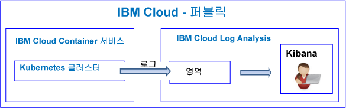
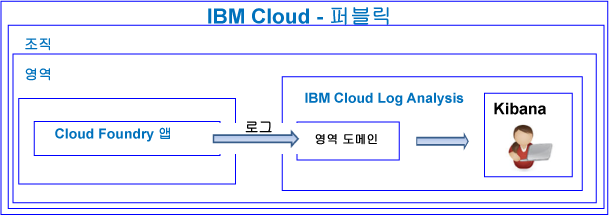

---

copyright:
  years: 2017, 2019

lastupdated: "2019-03-06"

keywords: IBM Cloud, logging

subcollection: cloudloganalysis

---

{:new_window: target="_blank"}
{:shortdesc: .shortdesc}
{:screen: .screen}
{:pre: .pre}
{:table: .aria-labeledby="caption"}
{:codeblock: .codeblock}
{:tip: .tip}
{:download: .download}
{:important: .important}
{:note: .note}

# 시작하기 튜토리얼
{: #getting-started-with-cla}

이 튜토리얼을 사용하여 {{site.data.keyword.Bluemix}}의 {{site.data.keyword.loganalysislong}} 서비스에 대한 작업을 시작하는 방법을 학습할 수 있습니다. 
{:shortdesc}

기본적으로 {{site.data.keyword.Bluemix_notm}}는 선택된 서비스에 대한 통합된 로깅 기능을 제공합니다. 로그에 대해 작업할 때 {{site.data.keyword.loganalysisshort}} 서비스를 사용하여 콜렉션 및 보존 기능을 확장할 수 있습니다.

## 시작하기 전에
{: #prereqs}

{{site.data.keyword.Bluemix_notm}} 계정의 구성원이거나 소유자인 사용자 ID가 있어야 합니다. {{site.data.keyword.Bluemix_notm}} 사용자 ID를 얻으려면 [등록 ](https://console.bluemix.net/registration/){:new_window}으로 이동하십시오.

## 1단계: 로그를 보려는 클라우드 리소스 선택
{: #step1}

{{site.data.keyword.Bluemix_notm}}에서 CF 애플리케이션, {{site.data.keyword.containershort}}에서 실행되는 컨테이너 및 선택된 서비스는 로그 데이터를 자동으로 수집하고 이를 {{site.data.keyword.loganalysisshort}} 서비스에 전달합니다.

여러 가지 클라우드 리소스가 다음 표에 나열되어 있습니다. {{site.data.keyword.loganalysisshort}} 서비스에 대한 작업을 시작하려면 리소스에 대한 다음 튜토리얼을 완료하십시오.

<table>
  <caption>{{site.data.keyword.loganalysisshort}} 서비스에 대한 작업을 시작하기 위한 튜토리얼 </caption>
  <tr>
    <th>리소스</th>
    <th>튜토리얼</th>
    <th>클라우드 환경</th>
    <th>시나리오</th>
  </tr>
  <tr>
    <td>{{site.data.keyword.containershort}}에서 실행되는 컨테이너</td>
    <td>[Kubernetes 클러스터에 배치된 앱에 대한 Kibana에서 로그 분석](/docs/services/CloudLogAnalysis/tutorials?topic=cloudloganalysis-container_logs#container_logs)</td>
    <td>공용 </br>전용</td>
    <td></td>
  </tr>
  <tr>
    <td>CF 앱</td>
    <td>[Kibana에서 Cloud Foundry 앱에 대한 로그 분석](https://console.bluemix.net/docs/tutorials/application-log-analysis.html#generate-access-and-analyze-application-logs)</td>
    <td>공용</td>
    <td></td>
  </tr>
</table>


## 2단계: 사용자가 로그를 볼 수 있도록 권한 설정
{: #step24}

사용자가 수행할 수 있는 {{site.data.keyword.loganalysisshort}} 조치를 제어하기 위해 사용자에게 역할 및 정책을 지정할 수 있습니다. 

{{site.data.keyword.Bluemix_notm}}에는 사용자가 {{site.data.keyword.loganalysisshort}} 서비스에 대해 작업할 때 수행할 수 있는 조치를 제어하는 두 가지 유형의 보안 권한이 있습니다.

* CF(Cloud Foundry) 역할: 사용자가 영역의 로그를 보기 위해 보유해야 하는 권한을 정의하려면 사용자에게 CF 역할을 부여합니다.
* IAM 역할: 사용자가 계정 도메인의 로그를 보기 위해 보유해야 하는 권한을 정의하려면 사용자에게 IAM 정책을 부여합니다.

### 사용자가 영역 도메인의 로그를 볼 수 있도록 권한 설정
{: #step42a}

사용자에게 영역의 로그를 볼 수 있는 권한을 부여하려면 다음 단계를 완료하십시오.

1. {{site.data.keyword.Bluemix_notm}} 콘솔에 로그인하십시오.

    웹 브라우저를 열고 {{site.data.keyword.Bluemix_notm}} 대시보드를 실행하십시오. [http://bluemix.net ](http://bluemix.net){:new_window}
	
	사용자 ID 및 비밀번호를 사용하여 로그인하면 {{site.data.keyword.Bluemix_notm}} UI가 열립니다.

2. 메뉴 표시줄에서 **관리 > 계정 > 사용자**를 클릭하십시오. 

    *사용자* 창에 현재 선택한 계정의 이메일 주소와 함께 사용자 목록이 표시됩니다.
	
3. 사용자가 계정의 구성원인 경우 목록에서 사용자 이름을 선택하거나 *조치* 메뉴에서 **사용자 관리**를 클릭하십시오.

    사용자가 계정의 구성원이 아닌 경우 [사용자 초대](/docs/iam?topic=iam-iamuserinv#iamuserinv)를 참조하십시오.

4. **Cloud Foundry 액세스**를 선택한 후 조직을 선택하십시오.

    해당 조직에서 사용 가능한 영역의 목록이 나열됩니다.

5. {{site.data.keyword.loganalysisshort}} 서비스를 프로비저닝한 영역을 선택하십시오. 그런 다음 메뉴 조치에서 **영역 역할 편집**을 선택하십시오.

6. *감사자*를 선택하십시오. 

    하나 이상의 영역 역할을 선택할 수 있습니다. *관리자*, *개발자* 및 *감사자* 역할 모두는 사용자가 로그를 보도록 허용합니다.
	
7. **역할 저장**을 클릭하십시오.


### 사용자가 계정 도메인의 로그를 볼 수 있도록 권한 설정
{: #step24b}


사용자에게 계정 로그를 볼 수 있는 권한을 부여하려면 다음 단계를 완료하십시오.

1. {{site.data.keyword.Bluemix_notm}} 콘솔에 로그인하십시오.

    웹 브라우저를 열고 {{site.data.keyword.Bluemix_notm}} 대시보드를 실행하십시오. [http://bluemix.net ](http://bluemix.net){:new_window}
	
	사용자 ID 및 비밀번호를 사용하여 로그인하면 {{site.data.keyword.Bluemix_notm}} UI가 열립니다.

2. 메뉴 표시줄에서 **관리 > 계정 > 사용자**를 클릭하십시오. 

    *사용자* 창에 현재 선택한 계정의 이메일 주소와 함께 사용자 목록이 표시됩니다.
	
3. 사용자가 계정의 구성원인 경우 목록에서 사용자 이름을 선택하거나 *조치* 메뉴에서 **사용자 관리**를 클릭하십시오.

    사용자가 계정의 구성원이 아닌 경우 [사용자 초대](/docs/iam?topic=iam-iamuserinv#iamuserinv)를 참조하십시오.

4. **액세스 정책** 섹션에서 **액세스 권한 지정**을 클릭한 후 **리소스에 대한 액세스 권한 지정**을 선택하십시오.

    *사용자에 리소스 액세스 권한 지정** 창이 열립니다.

5. 정책에 대한 정보를 입력하십시오. 다음 표는 정책을 정의하는 데 필요한 필드를 나열합니다. 

    <table>
	  <caption>IAM 정책을 구성하는 필드 목록입니다.</caption>
	  <tr>
	    <th>필드</th>
		<th>값</th>
	  </tr>
	  <tr>
	    <td>서비스</td>
		<td>*IBM Cloud Log Analysis*</td>
	  </tr>	  
	  <tr>
	    <td>지역</td>
		<td>사용자에게 로그 작업을 수행하기 위한 액세스 권한을 부여할 지역을 지정할 수 있습니다. 하나 이상의 지역을 개별적으로 선택하거나 **모든 현재 지역**을 선택하여 모든 지역에 대한 액세스 권한을 부여하십시오.</td>
	  </tr>
	  <tr>
	    <td>서비스 인스턴스</td>
		<td>*모든 서비스 인스턴스*를 선택하십시오.</td>
	  </tr>
	  <tr>
	    <td>역할</td>
		<td>하나 이상의 IAM 역할을 선택하십시오. <br>올바른 역할: *관리자*, *운영자*, *편집자* 및 *뷰어*. <br>각 역할에 허용되는 조치에 대한 자세한 정보는 [IAM 역할](/docs/services/CloudLogAnalysis?topic=cloudloganalysis-security_ov#iam_roles)을 참조하십시오.
		</td>
	  </tr>
     </table>
	
6. **지정**을 클릭하십시오.
	
구성하는 정책을 선택한 지역에 적용할 수 있습니다. 


## 다음 단계 
{: #next_steps}

**참고:** 로그 데이터를 보고 분석하려면 로그 데이터가 사용 가능한 클라우드 공용 지역에서 Kibana에 액세스해야 합니다. 

예를 들어, 미국 남부 지역에서 Kibana를 실행하려면 웹 브라우저를 열고 다음 URL을 입력하십시오.

```
https://logging.ng.bluemix.net/ 
```
{: codeblock}


다른 지역에서 Kibana를 실행하는 방법에 대한 자세한 정보는 [웹 브라우저에서 Kibana로 이동](/docs/services/CloudLogAnalysis/kibana?topic=cloudloganalysis-launch#launch_Kibana_from_browser)을 참조하십시오.

**참고:** Kibana를 실행할 때 *bearer 토큰이 올바르지 않음*을 나타내는 메시지가 표시되는 경우 계정의 권한을 확인하십시오. 이 메시지는 사용자 ID에 로그를 볼 수 있는 권한이 없음을 표시합니다.

그런 다음 로그 데이터를 보고 분석하려면 Kibana를 사용자 정의하십시오. 자세한 정보는 [로그 보기 및 분석](/docs/services/CloudLogAnalysis/kibana?topic=cloudloganalysis-analyzing_logs_Kibana#analyzing_logs_Kibana)을 참조하십시오.
    


