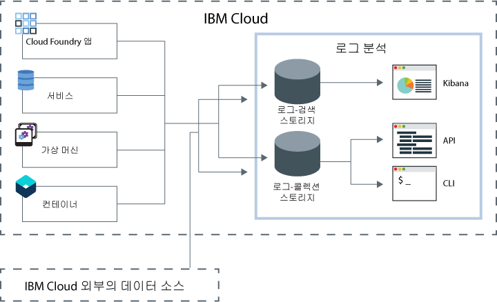

---

copyright:
  years: 2017, 2019

lastupdated: "2019-03-06"

keywords: IBM Cloud, logging

subcollection: cloudloganalysis

---

{:new_window: target="_blank"}
{:shortdesc: .shortdesc}
{:screen: .screen}
{:pre: .pre}
{:table: .aria-labeledby="caption"}
{:codeblock: .codeblock}
{:tip: .tip}
{:download: .download}
{:important: .important}
{:note: .note}

# IBM Cloud Log Analysis
{: #log_analysis_ov}

{{site.data.keyword.loganalysisfull}} 서비스를 사용하여 {{site.data.keyword.Bluemix}}에서 로그 콜렉션, 로그 보존 및 로그 검색 기능을 확장할 수 있습니다. 애플리케이션의 집계 및 통합된 애플리케이션 또는 환경 인사이트에 대한 환경 로그, 로그의 암호화, 필요로 하는 만큼의 기간 동안 로그 데이터의 보존, 문제의 신속한 발견 및 문제점 해결과 같은 기능으로 DevOps 팀의 권한을 강화하십시오. 고급 분석 태스크에 Kibana를 사용하십시오.
{:shortdesc}

{{site.data.keyword.Bluemix_notm}} 로깅 기능은 플랫폼에서 통합됩니다.

* 데이터의 수집이 클라우드 리소스에 대해 자동으로 사용 가능하게 설정됩니다. {{site.data.keyword.Bluemix_notm}}는 기본적으로 앱의 로그, 앱 런타임 및 해당 앱이 실행되는 컴퓨팅 런타임을 수집하고 표시합니다. 
* 하루에 최대 500MB의 로그를 검색할 수 있습니다. 
* 최근 3일 동안의 로그가 {{site.data.keyword.loganalysisshort}} 서비스의 컴포넌트인 로그 검색에 저장됩니다.

{{site.data.keyword.Bluemix_notm}}에서 로깅 기능을 사용하여 여기에서 실행 중인 클라우드 플랫폼 및 리소스의 동작을 이해할 수 있습니다. 표준 출력 및 표준 오류 로그를 수집하기 위해 특별한 인스트루먼테이션이 필요하지 않습니다. 예를 들면, 로그를 사용하여 애플리케이션에 대한 감사 추적 제공, 서비스에서 문제점 발견, 취약점 식별, 앱 배치 및 런타임 작동의 문제점 해결, 앱이 실행 중인 인프라에서 문제점 발견, 클라우드 플랫폼에서 앱 전체 컴포넌트 추적, 서비스 SLA에 영향을 미칠 수 있는 선점 조치를 사용할 수 있는 패턴 발견을 수행할 수 있습니다.

{{site.data.keyword.loganalysisfull}} 서비스는 {{site.data.keyword.Bluemix_notm}} 플랫폼에 대한 로그 콜렉션 및 로그 검색 서비스를 제공하여 선택한 {{site.data.keyword.Bluemix_notm}} 서비스에서 애플리케이션 및 {{site.data.keyword.Bluemix_notm}} 서비스 데이터를 자동으로 수집합니다.

다음 그림은 {{site.data.keyword.loganalysisshort}} 서비스의 상위 레벨 보기를 보여줍니다. 

영역에서 실행되는 클라우드 리소스의 로그를 수집하고 검색하려면 해당 클라우스 리소스가 실행 중인 동일한 영역에서 {{site.data.keyword.loganalysisshort}} 서비스의 인스턴스를 프로비저닝해야 합니다. 로그는 수집되어 로그 검색에 기본적으로 저장됩니다. 확장된 검색 및 수집 기능이 포함된 서비스 플랜을 선택하면 로그 역시 로그 콜렉션 컴포넌트에 수집 및 저장됩니다. 로그 콜렉션에 저장된 로그 데이터가 암호화됩니다.

기본적으로 {{site.data.keyword.Bluemix_notm}}는 최대 3일 동안의 로그 데이터를 로그 검색에 저장합니다.   

* 하루에 영역당 최대 500MB의 데이터가 저장됩니다. 500MB 상한을 넘는 로그는 버려집니다. 상한 분배는 매일 오전 12:30 UTC에
재설정됩니다.
* 최대 1.5GB의 데이터를 최대 3일 동안 검색할 수 있습니다. 로그 데이터는 1.5GB의 데이터에 도달하거나 3일 이후에 롤오버(FIFO)됩니다.

{{site.data.keyword.loganalysisshort}} 서비스는 필요한 기간 만큼 로그 콜렉션에 로그를 저장하도록 허용하는 추가 플랜을 제공합니다. 로그 콜렉션에 수집하고 저장할 수 있는 로그 크기는 사용자가 선택하는 서비스 플랜에 따라 판별됩니다. 저장된 데이터에 대해 월별 GB의 데이터로 비용을 지불합니다.  로그는 JSON으로 로그 콜렉션에 저장됩니다.

고급 검색 로그 분석 태스크를 위해 Kibana 5.1을를 사용할 수 있습니다.

* 각 플랜은 하루에 검색할 수 있는 로그 크기를 제한합니다. 
* 검색은 지난 3일 동안의 데이터만 범위에 포함합니다.

3일 이전의 로그에 액세스하려면 로그 콜렉션 CLI 또는 로그 콜렉션 API를 사용하여 로그를 로컬로 다운로드하거나 다른 애플리케이션 또는 서드파티 클라우드 서비스로 로그를 보낼 수 있습니다. 

{{site.data.keyword.loganalysisshort}} CLI를 사용하여 수동으로 또는 보존 정책을 설정하여 로그를 자동으로 삭제할 수 있습니다.

## Log Analysis 서비스 사용 이유
{: #value}

1. **애플리케이션의 인스트루먼트 시간을 줄이고 가치를 향상시키는 데 더 많은 시간 투자**

    {{site.data.keyword.loganalysislong_notm}}에서는 선택한 {{site.data.keyword.Bluemix_notm}} 서비스에서 자동으로 데이터를 수집하며, 인스트루먼테이션은 필요하지 않습니다.
	
	하루에 검색할 수 있는 로그의 양을 선택할 수 있습니다.  하루에 500MB,  2GB, 5GB 및 10GB의 로그를 검색하는 데 사용할 수 있는 다양한 플랜이 있습니다.

2. **사용자의 애플리케이션 워크로드에 가깝게 로그 데이터를 보존하고 클라우드 클래스 경제적인 스토리지 솔루션에서 안전하게 보호**

    {{site.data.keyword.Bluemix_notm}}에서 실행되는 기존의 마이크로서비스 구동 애플리케이션에서 로그 데이터를 수집하여 중앙 집중식 로그에 저장합니다. 사용자가 필요로 하는 만큼 로그 데이터를 보존합니다.
	
	로그는 {{site.data.keyword.IBM_notm}} 클라우드 스토리지에 저장됩니다. 로그가 필요할 때 다운로드할 수 있습니다.

3. **문제를 신속하게 발견, 진단 및 식별하도록 사용자의 환경에 대한 인사이트를 얻음**

    사용자 정의 가능한 대시보드를 통해 사용자의 데이터를 시각화, 분석 및 상호작용하십시오. Elastic 스택 플랫폼에 빌드되어 로그 검색 기능은 사용자의 애플리케이션 요구사항대로 대시보드를 신속하게 빌드하도록 Kibana의 유연성 및 친숙성을 제공합니다.

4. **API와 강력한 통합**

    서비스의 API를 통해 사용자의 애플리케이션 및 오퍼레이션에 로그 데이터를 통합합니다. {{site.data.keyword.loganalysisshort}} 서비스 API를 사용하여 보존된 로그를 관리하고 {{site.data.keyword.IBM_notm}} 클라우드 외부에서 로그 데이터를 전송하십시오.

## 지역
{: #regions}

{{site.data.keyword.loganalysisfull_notm}} 서비스는 다음 지역에서 사용 가능합니다.

* 독일
* 영국
* 미국 남부
* 시드니

## 데이터 집약
{: #data_location}

다음 표는 지역별 로그 위치를 나열합니다.

<table>
  <caption>지역별 로그 위치</caption>
  <tr>
    <th>지역</th>
	<th>로그 검색 로그</th>
	<th>로그 콜렉션 로그</th>
  </tr>
  <tr>
    <td>독일</td>
	  <td>독일에서 호스팅됨</td>
	  <td>독일에서 호스팅됨</td>
  </tr>
  <tr>
    <td>영국</td>
	  <td>영국에서 호스팅됨</td>
	  <td>영국에서 호스팅됨</td>
  </tr>
  <tr>
    <td>미국 남부</td>
	  <td>미국 남부에서 호스팅됨</td>
	  <td>미국 남부에서 호스팅됨</td>
  </tr>
  <tr>
    <td>시드니</td>
	  <td>시드니에서 호스팅됨</td>
	  <td>미국 남부에서 호스팅됨(*)</td>
  </tr>
</table>

(*) 시드니의 로그 콜렉션 로그는 현재 미국 남부에서 호스팅됩니다. 시드니의 로그 콜렉션 로그의 데이터 집약이 계획 중입니다.

## 서비스 플랜
{: #plans}

{{site.data.keyword.loganalysisshort}} 서비스는 여러 가지 플랜을 제공합니다. 각 플랜에는 여러 가지 로그 콜렉션 및 로그 검색 기능이 있습니다. 

**참고:** 서비스 플랜에 포함된 기능은 해당 플랜으로 {{site.data.keyword.loganalysisshort}} 서비스를 프로비저닝한 영역에서만 사용됩니다.

{{site.data.keyword.Bluemix_notm}} UI 또는 명령행을 통해 플랜을 변경할 수 있습니다. 플랜은 언제든지 업그레이드하거나 줄일 수 있습니다. 서비스 플랜 업그레이드에 대한 자세한 정보는 [플랜 변경](/docs/services/CloudLogAnalysis/how-to/change_plan.html#change_plan)을 참조하십시오. 

다음 표에서는 사용 가능한 플랜에 대한 개요를 설명합니다.

<table>
    <caption>플랜별 로그 검색 및 로그 콜렉션 기능의 요약</caption>
      <tr>
        <th>플랜</th>
        <th>로그 수집</th>
        <th>로그 보존</th>
        <th>데이터 암호화</th>
        <th>로그 검색</th>
      </tr>
      <tr>
        <td>Lite(기본값)</td>
        <td>아니오</td>
        <td>최근 3일</td>
        <td>아니오</td>
        <td>최대 500MB 검색</td>
      </tr>
      <tr>
        <td>로그 콜렉션</td>
        <td>예</td>
        <td>구성 가능한 일 수.</td>
        <td>예</td>
        <td>일별 최대 500MB 검색</td>
      </tr>
      <tr>
        <td>2GB/일 검색의 로그 콜렉션</td>
        <td>예</td>
        <td>구성 가능한 일 수.</td>
        <td>예</td>
        <td>일별 최대 2GB 검색</td>
      </tr>
      <tr>
        <td>5GB/일 검색의 로그 콜렉션</td>
        <td>예</td>
        <td>구성 가능한 일 수.</td>
        <td>예</td>
        <td>일별 최대 5GB 검색</td>
      </tr>
       <tr>
        <td>10GB/일 검색의 로그 콜렉션</td>
        <td>예</td>
        <td>구성 가능한 일 수.</td>
        <td>예</td>
        <td>일별 최대 10GB 검색</td>
      </tr>
</table>

**참고:** 로그 콜렉션 스토리지의 월별 비용은 청구 주기의 평균으로 계산됩니다.

