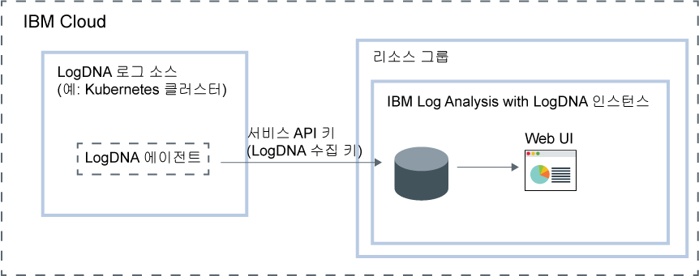

---

copyright:
  years:  2018, 2019
lastupdated: "2019-03-23"

keywords: LogDNA, IBM, Log Analysis, logging, overview

subcollection: LogDNA

---

{:new_window: target="_blank"}
{:shortdesc: .shortdesc}
{:screen: .screen}
{:pre: .pre}
{:table: .aria-labeledby="caption"}
{:codeblock: .codeblock}
{:tip: .tip}
{:download: .download}
{:important: .important}
{:note: .note}

# {{site.data.keyword.la_full_notm}} 정보
{: #about}

{{site.data.keyword.la_full}}는 로그 관리 기능을 추가하기 위해 {{site.data.keyword.cloud_notm}} 아키텍처의 일부로 포함할 수 있는 서드파티 서비스입니다. {{site.data.keyword.la_full_notm}}는 {{site.data.keyword.IBM_notm}}과 협력 관계인 LogDNA에서 운영됩니다.
{:shortdesc}

{{site.data.keyword.la_full_notm}}를 사용하여 {{site.data.keyword.cloud_notm}}에서 시스템 및 애플리케이션 로그를 관리할 수 있습니다.

{{site.data.keyword.la_full_notm}}는 관리자, DevOps 팀 및 개발자 고급 기능을 제공하여 로그 데이터를 필터링하고 검색하고 추적하며, 경보를 정의하고, 애플리케이션 및 시스템 로그를 모니터할 수 있도록 사용자 정의 보기를 디자인합니다.

## 개요
{: #ov}

{{site.data.keyword.cloud_notm}}에서 LogDNA를 사용하여 로깅 기능을 추가하려면 {{site.data.keyword.la_full_notm}}의 인스턴스를 프로비저닝해야 합니다.

{{site.data.keyword.la_full_notm}}의 인스턴스를 프로비저닝하기 전에 다음 정보를 고려하십시오.
* 로그 데이터는 {{site.data.keyword.cloud_notm}}에서 호스팅됩니다.
* 로그 데이터는 서드파티로 전송됩니다.
* 사용자는 {{site.data.keyword.cloud_notm}}에서 서비스의 인스턴스를 작성하고 보고 삭제할 수 있는 플랫폼 권한을 갖고 있어야 합니다.
* 사용자는 LogDNA 인스턴스를 프로비저닝할 리소스 그룹의 컨텍스트 내에서 리소스를 작성할 수 있는 플랫폼 권한을 갖고 있어야 합니다.

리소스 그룹의 컨텍스트 내에서 {{site.data.keyword.la_full_notm}} 인스턴스를 프로비저닝합니다. 리소스 그룹을 사용하여 액세스 제어 및 청구를 위해 서비스를 구성합니다. *기본* 리소스 그룹 또는 사용자 정의 리소스 그룹에서 인스턴스를 프로비저닝할 수 있습니다.

{{site.data.keyword.la_full_notm}}의 인스턴스를 프로비저닝한 후 LogDNA에서 계정이 작성되고 사용자는 계정에 대한 수집 키를 수신합니다.

그런 다음 각 로그 소스에 대해 LogDNA 에이전트를 구성해야 합니다. 로그 소스는 로그를 생성하는 클라우드 또는 온프레미스 리소스입니다. 예를 들어, 로그 소스는 Kubernetes 클러스터일 수 있습니다. 수집 키를 사용하여 로그를 수집하고 {{site.data.keyword.la_full_notm}} 인스턴스로 전달하는 LogDNA 에이전트를 구성합니다.

LogDNA 에이전트가 로그 소스에 배치되면 로그는 자동으로 수집되어 {{site.data.keyword.la_full_notm}} 인스턴스에 전달됩니다.

{{site.data.keyword.la_full_notm}} Web UI를 실행하여 로그를 보고 모니터하고 관리할 수 있습니다.

다음 그림은 {{site.data.keyword.cloud_notm}}에서 실행되는 {{site.data.keyword.la_full_notm}} 서비스의 컴포넌트 개요를 보여줍니다.

## 로그 데이터
{: #overview_data}

{{site.data.keyword.la_full_notm}}는 하나의 중앙화된 로깅 시스템에서 로그를 수집하고 집계합니다.

* 로그 데이터는 {{site.data.keyword.cloud_notm}}에서 호스팅됩니다.
* 데이터는 {{site.data.keyword.la_full_notm}} 인스턴스가 프로비저닝된 지역에 배치됩니다. 예를 들어, 미국 남부에서 프로비저닝된 인스턴스에 대한 로그 데이터는 미국 남부 지역에서 호스팅됩니다.

{{site.data.keyword.la_full_notm}} 인스턴스에 대해 선택한 서비스 플랜은 데이터가 LogDNA에 저장되고 보유되는 일 수를 정의합니다. 예를 들어, *무료* 플랜을 선택하면 데이터가 저장되지 않습니다. 하지만 7일 플랜을 선택하면 데이터가 7일 동안 저장되고 LogDNA Web UI를 통해 액세스할 수 있습니다.

{{site.data.keyword.cloud_notm}}에서 {{site.data.keyword.la_full_notm}}의 인스턴스를 삭제하면 모든 데이터가 삭제됩니다.

## 기능
{: #overview_features}

**실시간으로 로그를 해결하여 문제를 진단하고 문제점을 식별합니다.**

개발자 및 DevOps 팀은 *라이브 스트리밍 추적* 기능을 사용하여 문제를 진단하고 스택 추적 및 예외를 분석하며 오류 소스를 식별하고 단일 보기를 통해 여러 로그 소스를 모니터할 수 있습니다. 이 기능은 명령행 및 웹 인터페이스를 통해 사용 가능합니다.

**중요한 조치를 알리는 경보를 발행합니다.**
 
DevOps 팀은 사용자가 위험 또는 경고로 식별하는 애플리케이션 및 서비스 이벤트에 대해 즉시 조치하기 위해 이메일, Slack, HipChat, webHook, PagerDuty 및 OpsGenie와 같은 시스템에 대한 경보 알림 통합을 구성할 수 있습니다.

**분석을 위해 로그를 로컬 파일로 내보내거나 감사 요구사항을 충족하기 위해 로그를 아카이브 서비스로 내보냅니다.**

특정 로그 행을 로컬 사본으로 내보내거나 {{site.data.keyword.la_full_notm}}에서 IBM Cloud Object Storage로 로그를 아카이브합니다.
로그 행을 JSON 행 형식으로 내보냅니다. 로그는 JSON 형식으로 아카이브되고 각 행과 연관된 메타데이터를 보존합니다.

**{{site.data.keyword.la_full_notm}}를 통해 관리할 로그를 사용자 정의하여 로깅 인프라 비용을 제어합니다.**

로그를 수집하고 관리할 로그 소스를 구성하여 IBM Cloud에서 로깅 인프라 비용을 제어합니다.

## 가격 플랜
{: #overview_pricing_plans}

{{site.data.keyword.la_full_notm}} 인스턴스에 대해 선택할 수 있는 여러 가격 플랜을 사용할 수 있습니다. 각 플랜은 검색을 위해 데이터를 보유하는 일 수, 데이터를 관리할 수 있는 사용자의 수 및 사용 가능한 LogDNA 기능을 정의합니다.

| 플랜                     | 
|--------------------------|
| `30 day log search`  |
| `14 day log search`  |
| `7 day log search`   |
| `Lite`                  |
{: caption="표 1. 서비스 플랜 목록" caption-side="top"} 

{{site.data.keyword.la_full_notm}}는 시스템을 통과할 때 로그를 보는 데 사용할 수 있는 `Lite` 플랜을 제공합니다. 로그 추적을 사용하여 로그를 볼 수 있습니다. 또한 장기 보존 기간 플랜으로 업그레이드를 준비하기 위해 필터를 디자인할 수 있습니다. 이 플랜에는 0일의 보존 기간이 있습니다.

다음 표에는 각 서비스 플랜에 포함된 여러 기능이 요약되어 있습니다.

| 기능                          | `30 day log search` 플랜 | `14 day log search` 플랜    | `7 day log search` 플랜     | `Lite` 플랜 | 
|----------------------------------|-------------------------|-------------------------------|-----------------------------|--------------|
| `로그를 저장했으며 검색할 수 있음` | 예 - 30일 동안       | 예 - 14일 동안             | 예 - 7일 동안            |아니오           |
| `실시간 스트리밍 추적`            |예                     |예                           |예                         |예          |
| `아카이브`                      |예                     |예                           |예                         |아니오           |
| `다중 채널 경보`         |예                     |예                           |예                         |아니오           | 
{: caption="표 2. 각 서비스 플랜에 사용 가능한 기능 목록" caption-side="top"} 

## 지역
{: #overview_regions}

{{site.data.keyword.la_full_notm}}를 사용한 로깅은 다음 지역에서 사용 가능합니다.

| 지역                | 위치  |
|-----------------------|-----------|
| **미국 남부**          | 댈러스    |
| **독일**             | 프랑크푸르트 | 
{: caption="표 3. 서비스가 사용 가능한 지역의 목록" caption-side="top"} 

현재 **프랑크푸르트** 위치는 EU에서 관리되지 **않습니다**. 자세한 정보는 [EU 지원 설정 사용](/docs/account?topic=account-eu-hipaa-supported#bill_eusupported)을 참조하십시오.
{: important}

