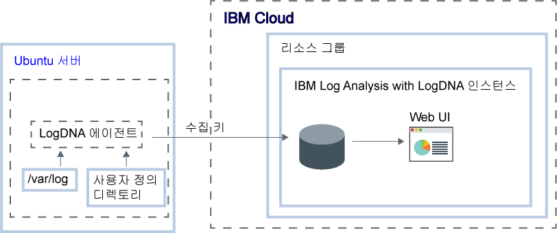

---

copyright:
  years:  2018, 2019
lastupdated: "2019-03-06"

keywords: LogDNA, IBM, Log Analysis, logging, ubuntu, tutorial

subcollection: LogDNA

---

{:new_window: target="_blank"}
{:shortdesc: .shortdesc}
{:screen: .screen}
{:pre: .pre}
{:table: .aria-labeledby="caption"}
{:codeblock: .codeblock}
{:tip: .tip}
{:download: .download}
{:important: .important}
{:note: .note}


# {{site.data.keyword.la_full_notm}}를 사용하여 Ubuntu 로그 관리
{: #ubuntu}

{{site.data.keyword.cloud_notm}}의 중앙화된 로깅 시스템에서 Ubuntu 로그를 모니터하고 관리하려면 {{site.data.keyword.la_full}} 서비스를 사용하십시오. 
{:shortdesc}

시스템 및 애플리케이션 로그를 수집하고 모니터할 수 있습니다. 

기본적으로 Ubuntu에 대한 LogDNA 에이전트는 **/var/log** 디렉토리의 로그 파일을 모니터합니다. 예를 들어, 기본적으로 Ubuntu 시스템 로그(*/var/log/syslog*)가 모니터됩니다.

{{site.data.keyword.cloud_notm}}에서 {{site.data.keyword.la_full_notm}} 인스턴스로 로그를 전달하도록 Ubuntu 서버를 구성하려면 다음 단계를 완료해야 합니다.

1. {{site.data.keyword.la_full_notm}} 서비스의 인스턴스를 프로비저닝하십시오. 
2. Ubuntu 서버에서 LogDNA 에이전트를 구성하십시오.
3. 선택적으로 에이전트가 모니터할 디렉토리를 추가하십시오.



이 튜토리얼에서는 {{site.data.keyword.la_full_notm}} 인스턴스로 로그를 전달하도록 Ubuntu 서버를 구성하는 방법에 대해 알아봅니다.

## 시작하기 전에
{: #ubuntu_prereqs}

{{site.data.keyword.la_full_notm}}에 대해 읽으십시오. 자세한 정보는 [LogDNA 정보](/docs/services/Log-Analysis-with-LogDNA?topic=LogDNA-about#about)를 참조하십시오.

미국 남부 지역에서 작업합니다. {{site.data.keyword.la_full_notm}}는 현재 미국 남부 지역에서 사용 가능합니다. **참고:** 같은 지역 또는 서로 다른 지역에 있는 Ubuntu 서버에서 데이터를 전송할 수 있습니다. 

{{site.data.keyword.cloud_notm}} 계정의 소유자 또는 구성원인 사용자 ID를 사용하십시오. {{site.data.keyword.cloud_notm}} 사용자 ID를 가져오려면 [등록 ](https://cloud.ibm.com/login){:new_window}으로 이동하십시오.

{{site.data.keyword.IBM_notm}} ID에는 다음 각 리소스에 대한 IAM 정책이 지정되어 있어야 합니다. 

| 리소스                             | 액세스 정책 범위 | 역할    | 지역    | 정보                  |
|--------------------------------------|----------------------------|---------|-----------|------------------------------|
| 리소스 그룹 **기본값**           |  리소스 그룹            | 뷰어  | 미국 남부  | 사용자가 기본 리소스 그룹에서 서비스 인스턴스를 보려면 이 정책이 필요합니다.    |
| {{site.data.keyword.la_full_notm}} 서비스 |  리소스 그룹            | 편집자  | 미국 남부  | 사용자가 기본 리소스 그룹에서 {{site.data.keyword.la_full_notm}} 서비스를 프로비저닝하고 관리하려면 이 정책이 필요합니다.   |
{: caption="표 1. 튜토리얼을 완료하는 데 필요한 IAM 정책 목록" caption-side="top"} 

{{site.data.keyword.cloud_notm}} CLI를 설치하십시오. 자세한 정보는 [{{site.data.keyword.cloud_notm}} CLI 설치](/docs/cli/index.html#overview)를 참조하십시오.


## 1단계. {{site.data.keyword.la_full_notm}} 인스턴스 프로비저닝
{: #ubuntu_step1}

{{site.data.keyword.cloud_notm}} UI를 통해 {{site.data.keyword.la_full_notm}} 인스턴스를 프로비저닝하려면 다음 단계를 완료하십시오.

1. {{site.data.keyword.cloud_notm}} 계정에 로그인하십시오.

    [{{site.data.keyword.cloud_notm}} 대시보드 ](https://cloud.ibm.com/login){:new_window}를 클릭하여 {{site.data.keyword.cloud_notm}} 대시보드를 실행하십시오.

	사용자 ID와 비밀번호로 로그인하면 {{site.data.keyword.cloud_notm}} UI가 열립니다.

2. **카탈로그**를 클릭하십시오. {{site.data.keyword.cloud_notm}}에서 사용 가능한 서비스 목록이 열립니다.

3. 표시된 서비스 목록을 필터링하려면 **개발자 도구** 카테고리를 선택하십시오.

4. **{{site.data.keyword.la_full_notm}}** 타일을 클릭하십시오.

5. 서비스 인스턴스의 이름을 입력하십시오.

6. **기본** 리소스 그룹을 선택하십시오. 

    기본적으로 **기본** 리소스 그룹이 설정됩니다.

7. **Lite** 서비스 플랜을 선택하십시오. 

    기본적으로 **Lite** 플랜이 설정됩니다.

    다른 서비스 플랜에 대한 자세한 정보는 [가격 플랜](/docs/services/Log-Analysis-with-LogDNA?topic=LogDNA-about#overview_pricing_plans)을 참조하십시오.

8. 로그인한 {{site.data.keyword.cloud_notm}} 리소스 그룹에서 {{site.data.keyword.la_full_notm}} 서비스를 프로비저닝하려면 **작성**을 클릭하십시오.

인스턴스를 프로비저닝하면 {{site.data.keyword.la_full_notm}} 대시보드가 열립니다. 


**참고:** CLI를 통해 LogDNA의 인스턴스를 프로비저닝하려면 [{{site.data.keyword.cloud_notm}} CLI를 통해 LogDNA 프로비저닝](/docs/services/Log-Analysis-with-LogDNA?topic=LogDNA-provision#provision_cli)을 참조하십시오.


## 2단계. 인스턴스에 로그를 전송하도록 Ubuntu 서버 구성
{: #ubuntu_step2}

{{site.data.keyword.la_full_notm}} 인스턴스로 로그를 보내도록 Ubuntu 서버를 구성하려면 `logdna-agent`를 설치해야 합니다. LogDNA 에이전트가 */var/log*에서 로그 파일을 읽고 로그 데이터를 LogDNA 인스턴스로 전달합니다.

LogDNA 인스턴스로 로그를 전달하도록 Ubuntu 서버를 구성하려면 Ubuntu 터미널에서 다음 단계를 완료하십시오.

1. LogDNA 에이전트를 설치하십시오. 다음 명령을 실행하십시오.

    ```
    echo "deb https://repo.logdna.com stable main" | sudo tee /etc/apt/sources.list.d/logdna.list 
    ```
    {: codeblock}

    ```
    wget -O- https://repo.logdna.com/logdna.gpg | sudo apt-key add - 
    ```
    {: codeblock}

    ```
    sudo apt-get update
    ```
    {: codeblock}

    ```
    sudo apt-get install logdna-agent < "/dev/null"
    ```
    {: codeblock}

2. LogDNA 에이전트가 로그를 {{site.data.keyword.la_full_notm}} 인스턴스로 전달하는 데 사용해야 하는 수집 키를 설정하십시오.  

    ```
    sudo logdna-agent -k INGESTION_KEY
    ```
    {: codeblock}

    여기서 INGESTION_KEY에는 로그를 전달하도록 구성하는 {{site.data.keyword.la_full_notm}} 인스턴스에 대해 활성 상태인 수집 키가 포함됩니다.

3. 인증 엔드포인트를 설정하십시오. LogDNA 에이전트는 이 호스트를 사용하여 토큰을 인증하고 가져와 로그를 전달합니다.

    ```
    sudo logdna-agent -s LOGDNA_APIHOST=api.us-south.logging.cloud.ibm.com
    ```
    {: codeblock}

4. 수집 엔드포인트를 설정하십시오.

    ```
    sudo logdna-agent -s LOGDNA_LOGHOST=logs.us-south.logging.cloud.ibm.com
    ```
    {: codeblock}

5. 모니터할 추가 로그 경로를 정의하십시오. 다음 명령을 실행하십시오. 

    ```
    sudo logdna-agent -d /path/to/log/folders
    ```
    {: codeblock}

    기본적으로 **/var/log**가 모니터됩니다.

6. 선택적으로 호스트를 태그하도록 LogDNA 에이전트를 구성하십시오. 다음 명령을 실행하십시오.

    ```
    sudo logdna-agent -t TAG1,TAG2 
    ```
    {: codeblock}

    ```
    sudo update-rc.d logdna-agent defaults
    ```
    {: codeblock}

    ``` 
    sudo /etc/init.d/logdna-agent start
    ```
    {: codeblock}


## 3단계. LogDNA Web UI 실행
{: #ubuntu_step3}

{{site.data.keyword.cloud_notm}} UI를 통해 IBM Log Analysis with LogDNA 대시보드를 실행하려면 다음 단계를 완료하십시오.

1. {{site.data.keyword.cloud_notm}} 계정에 로그인하십시오.

    [{{site.data.keyword.cloud_notm}} 대시보드 ](https://cloud.ibm.com/login){:new_window}를 클릭하여 {{site.data.keyword.cloud_notm}} 대시보드를 실행하십시오.

	사용자 ID와 비밀번호로 로그인하면 {{site.data.keyword.cloud_notm}} 대시보드가 열립니다.

2. 탐색 메뉴에서 **관찰 가능성**을 선택하십시오. 

3. **로깅**을 선택하십시오. 

    {{site.data.keyword.cloud_notm}}에서 사용 가능한 {{site.data.keyword.la_full_notm}} 인스턴스의 목록이 표시됩니다.

3. 하나의 인스턴스를 선택하십시오. 그런 다음 **LogDNA 보기**를 클릭하십시오.

    LogDNA Web UI가 열리고 클러스터 로그가 표시됩니다.


## 4단계. 로그 보기
{: #ubuntu_step4}

LogDNA Web UI에서 시스템을 통과할 때 로그를 볼 수 있습니다. 로그 추적을 사용하여 로그를 봅니다. 

**참고:** **무료** 서비스 플랜을 사용하면 최근 로그만 추적할 수 있습니다.

자세한 정보는 [로그 보기](/docs/services/Log-Analysis-with-LogDNA?topic=LogDNA-view_logs#view_logs)를 참조하십시오.


## 다음 단계
{: #ubuntu_next_steps}

[로그 필터링](/docs/services/Log-Analysis-with-LogDNA?topic=LogDNA-view_logs#view_logs_step5), [로그 검색](/docs/services/Log-Analysis-with-LogDNA?topic=LogDNA-view_logs#view_logs_step6), [보기 정의](/docs/services/Log-Analysis-with-LogDNA?topic=LogDNA-view_logs#view_logs_step7) 및 [경보 구성](https://docs.logdna.com/docs/alerts)을 수행하십시오. 

**참고:** 이러한 기능을 사용하려면 {{site.data.keyword.la_full_notm}} 플랜을 유료 플랜으로 업그레이드해야 합니다.

