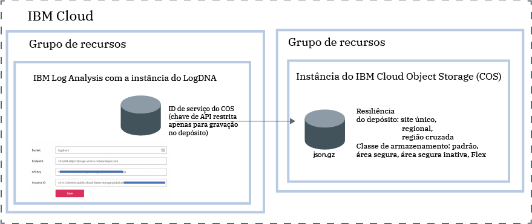

---

copyright:
  years:  2018, 2019
lastupdated: "2019-03-06"

keywords: LogDNA, IBM, Log Analysis, logging, archive logs, COS, cloud object storage

subcollection: LogDNA

---

{:new_window: target="_blank"}
{:shortdesc: .shortdesc}
{:screen: .screen}
{:pre: .pre}
{:table: .aria-labeledby="caption"}
{:codeblock: .codeblock}
{:tip: .tip}
{:download: .download}
{:important: .important}
{:note: .note}

 
# Arquivando logs para o IBM Cloud Object Storage
{: #archiving}

Arquive os logs de uma instância do {{site.data.keyword.la_full_notm}} em um depósito em uma instância do {{site.data.keyword.cos_full_notm}} (COS). 
{:shortdesc}

Para configurar o arquivamento, deve-se ter uma política do IAM com a função de plataforma **Visualizador** e a função de serviço **Gerenciador** para o serviço {{site.data.keyword.la_full_notm}}.

Arquive os logs de uma instância do {{site.data.keyword.la_full_notm}} em um depósito em uma instância do {{site.data.keyword.cos_full_notm}} (COS). Cada instância do {{site.data.keyword.la_full_notm}} tem sua própria configuração de arquivamento. 

Os logs são arquivados automaticamente uma vez por dia em um formato compactado **(.json.gz)**. Cada linha preserva seus metadados.

Os logs são arquivados dentro de 24 a 48 horas após você salvar a configuração. 

A instância do {{site.data.keyword.cos_full_notm}} é fornecida dentro do contexto de um grupo de recursos. A instância do {{site.data.keyword.la_full_notm}} também é fornecida dentro do contexto de um grupo de recursos. As duas instâncias podem ser agrupadas no mesmo grupo de recursos ou em grupos de recursos diferentes. 

O {{site.data.keyword.la_full_notm}} usa um ID de serviço para se comunicar com o serviço {{site.data.keyword.cos_full_notm}}.

* O ID de serviço que você cria para uma instância do {{site.data.keyword.cos_full_notm}} é usado pelo {{site.data.keyword.la_full_notm}} para autenticar e acessar a instância do {{site.data.keyword.cos_full_notm}}. 
* É possível designar políticas de acesso específicas para o ID de serviço que restringem as permissões na instância do {{site.data.keyword.cos_full_notm}}. Restrinja o ID de serviço para ter somente permissões de gravação no depósito em que você planeja arquivar os logs.

A figura a seguir mostra uma visualização de alto nível dos diferentes componentes que são integrados ao arquivar os logs:

Conclua as etapas a seguir para arquivar uma instância do {{site.data.keyword.la_full_notm}} em um depósito em uma instância do {{site.data.keyword.cos_full_notm}}:

## Etapa 1. Conceder políticas do IAM a um usuário para trabalhar com o {{site.data.keyword.cos_full_notm}}
{: #archiving_step1}

**Nota:** esta etapa deve ser concluída pelo proprietário da conta ou por um administrador do serviço {{site.data.keyword.cos_full_notm}} no {{site.data.keyword.cloud_notm}}.

Como um administrador do serviço {{site.data.keyword.cos_full_notm}}, você deve ser capaz de fornecer instâncias do serviço, conceder a outros usuários permissões para trabalhar com essas instâncias e criar IDs de serviço. 

Há maneiras diferentes pelas quais é possível conceder permissão a um usuário para se tornar um editor do serviço {{site.data.keyword.cos_full_notm}}:

* Como administrador do serviço na conta, o usuário deve ter uma política do IAM para o serviço {{site.data.keyword.cos_full_notm}} com a função de plataforma *Administrador*. Deve-se designar esse acesso de usuário a um recurso individual na conta. 

* Como administrador do serviço dentro do contexto de um grupo de recursos, o usuário deve ter uma política do IAM para o serviço {{site.data.keyword.cos_full_notm}} com a função de plataforma *Administrador* dentro do contexto do grupo de recursos. 

A tabela a seguir lista as funções que um usuário pode ter para concluir as ações listadas para o serviço {{site.data.keyword.cos_full_notm}}:

| Serviço                    | Funções da Plataforma    | Ações                                                                                        | 
|----------------------------|-------------------|-----------------------------------------------------------------------------------------------|       
| `Cloud Object Storage`     | Administrador     | Permite que o usuário designe políticas para usuários da conta para que eles trabalhem com o serviço {{site.data.keyword.cos_full_notm}}. |
| `Cloud Object Storage`     | Administrador  Aplicativos | Permite que o usuário forneça uma instância do serviço {{site.data.keyword.cos_full_notm}}.    |
| `Cloud Object Storage`     | Administrador  Aplicativos  Operador | Permite que o usuário crie um ID de serviço.    | 
{: caption="Tabela 1. Funções e ações" caption-side="top"} 

Conclua as etapas a seguir para designar a um usuário a função de administrador para o serviço {{site.data.keyword.cos_full_notm}} dentro do contexto de um grupo de recursos: 

1. Na barra de menus, clique em **Gerenciar** &gt; **Acesso (IAM)** e, em seguida, selecione **Usuários**.
2. Na linha para o usuário que você deseja designar acesso, selecione o menu **Ações** e, em seguida, clique em **Designar acesso**.
3. Selecione **Designar acesso em um grupo de recursos**.
4. Selecione um grupo de recursos.
5. Se o usuário não tiver uma função já concedida para o grupo de recursos selecionado, escolha uma função para o campo **Designar acesso a um grupo de recursos**. 

    Dependendo da função que você selecionar, o usuário poderá visualizar o grupo de recursos em seu painel, editar o nome do grupo de recursos ou gerenciar o acesso de usuário ao grupo. 
    
    Será possível selecionar **Sem acesso**, se você desejar que o usuário tenha acesso somente ao serviço do {{site.data.keyword.la_full_notm}} no grupo de recursos.

6. Selecione  ** Cloud Object Storage **.
7. Selecione a função de plataforma  ** Administrador **.
8. Clique em **Designar**.

## Etapa 2. Provisionar uma instância do {{site.data.keyword.cos_full_notm}}
{: #archiving_step2}

**Nota:** esta etapa deve ser concluída por um editor ou um administrador do serviço {{site.data.keyword.cos_full_notm}} no {{site.data.keyword.cloud_notm}}. 

Conclua as etapas a seguir para fornecer uma instância do {{site.data.keyword.cos_full_notm}}:

1. Efetue login em sua conta do  {{site.data.keyword.cloud_notm}} .

    Clique em [ Painel do {{site.data.keyword.cloud_notm}}](https://cloud.ibm.com/login){:new_window} para ativar o painel do {{site.data.keyword.cloud_notm}}.

	Depois de efetuar login com seu ID de usuário e senha, a UI do {{site.data.keyword.cloud_notm}} é aberta.

2. Clique em  ** Catálogo **. A lista de serviços que estão disponíveis no {{site.data.keyword.cloud_notm}} é aberta.

3. Para filtrar a lista de serviços que são exibidos, selecione a categoria **Armazenamento**.

4. Clique no ladrilho  ** Armazenamento de Objeto ** .

5. Insira um nome para a instância de serviço.

6. Selecione um grupo de recursos. 

    Por padrão, o grupo de recursos **Padrão** é configurado.

7. Selecione um plano de serviço. 

    Por padrão, o plano **Lite** é configurado.

9. Clique em  ** Criar **.

## Etapa 3. Criar um depósito
{: #archiving_step3}

Os depósitos são uma maneira de organização seus dados em uma instância do {{site.data.keyword.cos_full_notm}}. 

Para gerenciar os depósitos, seu usuário deve receber permissões para trabalhar com depósitos na instância do {{site.data.keyword.cos_full_notm}}. A tabela a seguir destaca as diferentes ações e funções que um usuário pode ter para trabalhar com depósitos:

| Serviço                    | Atribuições                   | Ações                             | 
|----------------------------|-------------------------|------------------------------------|       
| `Cloud Object Storage`     | Função de plataforma: visualizador   | Permite que o usuário visualize todos os depósitos e liste os objetos dentro deles por meio da IU do {site.data.keyword.Bluemix_notm}}. |
| `Cloud Object Storage`     | Função de serviço: gerenciador   | Permite que o usuário torne os objetos públicos.                                                       |
| `Cloud Object Storage`     | Funções de serviço: gerenciador  Gravador | Permite que o usuário crie e destrua depósitos e objetos.                         | 
| `Cloud Object Storage`     | Função de serviço: leitor    | Permite que o usuário liste e faça download de objetos.                                                 |
{: caption="Tabela 1. Funções e ações para trabalhar com depósitos" caption-side="top"} 

**Nota:** para criar um depósito, seu usuário deve ter permissões de gerenciador ou de gravador para a instância do {{site.data.keyword.cos_full_notm}}.

Conclua as etapas a seguir para criar um depósito:

1. Efetue login em sua conta do  {{site.data.keyword.cloud_notm}} .

    Clique em [ Painel do {{site.data.keyword.cloud_notm}}](https://cloud.ibm.com/login){:new_window} para ativar o painel do {{site.data.keyword.cloud_notm}}.

	Após você efetuar login com o seu ID do usuário e senha, o Painel do {{site.data.keyword.cloud_notm}} será aberto.

2. No Painel, selecione a instância do {{site.data.keyword.cos_full_notm}} na qual você planeja criar o depósito.

3. Selecione  ** Buckets **. Em seguida, clique em  ** Criar Bucket **.

4. Insira um nome do depósito para o campo *Nome do depósito exclusivo*.

    **Nota:** todos os depósitos em todas as regiões no mundo compartilham um único namespace. 

    É possível usar como parte do nome do depósito o nome da sua instância do {{site.data.keyword.la_full_notm}}. Por exemplo, para uma instância com o nome *logdna-1*, é possível usar *accountN-logdna-1* como o nome do depósito.

    Você precisará desse nome para configurar o arquivamento por meio da IU da web do {{site.data.keyword.la_full_notm}}.

5. Escolha o tipo de resiliência e uma localização na qual você gostaria que seus dados fossem armazenados fisicamente.

    Resiliência refere-se ao escopo e escala da área geográfica na qual seus dados são distribuídos. 
    
    A resiliência de região cruzada difundirá seus dados em várias áreas metropolitanas.
    
    A resiliência regional difundirá os dados por uma única área metropolitana. 
    
    Um data center único apenas distribuirá os dados pelos dispositivos dentro de um único site.

    Para obter mais informações, consulte [Selecionar regiões e terminais](/docs/services/cloud-object-storage?topic=cloud-object-storage-endpoints#endpoints).

6. Escolha o tipo de  * Classe de armazenamento *.

    É possível criar depósitos com diferentes classes de armazenamento. Escolha a classe de armazenamento para seu depósito com base em seus requisitos para recuperar dados. Para obter mais informações, consulte [Usar classes de armazenamento](/docs/services/cloud-object-storage?topic=cloud-object-storage-use-storage-classes#use-storage-classes).

    **Nota:** não é possível mudar a classe de armazenamento de um depósito depois que ele é criado. Se os objetos precisarem ser reclassificados, será necessário mover os dados para outro depósito com a classe de armazenamento desejada.

7. Opcionalmente, inclua uma chave de proteção para criptografar dados em repouso.

    Todos os objetos são criptografados por padrão usando chaves geradas aleatoriamente e uma transformação do tipo "tudo ou nada". Enquanto esse modelo de criptografia padrão fornece segurança em repouso, algumas cargas de trabalho precisam ser propriedade das chaves de criptografia usadas. Para obter mais informações, consulte  [ Gerenciar criptografia ](/docs/services/cloud-object-storage?topic=cloud-object-storage-manage-encryption#manage-encryption).

## Etapa 4. Criar um ID de serviço para a instância do {{site.data.keyword.cos_full_notm}}
{: #archiving_step4}

Um ID de serviço identifica um serviço, semelhante a como um ID do usuário identifica um usuário. Os IDs de serviço não são ligados a um usuário específico. Se o usuário que criou o ID de serviço sair de sua organização e for excluído da conta, o ID de serviço permanecerá.

Deve-se criar um ID de serviço para a sua instância do {{site.data.keyword.cos_full_notm}}. Esse ID de serviço é usado pela instância do {{site.data.keyword.la_full_notm}} para autenticação com a sua instância do {{site.data.keyword.cos_full_notm}}. 

Deve-se designar políticas de acesso específicas para o ID de serviço que restrinjam permissões para usar serviços específicos ou até mesmo combinem permissões para acessar serviços diferentes. Por exemplo, para restringir o acesso a um único depósito, assegure-se de que o ID de serviço não tenha políticas de nível de instância usando o console ou a CLI.

Conclua as etapas a seguir para criar um ID de serviço com permissões de gravação para a instância do {{site.data.keyword.cos_full_notm}}:

1. Efetue login em sua conta do  {{site.data.keyword.cloud_notm}} .

    Clique em [ Painel do {{site.data.keyword.cloud_notm}}](https://cloud.ibm.com/login){:new_window} para ativar o painel do {{site.data.keyword.cloud_notm}}.

	Após você efetuar login com o seu ID do usuário e senha, o Painel do {{site.data.keyword.cloud_notm}} será aberto.

2. No Painel, selecione a instância do {{site.data.keyword.cos_full_notm}} na qual você planeja criar o depósito.

3. Selecione  ** Credenciais de serviço **. Em seguida, selecione  ** Nova credencial **.

4. Insira um nome. 

5. Selecione a função  ** Gravador ** .

6. Clique em  ** Incluir **.

    Um novo ID de serviço é incluído na lista. 

Para o ID de serviço que você acabou de criar, clique em **Visualizar credenciais**. É possível ver informações que estão relacionadas ao ID de serviço. 

* Copie a chave API. Esse é o valor configurado para o campo **apikey**.
* Copie o ID da instância de recurso. Esse é o valor configurado para o campo **resource_instance_id**.

## Etapa 5. Restringir o ID de serviço para ter apenas permissões de gravação para o depósito
{: #archiving_step5}

Se você deseja restringir o ID de serviço para ter somente permissões de gravação para um depósito, conclua as etapas a seguir:

1. Leia as informações para o ID de serviço e anote o valor do campo **iam_apikey_name** e do campo **iam_apikey_name**. 

2. No Painel, selecione **Gerenciar** &gt; **Acessar (IAM)** e, em seguida, selecione **Usuários**.

3. Selecione **IDs de serviço**.

4. Procure um ID de serviço que tenha o nome a seguir: **auto-generated-serviceId-<ID que faz parte do valor iam_apikey_name>.

5. Selecione o ID do serviço. Em seguida, em  ** Políticas de acesso **, clique em  ** Gravador **.

6. No campo *Tipo de recurso*, insira **depósito**.

7. No campo *ID do recurso*, insira o nome de seu depósito.

8. Clique em  ** Salvar **.

**Nota:** se você deixar os campos Tipo de recurso ou Recurso em branco, a política criada será uma política de nível de instância.

## Etapa 6. Selecionar o terminal
{: #archiving_step6}

Um terminal define onde procurar um depósito. Existem diferentes terminais, dependendo da região e do tipo de resiliência. Para obter mais informações, consulte [Selecionar regiões e terminais](/docs/services/cloud-object-storage?topic=cloud-object-storage-endpoints#endpoints).

Conclua as etapas a seguir para obter o terminal para o seu depósito:

1. Efetue login em sua conta do  {{site.data.keyword.cloud_notm}} .

    Clique em [ Painel do {{site.data.keyword.cloud_notm}}](https://cloud.ibm.com/login){:new_window} para ativar o painel do {{site.data.keyword.cloud_notm}}.

	Após você efetuar login com o seu ID do usuário e senha, o Painel do {{site.data.keyword.cloud_notm}} será aberto.

2. No Painel, selecione a instância do {{site.data.keyword.cos_full_notm}} na qual você planeja criar o depósito.

3. Selecione  ** Buckets **. Em seguida, selecione o depósito que você criou no qual deseja arquivar os logs.

4. Selecione  ** Configuração **.

5. Copie um dos terminais privados. 

## Etapa 7. Conceder políticas do IAM a um usuário para arquivar logs
{: #archiving_step7}

A tabela a seguir lista as políticas que um usuário deve ter para configurar o arquivamento de logs por meio da IU da web do {{site.data.keyword.la_full_notm}} em um depósito em uma instância do {{site.data.keyword.cos_full_notm}}:

| Serviço                        | Função                      | Permissão concedida                  | 
|--------------------------------|---------------------------|-------------------------------------|  
| `{{site.data.keyword.la_full_notm}}` | Função de plataforma: visualizador     | Permite que o usuário visualize a lista de instâncias de serviço no painel Criação de log de Observabilidade. |
| `{{site.data.keyword.la_full_notm}}` | Função de serviço: gerenciador      | Permite que o usuário ative a IU da web e visualize os logs nela.                             |
{: caption="Tabela 2. Políticas do IAM" caption-side="top"} 

Para obter mais informações sobre como configurar essas políticas para um usuário, consulte [Concedendo permissões para um usuário visualizar os logs no LogDNA](/docs/services/Log-Analysis-with-LogDNA/work_iam.html#user_logdna).

Conclua as etapas a seguir para designar uma permissão de usuário para arquivar os logs: 

1. Na barra de menus, clique em **Gerenciar** &gt; **Acesso (IAM)** e, em seguida, selecione **Usuários**.
2. Na linha para o usuário que você deseja designar acesso, selecione o menu **Ações** e, em seguida, clique em **Designar acesso**.
3. Selecione **Designar acesso em um grupo de recursos**.
4. Selecione um grupo de recursos.
5. Se o usuário não tiver uma função já concedida para o grupo de recursos selecionado, escolha uma função para o campo **Designar acesso a um grupo de recursos**. 

    Dependendo da função que você selecionar, o usuário poderá visualizar o grupo de recursos em seu painel, editar o nome do grupo de recursos ou gerenciar o acesso de usuário ao grupo. 
    
    Será possível selecionar **Sem acesso**, se você desejar que o usuário tenha acesso somente ao serviço do {{site.data.keyword.la_full_notm}} no grupo de recursos.

6. Selecione  ** IBM Log Analysis com LogDNA **.
7. Selecione a função de plataforma  ** Visualizador **.
8. Selecione a função de serviço  ** Gerenciador **.
9. Clique em **Designar**.

## Etapa 8. Configurar o arquivamento para sua instância do {{site.data.keyword.la_full_notm}}
{: #archiving_step8}

Conclua as etapas a seguir para configurar o arquivamento de sua instância do {{site.data.keyword.la_full_notm}} em um depósito do COS:

1. Ative a IU da web do {{site.data.keyword.la_full_notm}}. [ Saiba mais ](/docs/services/Log-Analysis-with-LogDNA/view_logs.html#view_logs_step2).

2. Selecione o ícone  ** Configuração ** . Em seguida, selecione  ** Arquivamento **. 

3. Selecione  ** IBM Cloud Object Storage **.

4. Configure o depósito, o terminal, a chave de API e o ID da instância em que você deseja que os logs sejam arquivados.

    <table>
      <caption>Tabela 3. Campos do COS</caption>
      <tr>
         <th>Campo</th>
         <th>Valor</th>
      </tr>
      <tr>
         <td>Bucket</td>
         <td>Configure como o nome do depósito do COS. </td>
      </tr>
      <tr>
         <td>Nó de Extrem</td>
         <td>Configure para o terminal privado do depósito do COS.</td>
      </tr>
      <tr>
         <td>Chave API</td>
         <td>Configure para a chave de API associada ao ID de serviço do COS.</td>
      </tr>
      <tr>
         <td>ID da instância</td>
         <td>Configure para o ID da instância do COS. </td>
      </tr>
    </table>

5. Clique em  ** Salvar **.

Depois de salvar a configuração, os logs são arquivados uma vez por dia.

