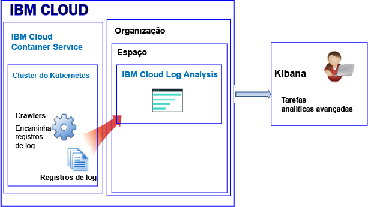
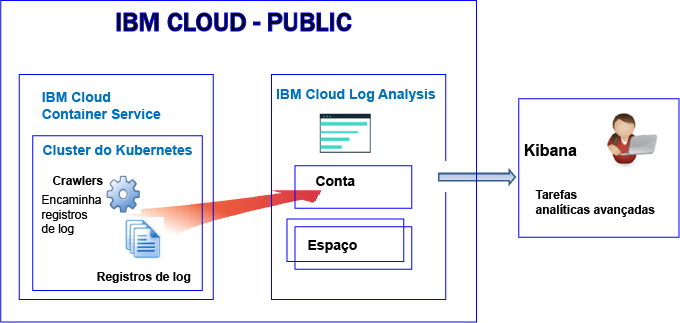
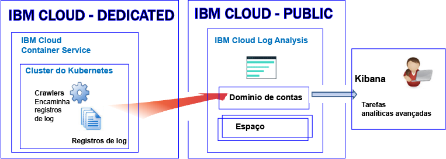

---

copyright:
  years: 2017, 2019

lastupdated: "2019-03-06"

keywords: IBM Cloud, logging

subcollection: cloudloganalysis

---

{:new_window: target="_blank"}
{:shortdesc: .shortdesc}
{:screen: .screen}
{:pre: .pre}
{:table: .aria-labeledby="caption"}
{:codeblock: .codeblock}
{:tip: .tip}
{:download: .download}
{:important: .important}
{:note: .note}


# {{site.data.keyword.containershort_notm}}
{: #containers_kubernetes}

No {{site.data.keyword.Bluemix_notm}}, é possível usar o serviço {{site.data.keyword.loganalysisshort}} para armazenar e analisar logs do contêiner e logs de cluster do Kubernetes que são coletados automaticamente pelo {{site.data.keyword.containershort}} no Public e no Dedicated.
{:shortdesc}

É possível ter 1 ou mais clusters do Kubernetes em uma conta. Os logs são coletados automaticamente pelo {{site.data.keyword.containershort}} assim que o cluster é provisionado. 

* Os logs do aplicativo são coletados assim que o pod é implementado. 
* As informações de que um processo de contêiner é impresso em stdout (saída padrão) e stderr (erro padrão) são coletadas automaticamente pelo {{site.data.keyword.containershort}}.

Para que esses logs fiquem disponíveis para análise no serviço {{site.data.keyword.loganalysisshort}}, deve-se configurar seu cluster para encaminhar logs para o {{site.data.keyword.loganalysisshort}}. É possível encaminhar logs para o domínio de contas do {{site.data.keyword.loganalysisshort}} ou para um domínio de espaço em sua conta. Por padrão:

* Os clusters que estão disponíveis na região Sul dos EUA enviam logs para o serviço {{site.data.keyword.loganalysisshort}} que está disponível na região Sul dos EUA.
* Os clusters que estão disponíveis na região Leste dos EUA enviam logs para o serviço {{site.data.keyword.loganalysisshort}} que está disponível na região Sul dos EUA.
* Os clusters que estão disponíveis na região Alemanha enviam logs para o serviço {{site.data.keyword.loganalysisshort}} que está disponível na região Alemanha.
* Os clusters que estão disponíveis na região Sydney enviam logs para o serviço {{site.data.keyword.loganalysisshort}} que está disponível na região Sydney.
* /Os clusters que estão disponíveis na região Reino Unido enviam logs para o serviço {{site.data.keyword.loganalysisshort}} que está disponível na região Alemanha.

Considere as informações a seguir ao decidir se deseja encaminhar logs para um domínio de espaço ou para o domínio de contas:

* Ao enviar logs para o domínio de contas, a cota de procura é 500 MB por dia e não é possível armazenar logs na Coleção de logs para armazenamento de longo prazo.
* Ao enviar logs para um domínio de espaço, será possível escolher um plano de serviço {{site.data.keyword.loganalysisshort}} que defina a cota de procura por dia e armazenar logs na Coleção de logs para armazenamento de longo prazo.

**Nota:** por padrão, o envio de logs de um cluster para o serviço {{site.data.keyword.loganalysisshort}} não é ativado automaticamente. Para ativar a criação de log, deve-se criar uma ou mais configurações de criação de log no cluster para encaminhar logs automaticamente para o serviço {{site.data.keyword.loganalysisshort}}. É possível ativar a criação de log por meio da linha de comandos usando o comando `ibmcloud cs logging-config-create` ou por meio do painel do cluster disponível na IU do {{site.data.keyword.Bluemix_notm}}. Para obter mais informações, veja [Ativando a coleta automática de logs de cluster](/docs/services/CloudLogAnalysis/containers/containers_kube_other_logs.html#containers_kube_other_logs).

Ao trabalhar com um cluster do Kubernetes, os namespaces *ibm-system* e *kube-system* são reservados. Não crie, exclua, modifique ou mude permissões de recursos que estão disponíveis nesses namespaces. Os logs para esses namespaces são para uso da {{site.data.keyword.IBM_notm}}.


## Logs de encaminhamento para um domínio de espaço
{: #space}

Ao configurar seu cluster para encaminhar os logs de cluster para o {{site.data.keyword.loganalysisshort}}, considere as informações a seguir:

* Deve-se definir uma organização e um espaço do Cloud Foundry nos quais os logs serão encaminhados. 
* A organização e o espaço podem estar disponíveis em qualquer região de nuvem do {{site.data.keyword.IBM_notm}} Public.

**Nota:** para clusters provisionados no **{{site.data.keyword.Bluemix_notm}} Dedicated**, não é possível configurar seu cluster para encaminhar logs de cluster para espaços do Cloud Foundry disponíveis em sua conta dedicada.

Para analisar dados do log no Kibana para um cluster que encaminha logs para um domínio de espaço, considere as informações a seguir:

* Deve-se ativar o Kibana na região do Public na qual a organização e o espaço que estão coletando os logs de cluster estão disponíveis.
* Para aumentar sua cota de procura do Kibana e armazenar logs na Coleção de logs para armazenamento de longo prazo, deve-se provisionar o serviço {{site.data.keyword.loganalysisshort}} no espaço no qual os logs estão sendo encaminhados com um plano que atenda às suas necessidades. 
* Seu ID do usuário deve ter permissões para visualizar logs. Para ver logs no domínio de espaço, um usuário precisa de uma função do CF. **Auditor** é a menor função que pode ser concedida para visualizar logs. Para obter mais informações, veja [Funções que são requeridas por um usuário para visualizar logs](/docs/services/CloudLogAnalysis/kibana/analyzing_logs_Kibana.html#roles).

Para gerenciar dados do log de cluster armazenados no armazenamento de longo prazo (Coleção de logs), seu ID de usuário deve ter uma política do IAM para funcionar com o serviço {{site.data.keyword.loganalysisshort}}. Seu ID de usuário deve ter as permissões **Administrador**, **Operador** ou **Editor**.  Para obter mais informações, veja [Funções que são requeridas por um usuário para gerenciar os logs](/docs/services/CloudLogAnalysis/manage_logs.html#roles1).


A figura a seguir mostra uma visualização de alto nível de criação de log no Public para o {{site.data.keyword.containershort}} quando o cluster encaminha logs para um domínio de espaço:



   

## Logs de encaminhamento para o domínio de contas
{: #acc_public}

Ao configurar seu cluster para encaminhar os logs de cluster para o domínio de contas, considere as informações a seguir:

* **Cluster provisionado no {{site.data.keyword.Bluemix_notm}} Public**: os logs são encaminhados para o domínio de contas na mesma região do {{site.data.keyword.Bluemix_notm}} Public em que o cluster está em execução.
* **Cluster provisionado no {{site.data.keyword.Bluemix_notm}} Dedicated**: os logs são encaminhados para o domínio de contas na mesma região do {{site.data.keyword.Bluemix_notm}} Public em que o cluster Dedicated está em execução.

Para analisar dados do log no Kibana para um cluster que encaminha logs para o domínio de contas, considere as informações a seguir:

* Deve-se ativar o Kibana na região do Public na qual o cluster está enviando logs para o serviço {{site.data.keyword.loganalysisshort}}.

    * Os clusters que estão disponíveis na região Sul dos EUA enviam logs para o serviço {{site.data.keyword.loganalysisshort}} que está disponível na região Sul dos EUA.
    * Os clusters que estão disponíveis na região Leste dos EUA enviam logs para o serviço {{site.data.keyword.loganalysisshort}} que está disponível na região Sul dos EUA.
    * Os clusters que estão disponíveis na região Alemanha enviam logs para o serviço {{site.data.keyword.loganalysisshort}} que está disponível na região Alemanha.
    * Os clusters que estão disponíveis na região Sydney enviam logs para o serviço {{site.data.keyword.loganalysisshort}} que está disponível na região Sydney.
    * /Os clusters que estão disponíveis na região Reino Unido enviam logs para o serviço {{site.data.keyword.loganalysisshort}} que está disponível na região Alemanha.

* Seu ID do usuário deve ter permissões para visualizar logs. Para ver logs no domínio de contas, um usuário precisa de uma política do IAM para o serviço {{site.data.keyword.loganalysisshort}}. O usuário precisa de permissões de **Visualizador**. 


A figura a seguir mostra uma visualização de alto nível de criação de log no Public para o {{site.data.keyword.containershort}} quando o cluster encaminha logs para o domínio de contas:



A figura a seguir mostra uma visualização de alto nível de criação de log no Dedicated para o {{site.data.keyword.containershort}}:




## Configurando um cluster para encaminhar logs para o {{site.data.keyword.loganalysisshort}}
{: #config_forward_logs}

É possível escolher quais logs de cluster encaminhar para o serviço {{site.data.keyword.loganalysisshort}}. 

Para obter mais informações sobre como configurar seu cluster para encaminhar arquivos de log para o serviço {{site.data.keyword.loganalysisshort}}, veja a seção [Ativando a coleta automática de logs de cluster](/docs/services/CloudLogAnalysis/containers/containers_kube_other_logs.html#containers_kube_other_logs).

* Para ativar a coleção de logs automática e encaminhar stdout e stderr, veja [Ativando a coleção de logs automática e encaminhando logs do contêiner](/docs/services/CloudLogAnalysis/containers/containers_kube_other_logs.html#containers).
* Para ativar a coleção automática de logs e o encaminhamento de logs do aplicativo, veja [Ativando a coleção automática de logs e o encaminhamento de logs do aplicativo](/docs/services/CloudLogAnalysis/containers/containers_kube_other_logs.html#apps). 
* Para ativar a coleção automática de logs e o encaminhamento de logs do trabalhador, veja [Ativando a coleção automática de logs e o encaminhamento de logs do trabalhador](/docs/services/CloudLogAnalysis/containers/containers_kube_other_logs.html#workers). 
* Para ativar a coleção automática de logs e o encaminhamento dos logs do componente do sistema do Kubernetes, veja [Ativando a coleção automática de logs e o encaminhamento dos logs do componente do sistema do Kubernetes](/docs/services/CloudLogAnalysis/containers/containers_kube_other_logs.html#system). 
* Para ativar a coleção automática de logs e o encaminhamento dos logs de controlador de ingresso do Kubernetes, veja [Ativando a coleção automática de logs e o encaminhamento dos logs de controlador de ingresso do Kubernetes](/docs/services/CloudLogAnalysis/containers/containers_kube_other_logs.html#controller).


## Configurando o tráfego de rede para configurações de firewall customizado no {{site.data.keyword.Bluemix_notm}}
{: #ports}

Quando você tiver um firewall adicional configurado ou tiver customizado as configurações de firewall na infraestrutura do {{site.data.keyword.Bluemix_notm}} (SoftLayer), será necessário permitir o tráfego de rede de saída do nó do trabalhador para o serviço {{site.data.keyword.loganalysisshort}}. 

Deve-se abrir a porta TCP 443 e a porta TCP 9091 de cada trabalhador para o serviço {{site.data.keyword.loganalysisshort}} para os endereços IP a seguir em seu firewall customizado:

<table>
  <tr>
    <th>Region</th>
    <th>URL de ingestão</th>
	<th>Endereço IP público</th>
  </tr>
  <tr>
    <td>Alemanha</td>
	<td>ingest-eu-fra.logging.bluemix.net</td>
	<td>158.177.88.43 <br>159.122.87.107</td>
  </tr>
  <tr>
    <td></td>
	<td>ingest.logging.eu-gb.bluemix.net</td>
	<td>169.50.115.113</td>
  </tr>
  <tr>
    <td>Sul dos Estados Unidos</td>
	<td>ingest.logging.ng.bluemix.net</td>
	<td>169.48.79.236 <br>169.46.186.113</td>
  </tr>
  <tr>
    <td>Sydney</td>
	<td>ingest-au-syd.logging.bluemix.net</td>
	<td>130.198.76.125 <br>168.1.209.20</td>
  </tr>
</table>


## Redirecionando logs de aplicativo customizado
{: #forward_app_logs}

Para ativar o encaminhamento de log de logs de aplicativo customizado em um cluster para o serviço {{site.data.keyword.loganalysisshort}}, deve-se definir uma configuração de criação de log de cluster com **Origem de log** configurada como **aplicativo**. É possível definir essa configuração usando o comando `ibmcloud cs logging-config-create` ou por meio da IU do cluster.

Ao configurar o cluster para encaminhar logs customizados, é possível especificar uma lista de contêineres em execução em seu cluster dos quais você deseja encaminhar logs customizados e os caminhos nesses contêineres nos quais os logs de arquivo customizado estão localizados.

* Deve-se especificar o parâmetro **app-paths** para configurar a lista de caminhos dos contêineres que você deseja observar. Os logs localizados nesses caminhos são encaminhados para o serviço {{site.data.keyword.loganalysisshort}}. 

    Para configurar esse parâmetro, defina uma lista separada por vírgula de caminhos disponíveis nos contêineres. Os caracteres curinga como '/var/log/* .log' são aceitos.

* Opcionalmente, é possível configurar o parâmetro **app-containers** para especificar a lista de contêineres dos quais coletar e encaminhar logs para o serviço {{site.data.keyword.loganalysisshort}}.

    Para configurar esse parâmetro, defina uma lista separada por vírgula de contêineres.

**Dica:** é possível definir múltiplas configurações de criação de log de cluster com **Origem de log** configurada como **aplicativo** em um cluster. Se os contêineres em um cluster tiverem caminhos diferentes nos quais os logs são hospedados, considere definir uma configuração de criação de log de cluster para cada grupo de contêineres cujos logs estão localizados no mesmo caminho. 


## Origens de log
{: #log_sources}


É possível configurar seu cluster para encaminhar logs para o serviço {{site.data.keyword.loganalysisshort}}. A tabela a seguir lista as diferentes origens de log que podem ser ativadas para encaminhar logs para o serviço {{site.data.keyword.loganalysisshort}}:

<table>
  <caption>Origens de log para um cluster do Kuberenetes</caption>
  <tr>
    <th>Origem do log</th>
	<th>Descrição</th>
	<th>Caminhos de log</th>
  </tr>
  <tr>
    <td>Contêiner</td>
	<td>Logs de contêiner.</td>
	<td>Logs de saída padrão (stdout) e de erro padrão (stderr).</td>
  </tr>
  <tr>
    <td>Aplicativo</td>
	<td>Logs para seu próprio aplicativo que é executado em um cluster do Kubernetes.</td>
	<td>`/var/log/apps/**/*.log`  </br>`/var/log/apps/**/*.err`</br>**NOTA:** em um pod, os logs podem ser gravados em `/var/logs/apps/` ou em qualquer subdiretório sob `/var/logs/apps/`. No trabalhador, deve-se montar `/var/log/apps/` no diretório no pod no qual seu app está gravando logs no pod.</td>
  </tr>
  <tr>
    <td>Trabalhador</td>
	<td>Logs para nós do trabalhador de máquina virtual em um cluster do Kubernetes. </td>
	<td>`/var/log/syslog` </br>`/var/log/auth.log`</td>
  </tr>
  <tr>
    <td>Componente do sistema do Kubernetes</td>
	<td>Logs para o componente do sistema do Kubernetes.</td>
	<td>*/var/log/kubelet.log* </br>*/var/log/kube-proxy.log*</td>
  </tr>
  <tr>
    <td>Controlador de ingresso</td>
	<td>Logs para um controlador de Ingresso que gerencia o tráfego de rede que entra em um cluster do Kubernetes.</td>
	<td>`/var/log/alb/ids/*.log` </br>`/var/log/alb/ids/*.err` </br>`/var/log/alb/customerlogs/*.log` </br>`/var/log/alb/customerlogs/*.err`</td>
  </tr>
</table>

## Procurando logs
{: #log_search}

Por padrão, é possível usar o Kibana para procurar até 500 MB de logs por dia no {{site.data.keyword.Bluemix_notm}}. 

Para procurar por logs maiores, é possível usar o serviço {{site.data.keyword.loganalysisshort}}. O serviço fornece múltiplos planos. Cada plano possui recursos de procura de log diferentes, por exemplo, o plano *Coleção de logs* permite procurar até 1 GB de dados por dia. Para obter mais informações sobre os planos que estão disponíveis, veja [Planos de serviço](/docs/services/CloudLogAnalysis/log_analysis_ov.html#plans).

Ao procurar seus logs, considere os campos a seguir que estão disponíveis no Kibana:

Campos que são comuns a qualquer entrada de log:

<table>
  <caption>Lista de campos comuns</caption>
  <tr>
    <th>Nome do campo</th>
	  <th>Descrição</th>
	  <th>Valor</th>
  </tr>
  <tr>
    <td>ibm-containers.region_str</td>
	  <td>Região na qual o cluster está disponível</td>
	  <td>Por exemplo, `us-south` é o valor para um cluster que está disponível na região Sul dos EUA.</td>
  </tr>
  <tr>
    <td>ibm-containers.account_id_str</td>
	  <td>ID da conta</td>
	  <td></td>
  </tr>
  <tr>
    <td>Ibm-containers.cluster_id_str</td>
	  <td>ID do cluster</td>
	  <td></td>
	</tr>
  <tr>
    <td>ibm-containers.cluster_name_str</td>
	  <td>Nome do cluster</td>
	  <td></td>
  </tr>
</table>

Campos que podem ser úteis ao analisar logs stdout e stderr do contêiner:

<table>
  <caption>Lista de campos para aplicativos</caption>
  <tr>
    <th>Nome do campo</th>
	<th>Descrição</th>
	<th>Valor</th>
  </tr>
  <tr>
    <td>Kubernetes.container_name_str</td>
	<td>Nome do contêiner</td>
	<td></td>
  </tr>
  <tr>
    <td>Kubernetes.namespace_name_str</td>
	<td>O nome do namespace no qual o aplicativo está sendo executado no cluster</td>
	<td></td>
  </tr>
  <tr>
    <td>Stream_str</td>
	<td>Tipo de log</td>
	<td>*stdout* </br>*stderr *</td>
  </tr>
</table>

Campos que podem ser úteis ao analisar logs do trabalhador:

<table>
  <caption>Lista de campos que são relevantes para os trabalhadores</caption>
  <tr>
    <th>Nome do campo</th>
	<th>Descrição</th>
	<th>Valor</th>
  </tr>
  
  <tr>
    <td>filename_str</td>
	<td>Caminho e nome do arquivo</td>
	<td>*/var/log/syslog*  </br>*/var/log/auth.log*</td>
  </tr>
  <tr>
    <td>tag_str</td>
	<td>Tipo de log</td>
	<td>*logfiles.worker.var.log.syslog* </br>*logfiles.worker.var.log.auth.log*</td>
  </tr>
  <tr>
    <td>worker_str</td>
	<td>Nome do trabalhador</td>
	<td>Por exemplo, *w1*</td>
  </tr>
</table>

Campos que podem ser úteis ao analisar logs do componente do sistema do Kubernetes:

<table>
  <caption>Lista de campos que são relevantes para o componente do sistema do Kubernetes</caption>
  <tr>
    <th>Nome do campo</th>
	<th>Descrição</th>
	<th>Valor</th>
  </tr>
  <tr>
    <td>tag_str</td>
	<td>Tipo de log</td>
	<td>*logfiles.kubernetes.var.log.kubelet.log* </br>*logfiles.kubernetes.var.log.kube-proxy.log*</td>
  </tr>
  <tr>
    <td>filename_str</td>
	<td>Caminho e nome do arquivo</td>
	<td>*/var/log/kubelet.log* </br>*/var/log/kube-proxy.log*</td>
  </tr>
 </table>

Campos que podem ser úteis ao analisar logs do controlador de Ingresso:
 
<table>
  <caption>Lista de campos que são relevantes para o controlador de Ingresso</caption>
  <tr>
    <th>Nome do campo</th>
	<th>Descrição</th>
	<th>Valor</th>
  </tr>
 <tr>
    <td>tag_str</td>
	<td>Tipo de log</td>
	<td></td>
  </tr>
  <tr>
    <td>filename_str</td>
	<td>Caminho e nome do arquivo</td>
	<td>*/var/log/alb/ids/*.log* </br>*/var/log/alb/ids/*.err* </br>*/var/log/alb/customerlogs/*.log* </br>*/var/log/alb/customerlogs/*.err*</td>
  </tr>
</table>


## Enviando logs para que seja possível usar os campos em uma mensagem como campos de procura do Kibana
{: #send_data_in_json}

Por padrão, a criação de log é ativada automaticamente para os contêineres. Cada entrada no arquivo de log de tempo de execução do contêiner é exibida no Kibana no campo **mensagem**. Se você precisar filtrar e analisar seus dados no Kibana usando um campo específico que faça parte da entrada de log do contêiner, configure seu aplicativo para enviar uma saída formatada em JSON válida. Por exemplo, registre a mensagem no formato JSON para stdout (saída padrão) e stderr (erro padrão).

Cada campo que está disponível na mensagem é analisado para o tipo de campo que corresponde a seu valor. Por exemplo, cada campo na mensagem JSON a seguir:
    
```
{"field1":"string type",
        "field2":123,
        "field3":false,
        "field4":"4567"
    }
```
{: codeblock}
    
está disponível como um campo que pode ser usado para filtragem e procuras:
    
* `field1` é analisado como `field1_str` do tipo sequência.
* `field2` é analisado como `field1_int` do tipo número inteiro.
* `field3` é analisado como `field3_bool` do tipo booleano.
* `field4` é analisado como `field4_str` do tipo sequência.
    


## Segurança
{: #security}


Para encaminhar logs de cluster para o {{site.data.keyword.loganalysisshort}}, deve-se conceder permissões do {{site.data.keyword.Bluemix_notm}} para o proprietário da chave do {{site.data.keyword.containershort}} e para o ID do usuário que está configurando as configurações de cluster de criação de log.

O ID do usuário que configura as configurações de cluster de criação de log deve ter as permissões a seguir:

* Política IAM para o {{site.data.keyword.containershort}} com permissões de **Visualizador**.
* Política IAM para a instância de cluster com permissões de **Administrador** ou **Operador**.

Para que um cluster encaminhe logs para um **domínio de espaço** do {{site.data.keyword.loganalysisshort}}, as permissões a seguir são necessárias para o proprietário da chave do {{site.data.keyword.containershort}}:

* Política IAM para o {{site.data.keyword.containershort}} com a função de **Administrador**.
* Política IAM para o serviço {{site.data.keyword.loganalysisshort}} com a função de **Administrador**.
* A função **orgManager** do Cloud Foundry (CF) para a organização em que o espaço está disponível.
* A função **SpaceManager** ou **Developer** do CF para o espaço no qual os logs são encaminhados do cluster.


Para que um cluster encaminhe logs para o **domínio de contas** do {{site.data.keyword.loganalysisshort}}, as permissões a seguir são necessárias para o proprietário da chave do {{site.data.keyword.containershort}}:

* Política IAM para o {{site.data.keyword.containershort}} com a função de **Administrador**.
* Política IAM para o serviço {{site.data.keyword.loganalysisshort}} com a função de **Administrador**.


## Armazenando logs em Coleção de logs
{: #log_collection1}

Considere as informações a seguir sobre o comportamento padrão no {{site.data.keyword.Bluemix_notm}} ao trabalhar com logs:

* O {{site.data.keyword.Bluemix_notm}} armazena dados do log por até 3 dias.
* Um máximo de 500 MB de dados é armazenado por dia. Qualquer log além desse valor máximo de 500 MB é descartado. As dotações de limite são reconfiguradas diariamente às 0h30 UTC.
* Até 1,5 GB de dados podem ser procurados por um máximo de 3 dias. Os dados do log são substituídos (Primeiro a entrar, Primeiro a sair) depois de atingir 1,5 GB de dados ou depois de 3 dias.
* Os logs não são armazenados na Coleção de logs para armazenamento de longo prazo.

O serviço {{site.data.keyword.loganalysisshort}} fornece planos adicionais que permitem armazenar logs na Coleção de logs o tempo que for necessário. Para obter mais informações sobre o preço de cada plano, veja [Planos de serviços](/docs/services/CloudLogAnalysis/log_analysis_ov.html#plans). 

Para gerenciar logs na Coleção de logs, considere as informações a seguir:

* É possível configurar uma política de retenção de log que possa ser usada para definir o número de dias que você deseja manter os logs na Coleção de logs. Para obter mais informações, veja [Política de retenção de log](/docs/services/CloudLogAnalysis/manage_logs.html#log_retention_policy).
* É possível excluir logs manualmente usando a CLI ou a API da Coleção de logs. 
* Para gerenciar logs na coleção de logs, um usuário precisa de uma política do IAM com permissões para trabalhar com o serviço {{site.data.keyword.loganalysisshort}} no {{site.data.keyword.Bluemix_notm}}. Para obter mais informações, veja [Funções do IAM](/docs/services/CloudLogAnalysis/security_ov.html#iam_roles).

## Visualizando e analisando logs
{: #logging_containers_ov_methods}

Para analisar dados do log, use o Kibana para executar tarefas analíticas avançadas. O Kibana é uma plataforma de software livre de visualização e analítica, que pode ser usada para monitorar, procurar, analisar e visualizar seus dados em uma variedade de gráficos, por exemplo, diagramas e tabelas. Para obter mais informações, veja [Analisando logs no Kibana](/docs/services/CloudLogAnalysis/kibana/analyzing_logs_Kibana.html#analyzing_logs_Kibana).

* É possível ativar o Kibana diretamente de um navegador da web. Para obter mais informações, veja [Navegando para o Kibana por meio de um navegador da web](/docs/services/CloudLogAnalysis/kibana/launch.html#launch_Kibana_from_browser).
* É possível ativar o Kibana por meio da UI do [{{site.data.keyword.Bluemix_notm}} dentro do contexto de um cluster. Para obter mais informações, veja [Navegando para o Kibana por meio do painel de um contêiner que é implementado em um cluster do Kubernetes](/docs/services/CloudLogAnalysis/kibana/launch.html#launch_Kibana_for_containers_kube).

Se você encaminhar os dados do log de um app executado em um contêiner para o coletor do log de tempo de execução do contêiner no formato JSON, será possível procurar e analisar os dados do log no Kibana usando campos JSON. Para obter mais informações, veja [Enviando logs para que seja possível usar os campos em uma mensagem como campos de procura do Kibana](/docs/services/CloudLogAnalysis/containers/containers_kubernetes.html#send_data_in_json).

Para visualizar logs no Kibana, considere as informações a seguir:

* Para ver logs em um domínio de espaço, o usuário deve ter a função de **auditor** ou a função de **desenvolvedor** no espaço associado ao cluster.
* Para ver logs no domínio de contas, o usuário deve ter uma política do IAM para trabalhar com o serviço {{site.data.keyword.loganalysisshort}}. A função mínima que permite visualizar entradas de log é **Visualizador**.


## Tutorial: analisar logs no Kibana para um app que é implementado em um cluster do Kubernetes
{: #tutorial1}

Para saber como usar o Kibana para analisar os logs de um contêiner implementado em um cluster do Kubernetes, veja [Analisar logs no Kibana para um app implementado em um cluster do Kubernetes](/docs/services/CloudLogAnalysis/tutorials/container_logs.html#container_logs).
