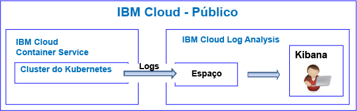
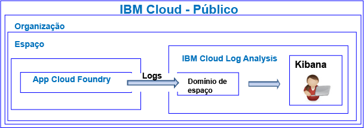

---

copyright:
  years: 2017, 2019

lastupdated: "2019-03-06"

keywords: IBM Cloud, logging

subcollection: cloudloganalysis

---

{:new_window: target="_blank"}
{:shortdesc: .shortdesc}
{:screen: .screen}
{:pre: .pre}
{:table: .aria-labeledby="caption"}
{:codeblock: .codeblock}
{:tip: .tip}
{:download: .download}
{:important: .important}
{:note: .note}

# Tutorial de introdução
{: #getting-started-with-cla}

Use este tutorial para saber como começar a trabalhar com o serviço {{site.data.keyword.loganalysislong}} no {{site.data.keyword.Bluemix}}. 
{:shortdesc}

Por padrão, o {{site.data.keyword.Bluemix_notm}} oferece recursos integrados de criação de log para serviços selecionados. É possível usar o serviço {{site.data.keyword.loganalysisshort}} para expandir seus recursos de coleta e retenção ao trabalhar com logs.

## Antes de iniciar
{: #prereqs}

Deve-se ter um ID de usuário que seja membro ou proprietário de uma conta do {{site.data.keyword.Bluemix_notm}}. Para obter um ID de usuário do {{site.data.keyword.Bluemix_notm}}, acesse: [Registro ](https://console.bluemix.net/registration/){:new_window}

## Etapa 1: Escolha um recurso em nuvem para o qual você deseja ver os logs
{: #step1}

No {{site.data.keyword.Bluemix_notm}}, aplicativos CF, os contêineres executados no {{site.data.keyword.containershort}} e os serviços selecionados coletam dados do log automaticamente e os encaminham para o serviço {{site.data.keyword.loganalysisshort}}.

A tabela a seguir lista os diferentes recursos em nuvem. Conclua o tutorial para que um recurso comece a trabalhar com o serviço {{site.data.keyword.loganalysisshort}}:

<table>
  <caption>Tutoriais para começar a trabalhar com o serviço {{site.data.keyword.loganalysisshort}} </caption>
  <tr>
    <th>Recursos</th>
    <th>Tutorial</th>
    <th>Ambiente de nuvem</th>
    <th>Cenário</th>
  </tr>
  <tr>
    <td>Os contêineres em execução no {{site.data.keyword.containershort}}</td>
    <td>[Analisar logs no Kibana para um app que é implementado em um cluster do Kubernetes](/docs/services/CloudLogAnalysis/tutorials?topic=cloudloganalysis-container_logs#container_logs)</td>
    <td>Público </br>Dedicado</td>
    <td></td>
  </tr>
  <tr>
    <td>Apps CF</td>
    <td>[Analisar logs no Kibana para um app Cloud Foundry](https://console.bluemix.net/docs/tutorials/application-log-analysis.html#generate-access-and-analyze-application-logs)</td>
    <td>Público</td>
    <td></td>
  </tr>
</table>


## Etapa 2: Configurar permissões para um usuário visualizar logs
{: #step24}

Para controlar as ações do {{site.data.keyword.loganalysisshort}} que um usuário tem permissão para executar, é possível designar funções e políticas para um usuário. 

Há dois tipos de permissões de segurança no {{site.data.keyword.Bluemix_notm}} que controlam as ações que os usuários podem executar ao trabalharem com o serviço {{site.data.keyword.loganalysisshort}}:

* Funções do Cloud Foundry (CF): você concede a um usuário uma função do CF para definir as permissões que o usuário tem para visualizar logs em um espaço.
* Funções do IAM: você concede a um usuário uma política do IAM para definir as permissões que o usuário tem para visualizar logs no domínio de contas.

### Configure permissões para um usuário visualizar logs em um domínio de espaço.
{: #step42a}

Conclua as etapas a seguir para conceder a um usuário permissões para visualizar logs em um espaço:

1. Efetue login no console do {{site.data.keyword.Bluemix_notm}}.

    Abra um navegador da web e ative o painel do {{site.data.keyword.Bluemix_notm}}: [http://bluemix.net ](http://bluemix.net){:new_window}
	
	Depois de efetuar login com seu ID de usuário e senha, a UI do {{site.data.keyword.Bluemix_notm}} é aberta.

2. Na barra de menus, clique em **Gerenciar > Conta > Usuários**. 

    A janela *Usuários* exibe uma lista de usuários com seus endereços de e-mail para a conta selecionada atualmente.
	
3. Se o usuário é um membro da conta, selecione o nome do usuário na lista ou clique em **Gerenciar usuário** no menu *Ações*.

    Se o usuário não é um membro da conta, veja [Convidando usuários](/docs/iam?topic=iam-iamuserinv#iamuserinv).

4. Selecione **Acesso do Cloud Foundry** e, em seguida, selecione a organização.

    Os espaços disponíveis nessa organização estão listados.

5. Escolha o espaço no qual você provisionou o serviço {{site.data.keyword.loganalysisshort}}. Em seguida, na ação de menu, selecione **Editar função de espaço**.

6. Selecione *Auditor*. 

    É possível selecionar 1 ou mais funções de espaço. Todas as funções a seguir permitem que um usuário visualize logs: *Gerenciador*, *Desenvolvedor* e *Auditor*
	
7. Clique em **Salvar função**.


### Configure permissões para um usuário visualizar logs em um domínio de contas.
{: #step24b}


Conclua as etapas a seguir para conceder a um usuário permissões para visualizar logs de conta:

1. Efetue login no console do {{site.data.keyword.Bluemix_notm}}.

    Abra um navegador da web e ative o painel do {{site.data.keyword.Bluemix_notm}}: [http://bluemix.net ](http://bluemix.net){:new_window}
	
	Depois de efetuar login com seu ID de usuário e senha, a UI do {{site.data.keyword.Bluemix_notm}} é aberta.

2. Na barra de menus, clique em **Gerenciar > Conta > Usuários**. 

    A janela *Usuários* exibe uma lista de usuários com seus endereços de e-mail para a conta selecionada atualmente.
	
3. Se o usuário é um membro da conta, selecione o nome do usuário na lista ou clique em **Gerenciar usuário** no menu *Ações*.

    Se o usuário não é um membro da conta, veja [Convidando usuários](/docs/iam?topic=iam-iamuserinv#iamuserinv).

4. Na seção **Políticas de acesso**, clique em **Designar acesso** e, em seguida, selecione **Designar acesso aos recursos**.

    A janela *Designar acesso a recursos ao usuário** é aberta.

5. Insira informações sobre a política. A tabela a seguir lista os campos que são necessários para definir uma política: 

    <table>
	  <caption>Lista de campos para configurar uma política do IAM.</caption>
	  <tr>
	    <th>Campo</th>
		<th>Valor</th>
	  </tr>
	  <tr>
	    <td>Serviços</td>
		<td>*IBM Cloud Log Analysis*</td>
	  </tr>	  
	  <tr>
	    <td>Regiões</td>
		<td>É possível especificar as regiões nas quais o acesso será concedido ao usuário para trabalhar com logs. Selecione uma ou mais regiões individualmente ou selecione **Todas as regiões atuais** para conceder acesso a todas as regiões.</td>
	  </tr>
	  <tr>
	    <td>Instância de serviço</td>
		<td>Selecione *Todas as instâncias de serviço*.</td>
	  </tr>
	  <tr>
	    <td>Funções</td>
		<td>Selecione uma ou mais funções do IAM. <br>As funções válidas são: *administrador*, *operador*, *editor* e *visualizador*. <br>Para obter mais informações sobre as ações que são permitidas por função, veja [Funções do IAM](/docs/services/CloudLogAnalysis?topic=cloudloganalysis-security_ov#iam_roles).
		</td>
	  </tr>
     </table>
	
6. Clique em **Designar**.
	
A política que você configura é aplicável às regiões selecionadas. 


## Etapas Seguintes 
{: #next_steps}

**Nota:** um usuário deve acessar o Kibana na região pública da nuvem em que os dados do log estão disponíveis para visualizar e analisar os dados do log. 

Por exemplo, para ativar o Kibana na região sul dos EUA, abra um navegador da web e insira a URL a seguir:

```
Https://logging.ng.bluemix.net/ 
```
{: codeblock}


Para obter mais informações sobre como ativar o Kibana em outras regiões, veja [Navegando para o Kibana por meio de um navegador da web](/docs/services/CloudLogAnalysis/kibana?topic=cloudloganalysis-launch#launch_Kibana_from_browser).

**Nota:** ao ativar o Kibana, se você receber uma mensagem que indica *token de acesso não válido*, verifique suas permissões na conta. Essa mensagem é uma indicação de que seu ID de usuário não tem permissões para ver logs.

A seguir, customize o Kibana para visualizar e analisar seus dados do log. Para obter mais informações, veja [Visualizando e analisando logs](/docs/services/CloudLogAnalysis/kibana?topic=cloudloganalysis-analyzing_logs_Kibana#analyzing_logs_Kibana)
    


