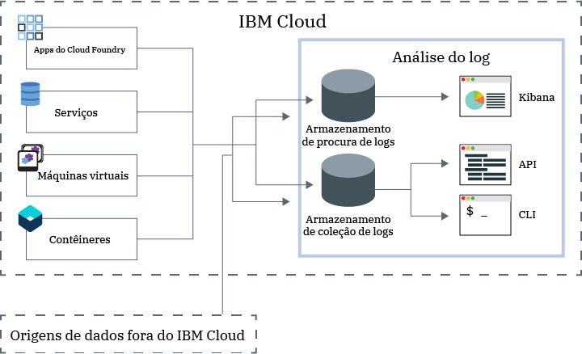

---

copyright:
  years: 2017, 2019

lastupdated: "2019-03-06"

keywords: IBM Cloud, logging

subcollection: cloudloganalysis

---

{:new_window: target="_blank"}
{:shortdesc: .shortdesc}
{:screen: .screen}
{:pre: .pre}
{:table: .aria-labeledby="caption"}
{:codeblock: .codeblock}
{:tip: .tip}
{:download: .download}
{:important: .important}
{:note: .note}

# IBM Cloud Log Analysis
{: #log_analysis_ov}

Use o serviço {{site.data.keyword.loganalysisfull}} para expandir sua capacidade de coleção de logs, retenção de log e procura de log no {{site.data.keyword.Bluemix}}. Confira poderes à equipe do DevOps com recursos, como agregação de logs de aplicativo e de ambiente para insights consolidados de aplicativo ou ambiente, criptografia de logs, retenção de dados do log durante o tempo que for necessário e detecção e resolução rápida de problemas. Use o Kibana para tarefas de análise avançadas.
{:shortdesc}

Os recursos de criação de log do {{site.data.keyword.Bluemix_notm}} são integrados na plataforma:

* A coleção de dados é ativada automaticamente para recursos em nuvem. O {{site.data.keyword.Bluemix_notm}}, por padrão, coleta e exibe os logs para seus apps, tempos de execução de apps e tempos de execução de cálculo nos quais esses apps são executados. 
* É possível procurar até 500 MB de logs por dia. 
* Os logs dos últimos 3 dias são armazenados na Procura de log, um componente do serviço {{site.data.keyword.loganalysisshort}}.

É possível usar os recursos de criação de log no {{site.data.keyword.Bluemix_notm}} para entender o comportamento da plataforma de nuvem e os recursos que estão em execução nela. Nenhuma instrumentação especial é necessária para coletar os logs de saída padrão e erro padrão. Por exemplo, é possível usar logs para fornecer uma trilha de auditoria para um aplicativo, detectar problemas no serviço, identificar vulnerabilidades, solucionar problemas de implementações de app e de comportamento de tempo de execução, detectar problemas na infraestrutura na qual o app está em execução, rastrear o app entre os componentes na plataforma de nuvem e detectar padrões que podem ser usados para priorizar ações que possam afetar o SLA de serviço.

O serviço {{site.data.keyword.loganalysisfull}} fornece serviços de coleção de logs e de procura de log para a plataforma do {{site.data.keyword.Bluemix_notm}}, coletando dados dos aplicativos e dos serviços do {{site.data.keyword.Bluemix_notm}} automaticamente de serviços selecionados do {{site.data.keyword.Bluemix_notm}}.

A figura a seguir mostra uma visualização de alto nível do serviço {{site.data.keyword.loganalysisshort}}: 

Para coletar e procurar logs de recursos em nuvem que são executados em um espaço, deve-se provisionar uma instância do serviço {{site.data.keyword.loganalysisshort}} no mesmo espaço em que esses recursos em nuvem estão em execução. Os logs são coletados e armazenados em Procura de log, por padrão. Ao selecionar um plano de serviço que inclua os recursos de procura e coleta estendidas, os logs também são coletados e armazenados no componente de Coleção de logs. Os dados do log armazenados na Coleção de logs são criptografados.

Por padrão, o {{site.data.keyword.Bluemix_notm}} armazena dados do log por até 3 dias em Procura de log:   

* Um máximo de 500 MB por espaço de dados é armazenado por dia. Qualquer log além desse valor máximo de 500 MB é descartado. As dotações de limite são reconfiguradas diariamente às 0h30 UTC.
* Até 1,5 GB de dados podem ser procurados por um máximo de 3 dias. Os dados do log são substituídos (Primeiro a entrar, Primeiro a sair) depois de atingir 1,5 GB de dados ou depois de 3 dias.

O serviço {{site.data.keyword.loganalysisshort}} fornece planos adicionais que permitem armazenar logs na Coleção de logs o tempo que for necessário. O tamanho de log que pode ser coletado e armazenado na Coleção de logs é determinado pelo plano de serviço escolhido. Você paga por GB de dados por mês para os dados armazenados. Os logs são armazenados na Coleção de logs como JSON.

É possível usar o Kibana 5.1 para tarefas de análise de procura de log avançadas:

* Cada plano limita o tamanho de log que pode ser procurado por dia. 
* As procuras só cobrem os dados dos últimos 3 dias.

Para acessar logs com mais de 3 dias, é possível usar a CLI ou a API da Coleção de logs para fazer download de logs localmente ou canalizar logs para outros aplicativos ou serviços de nuvem de terceiros. 

É possível excluir logs automaticamente configurando uma política de retenção ou manualmente usando a CLI do {{site.data.keyword.loganalysisshort}}.

## Por que usar o serviço Log Analysis
{: #value}

1. **Gaste menos tempo instrumentando seu aplicativo e mais tempo aprimorando seu valor**

    O {{site.data.keyword.loganalysislong_notm}} coleta dados automaticamente de serviços selecionados do {{site.data.keyword.Bluemix_notm}}, sem a necessidade de instrumentação.
	
	É possível escolher a quantia de logs que podem ser procurados por dia.  Estão disponíveis planos diferentes que podem ser usados para procurar até 500 MB, 2 GB, 5 GB e 10 GB de logs por dia.

2. **Mantenha seus dados de log próximos das cargas de trabalho do aplicativo e protegidos nas soluções econômicas de armazenamento da classe de nuvem**

    Colete e armazene dados do log dos aplicativos tradicionais e orientados a microsserviço em execução no {{site.data.keyword.Bluemix_notm}} em um log centralizado. Retenha dados do log por quanto tempo você precisar.
	
	Os logs são armazenados no armazenamento do {{site.data.keyword.IBM_notm}} Cloud. Será possível fazer download de logs quando eles forem necessários.

3. **Obtenha insights em seu ambiente para detectar, diagnosticar e identificar problemas rapidamente**

    Visualize, analise e interaja com seus dados por meio de painéis customizáveis. Construídos com base na plataforma Elastic Stack, os recursos de procura de log oferecem a flexibilidade e a familiaridade do Kibana para construir rapidamente seu painel de acordo com as necessidades do seu aplicativo.

4. **Robusto integração com APIs**

    Integre os dados do log nos aplicativos e nas operações por meio de APIs do serviço. Use as APIs do serviço {{site.data.keyword.loganalysisshort}} para gerenciar seus logs retidos e enviar dados de log de fora do {{site.data.keyword.IBM_notm}} Cloud.

## Regiões
{: #regions}

O serviço {{site.data.keyword.loganalysisfull_notm}} está disponível nas regiões a seguir:

* Alemanha
* 
* Sul dos Estados Unidos
* Sydney

## Localidade de dados
{: #data_location}

A tabela a seguir lista o local de logs por região:

<table>
  <caption>Local de logs por região</caption>
  <tr>
    <th>Region</th>
	<th>Logs de procura de log</th>
	<th>Logs de coleção de logs</th>
  </tr>
  <tr>
    <td>Alemanha</td>
	  <td>Hospedado na Alemanha</td>
	  <td>Hospedado na Alemanha</td>
  </tr>
  <tr>
    <td></td>
	  <td>Hospedado no Reino Unido</td>
	  <td>Hospedado no Reino Unido</td>
  </tr>
  <tr>
    <td>Sul dos Estados Unidos</td>
	  <td>Hospedado no Sul dos EUA</td>
	  <td>Hospedado no Sul dos EUA</td>
  </tr>
  <tr>
    <td>Sydney</td>
	  <td>Hospedado em Sydney</td>
	  <td>Hospedado no Sul dos EUA (*)</td>
  </tr>
</table>

(*) Para Sydney, os logs de Coleção de logs são hospedados em Sul dos EUA atualmente. A localidade de dados de logs de Coleção de logs em Sydney está no plano.

## Planos de serviço
{: #plans}

O serviço {{site.data.keyword.loganalysisshort}} fornece múltiplos planos. Cada plano tem recursos diferentes de coleção de logs e de procura de log. 

**NOTA:** os recursos que estão incluídos em um plano de serviço são ativados somente no espaço em que você provisiona o serviço {{site.data.keyword.loganalysisshort}} com esse plano.

É possível mudar um plano por meio da UI do {{site.data.keyword.Bluemix_notm}} ou da linha de comandos. É possível fazer upgrade ou reduzir seu plano a qualquer momento. Para obter mais informações sobre upgrades de plano de serviço, veja [Mudando o plano](/docs/services/CloudLogAnalysis/how-to?topic=cloudloganalysis-change_plan#change_plan). 

A tabela a seguir descreve os planos disponíveis:

<table>
    <caption>Resumo dos recursos de Procura de log e Coleção de logs por plano</caption>
      <tr>
        <th>Planejar</th>
        <th>Ingestão de Log</th>
        <th>Retenção do Log</th>
        <th>Criptografia de Dados</th>
        <th>Procura de Log</th>
      </tr>
      <tr>
        <td>Lite (padrão)</td>
        <td>Não</td>
        <td>Últimos 3 dias</td>
        <td>Não</td>
        <td>Procurar até 500 MB</td>
      </tr>
      <tr>
        <td>Coleta de Log</td>
        <td>Sim</td>
        <td>O número configurável de dias.</td>
        <td>Sim</td>
        <td>Procurar até 500 MB por dia</td>
      </tr>
      <tr>
        <td>Coleta de Log com 2GB/Day Search</td>
        <td>Sim</td>
        <td>O número configurável de dias.</td>
        <td>Sim</td>
        <td>Procurar até 2 GB por dia</td>
      </tr>
      <tr>
        <td>Coleta de Log com 5GB/Day Search</td>
        <td>Sim</td>
        <td>O número configurável de dias.</td>
        <td>Sim</td>
        <td>Procurar até 5 GB por dia</td>
      </tr>
       <tr>
        <td>Coleta de Log com 10GB/Day Search</td>
        <td>Sim</td>
        <td>O número configurável de dias.</td>
        <td>Sim</td>
        <td>Procurar até 10 GB por dia</td>
      </tr>
</table>

**Nota:** o custo mensal do armazenamento de Coleção de logs é calculado como uma média do ciclo de faturamento.

