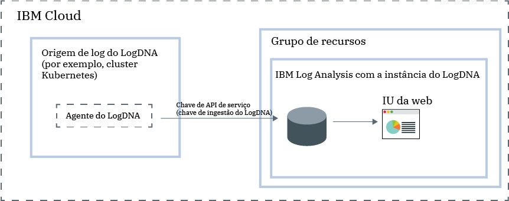

---

copyright:
  years:  2018, 2019
lastupdated: "2019-03-23"

keywords: LogDNA, IBM, Log Analysis, logging, overview

subcollection: LogDNA

---

{:new_window: target="_blank"}
{:shortdesc: .shortdesc}
{:screen: .screen}
{:pre: .pre}
{:table: .aria-labeledby="caption"}
{:codeblock: .codeblock}
{:tip: .tip}
{:download: .download}
{:important: .important}
{:note: .note}

# Sobre o {{site.data.keyword.la_full_notm}}
{: #about}

O {{site.data.keyword.la_full}} é um serviço de terceiro que pode ser incluído como parte da arquitetura do seu {{site.data.keyword.cloud_notm}} para incluir recursos de gerenciamento de log. O {{site.data.keyword.la_full_notm}} é operado por LogDNA em parceria com o {{site.data.keyword.IBM_notm}}.
{:shortdesc}

É possível usar o {{site.data.keyword.la_full_notm}} para gerenciar logs do sistema e do aplicativo no {{site.data.keyword.cloud_notm}}.

O {{site.data.keyword.la_full_notm}} oferece administradores, equipes do DevOps e recursos avançados de desenvolvedores para filtrar, procurar e seguir dados do log, definir alertas e projetar visualizações customizadas para monitorar logs do aplicativo e do sistema.

## Visão geral
{: #ov}

Para incluir recursos de criação de log com LogDNA no {{site.data.keyword.cloud_notm}}, deve-se fornecer uma instância do {{site.data.keyword.la_full_notm}}.

Antes de fornecer uma instância do {{site.data.keyword.la_full_notm}}, considere as informações a seguir:
* Os dados do log são hospedados no  {{site.data.keyword.cloud_notm}}.
* Os dados do log são enviados para um terceiro.
* Seus usuários devem ter permissões de plataforma para criar, visualizar e excluir uma instância de um serviço no {{site.data.keyword.cloud_notm}}.
* Seus usuários devem ter permissões de plataforma para criar recursos dentro do contexto do grupo de recursos no qual você planeja fornecer a instância de LogDNA.

Forneça uma instância do {{site.data.keyword.la_full_notm}} dentro do contexto de um grupo de recursos. Organize seus serviços para propósitos de controle de acesso e faturamento usando grupos de recursos. É possível fornecer a instância no grupo de recursos *padrão* ou em um grupo de recursos customizados.

Após provisionar uma instância do {{site.data.keyword.la_full_notm}}, uma conta será criada no LogDNA, e você receberá a chave de ingestão para sua conta.

Em seguida, deve-se configurar um agente LogDNA para cada origem de log. Uma origem de log é um recurso no local ou do Cloud que gera logs. Por exemplo, uma origem de log pode ser um cluster Kubernetes. Use a chave de ingestão para configurar o agente LogDNA que é responsável por coletar e encaminhar logs para a sua instância do {{site.data.keyword.la_full_notm}}.

Depois que o agente LogDNA é implementado em uma origem de log, a coleta e o encaminhamento de logs para a instância do {{site.data.keyword.la_full_notm}} são automáticos.

É possível ativar a IU da web do {{site.data.keyword.la_full_notm}} para visualizar, monitorar e gerenciar seus logs.

A figura a seguir mostra a visão geral dos componentes para o serviço {{site.data.keyword.la_full_notm}} que está em execução no {{site.data.keyword.cloud_notm}}:

## Dados do Log
{: #overview_data}

O {{site.data.keyword.la_full_notm}} coleta e agrega logs em um sistema de criação de log centralizado.

* Os dados do log são hospedados no  {{site.data.keyword.cloud_notm}}.
* Os dados são colocados na região em que a instância do {{site.data.keyword.la_full_notm}} é fornecida. Por exemplo, os dados do log para uma instância fornecida no Sul dos EUA são hospedados na região Sul dos EUA.

O plano de serviço que você escolhe para uma instância do {{site.data.keyword.la_full_notm}} define o número de dias em que os dados são armazenados e retidos no LogDNA. Por exemplo, se você escolher o plano *Grátis*, os dados não serão armazenados. No entanto, se você escolher o plano de 7 dias, os dados serão armazenados por 7 dias e você terá acesso a eles por meio da IU da web do LogDNA.

Quando você exclui uma instância do {{site.data.keyword.la_full_notm}} por meio do {{site.data.keyword.cloud_notm}}, todos os dados são excluídos.

## Recursos
{: #overview_features}

**Logs de resolução de problemas em tempo real para diagnosticar e identificar problemas.**

Ao usar o recurso *seguimento de fluxo em tempo real*, os desenvolvedores e as equipes do DevOps podem diagnosticar problemas, analisar rastreios e exceções de pilha, identificar a origem de erros e monitorar origens de log diferentes por meio de uma única visualização.  Esse recurso está disponível por meio da linha de comandos e da interface da web. 

**Emita alertas para ser notificado de ações importantes.**
 
Para agir rapidamente nos eventos de aplicativo e de serviços que você identifica como críticos ou avisos, as equipes do DevOps podem configurar integrações de notificação de alerta para os sistemas a seguir: email, Slack, HipChat, webHook, PagerDuty e OpsGenie.

**Exportar logs para um arquivo local para análise ou para um serviço de archive para atender aos requisitos de auditoria.**

Exportar linhas de log específicas para uma cópia local ou logs de archive do {{site.data.keyword.la_full_notm}} para o IBM Cloud Object Storage.
As linhas de log são exportadas no formato de linha JSON. Logs são arquivados no formato JSON e preservam os metadados associados a cada linha. 

**Controle os custos de infraestrutura de criação de log customizando quais logs gerenciar por meio do {{site.data.keyword.la_full_notm}}.**

Controle o custo de sua infraestrutura de criação de log no IBM Cloud, configurando as origens de log para as quais você deseja coletar e gerenciar logs. 

## Planos de precificação
{: #overview_pricing_plans}

É possível escolher diferentes planos de precificação disponíveis para uma instância do {{site.data.keyword.la_full_notm}}. Cada plano define o número de dias que os dados são retidos para procura, o número de usuários com permissão para gerenciar os dados e os recursos de LogDNA que são ativados.

| Plano                     | 
|--------------------------|
| `30 days log search`  |
| `14 days log search`  |
| `7-day log search`   |
| `Lite`                  |
{: caption="Tabela 1. Lista de planos de serviços" caption-side="top"} 

O {{site.data.keyword.la_full_notm}} oferece um plano `Lite` que pode ser usado para visualizar seus logs à medida que eles passam pelo sistema. É possível visualizar logs usando o registro de log mais recente. Também é possível projetar filtros para se preparar para fazer upgrade para um plano de período de retenção mais longo. Esse plano tem um período de retenção de 0 dias.

As tabelas a seguir destacam os diferentes recursos que são incluídos em cada plano de serviço:

| Recurso                          | Plano `30 day log search` | Plano `14 days log search`    | Plano `7 days log search     | Plano `Lite` | 
|----------------------------------|-------------------------|-------------------------------|-----------------------------|--------------|
| `Logs are stored and searchable` | Sim-por 30 dias       | Sim-por 14 dias             | Sim-por 7 dias            | Não           |
| `Live streaming tail`            | Sim                     | Sim                           | Sim                         | Sim          |
| `Archiving`                      | Sim                     | Sim                           | Sim                         | Não           |
| `Multi-channel Alerting`         | Sim                     | Sim                           | Sim                         | Não           | 
{: caption="Tabela 2. Lista de recursos disponíveis para cada plano de serviço" caption-side="top"} 

## Regiões
{: #overview_regions}

A criação de log com o {{site.data.keyword.la_full_notm}} está disponível nas regiões a seguir:

| Região                | Localização  |
|-----------------------|-----------|
| **US South**          | Dallas    |
| **DE-UE**             | Frankfurt | 
{: caption="Tabela 3. Lista de regiões em que o serviço está disponível" caption-side="top"} 

Atualmente, a localização **Frankfurt** **não** é gerenciada pela UE. Para obter mais informações, consulte [Ativando a configuração Suporte à UE](/docs/account?topic=account-eu-hipaa-supported#bill_eusupported).
{: important}

