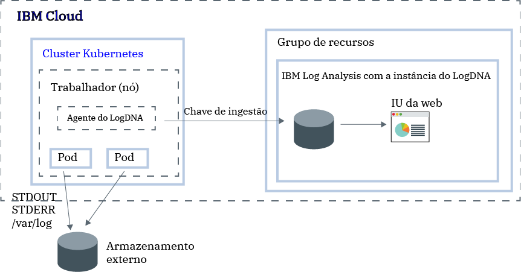

---

copyright:
  years:  2018, 2019
lastupdated: "2019-05-01"

keywords: LogDNA, IBM, Log Analysis, logging, kubernetes, tutorial

subcollection: LogDNA

---

{:new_window: target="_blank"}
{:shortdesc: .shortdesc}
{:screen: .screen}
{:pre: .pre}
{:table: .aria-labeledby="caption"}
{:codeblock: .codeblock}
{:tip: .tip}
{:download: .download}
{:important: .important}
{:note: .note}


# Gerenciando logs de cluster do Kubernetes com o  {{site.data.keyword.la_full_notm}}
{: #kube}

Use o serviço {{site.data.keyword.la_full_notm}} para configurar a criação de log no nível do cluster no {{site.data.keyword.containerlong}}. 
{:shortdesc}

Desde o momento em que você fornece um cluster com o {{site.data.keyword.containerlong_notm}}, você deseja saber o que está acontecendo dentro do cluster. É necessário acessar os logs para solucionar e priorizar problemas. A qualquer momento, você deseja ter acesso aos diferentes tipos de logs, como os logs do trabalhador, os logs de pod, os logs de app ou os logs de rede. Além disso, você deseja monitorar diferentes origens de dados do log em seu cluster Kubernetes. Portanto, sua capacidade de gerenciar e acessar registros de log de qualquer uma dessas origens é fundamental. Seu sucesso gerenciando e monitorando logs depende de como você configura os recursos de criação de log para a sua plataforma Kubernetes.

Para configurar a criação de log no nível do cluster para um cluster Kubernetes, considere as informações a seguir:

* Deve-se ser capaz de armazenar dados do log, logs do sistema e logs do aplicativo containerizados em armazenamento separado dos componentes do sistema Kubernetes.
* Deve-se implementar um agente de criação de log para cada nó do trabalhador em seu cluster. Esse agente coleta e encaminha logs para um back-end de criação de log externo.
* Deve-se ser capaz de centralizar dados do log para análise em um back-end de criação de log externo.


No {{site.data.keyword.cloud_notm}}, para configurar a criação de log no nível do cluster para um cluster Kubernetes, deve-se concluir as etapas a seguir:

1. Provisão de uma instância do serviço  {{site.data.keyword.la_full_notm}} . Com esta etapa, você configura um sistema de gerenciamento de log centralizado no qual os dados do log são hospedados no {{site.data.keyword.cloud_notm}}.
2. Forneça um cluster no {{site.data.keyword.containerlong_notm}}. Os clusters do Kubernetes v1.9 + são suportados.
3. Configure o agente LogDNA em cada trabalhador (nó) em um cluster.



Neste tutorial, você aprenderá como configurar a criação de log no nível do cluster.

## Antes de iniciar
{: #kube_prereqs}

Trabalhe em uma [região suportada](/docs/services/Log-Analysis-with-LogDNA/tutorials?topic=LogDNA-about#overview_regions). **Nota:** é possível enviar dados de um cluster Kubernetes que está localizado na mesma região ou em uma região diferente. 

Leia sobre o {{site.data.keyword.la_full_notm}}. Para obter mais informações, consulte [Sobre o ](/docs/services/Log-Analysis-with-LogDNA?topic=LogDNA-about#about).

Use um ID do usuário que seja um membro ou um proprietário de uma conta do {{site.data.keyword.cloud_notm}}. Para obter um ID do usuário do {{site.data.keyword.cloud_notm}}, acesse: [Registro ](https://cloud.ibm.com/login){:new_window}.

Seu ID do {{site.data.keyword.IBM_notm}}deve ter designadas as políticas do IAM para cada um dos recursos a seguir na região em que está a sua instância do {{site.data.keyword.la_full_notm}}:  

| Recurso                             | Escopo da política de acesso | Função    | Informações                  |
|--------------------------------------|----------------------------|---------|------------------------------|
| Grupo de recursos **Padrão**           |  Grupo de recursos            | Visualizador  | Essa política é necessária para permitir que o usuário veja instâncias de serviço no Grupo de recursos padrão.    |
| Serviço {{site.data.keyword.la_full_notm}} |  Grupo de recursos            | Aplicativos  | Essa política é necessária para permitir que o usuário provisione e administre o serviço do {{site.data.keyword.la_full_notm}} no Grupo de recursos padrão.   |
| Instância de cluster do Kubernetes          |  Recurso                 | Aplicativos  | Essa política é necessária para configurar o segredo e o agente LogDNA no cluster Kubernetes. |
{: caption="Tabela 1. Lista de políticas do IAM necessárias para concluir o tutorial" caption-side="top"} 

Para obter mais informações sobre as funções do IAM do {{site.data.keyword.containerlong}}, consulte [Permissões de acesso de usuário](/docs/containers?topic=containers-access_reference#access_reference).

Instale a CLI do {{site.data.keyword.cloud_notm}} e o plug-in da CLI do Kubernetes. Para obter mais informações, consulte [Instalando a CLI do {{site.data.keyword.cloud_notm}}](/docs/cli?topic=cloud-cli-ibmcloud-cli#ibmcloud-cli).


## Objetivos
{: #kube_objectives}

Neste tutorial, você configura a criação de log com o LogDNA para o cluster do {{site.data.keyword.containerlong_notm}}. Em particular, você:

- Provisão de um  {{site.data.keyword.la_full_notm}}. 
- Configure o agente LogDNA em seu cluster para iniciar o envio de logs para o LogDNA. 
- Abra o painel LogDNA para localizar seus logs. 


## Etapa 1. Provisão de uma instância de serviço do  {{site.data.keyword.la_full_notm}}
{: #kube_step1}

Para fornecer uma instância de serviço do {{site.data.keyword.la_full_notm}} por meio do console do {{site.data.keyword.cloud_notm}}, conclua as etapas a seguir:

1. Efetue login na conta do [{{site.data.keyword.cloud_notm}} ](https://cloud.ibm.com/login) na qual você criou seu cluster Kubernetes.

2. Clique em  ** Catálogo **. Uma lista de serviços do  {{site.data.keyword.cloud_notm}}  é aberta.

3. Para filtrar a lista de serviços que são exibidos, selecione a categoria **Ferramentas do desenvolvedor**.

4. Clique em  ** {{site.data.keyword.la_full_notm}} **. O painel  ** Observabilidade **  é aberto.

5. Selecione  ** Criar instância **. 

6. Insira um nome para a instância de serviço.

7. Selecione o grupo de recursos no qual está o seu cluster. Por padrão, o grupo de recursos **Padrão** é configurado para você. 

8. Insira um plano de serviço para a sua instância de serviço. Por padrão, o plano **Lite** é selecionado para você. Para obter mais informações sobre outros planos de serviço, consulte [Planos de precificação](/docs/services/Log-Analysis-with-LogDNA?topic=LogDNA-about#overview_pricing_plans).

9. Para provisionar o serviço do {{site.data.keyword.la_full_notm}} no grupo de recursos do {{site.data.keyword.cloud_notm}} no qual você efetuou login, clique em **Criar**. O painel **Observabilidade** é aberto e mostra os detalhes para o seu serviço. 

Para fornecer uma instância por meio da CLI, consulte [Fornecendo uma instância por meio da CLI do {{site.data.keyword.cloud_notm}} ](/docs/services/Log-Analysis-with-LogDNA?topic=LogDNA-provision#provision_cli).
{: tip}

## Etapa 2. Obtenha a chave de ingestão
{: #kube_step2}

Conclua as etapas a seguir para obter a chave de ingestão:

1. Efetue login em sua conta do  {{site.data.keyword.cloud_notm}} .

    Clique em [ Painel do {{site.data.keyword.cloud_notm}}](https://cloud.ibm.com/login){:new_window} para ativar o painel do {{site.data.keyword.cloud_notm}}.

	Depois de efetuar login com seu ID de usuário e senha, a UI do {{site.data.keyword.cloud_notm}} é aberta.

2. No menu de navegação, selecione  ** Observabilidade **. 

3. Selecione  ** Criação de log **. O painel do  {{site.data.keyword.la_full_notm}}  é aberto. É possível ver a lista de instâncias de criação de log que estão disponíveis no {{site.data.keyword.cloud_notm}}.

3. Identifique a instância para a qual você deseja obter a chave de ingestão e clique em **Visualizar chave de ingestão**.

4. É aberta uma janela na qual é possível clicar em **Mostrar** para visualizar a chave de ingestão.


## Etapa 3: Configure o cluster Kubernetes para enviar logs para a instância de LogDNA
{: #kube_step3}

Para configurar o cluster Kubernetes para enviar logs para a sua instância do {{site.data.keyword.la_full_notm}}, deve-se instalar um pod `logdna-agent` em cada nó do cluster. O agente do LogDNA lê os arquivos de log do pod no qual ele está instalado e encaminha os dados do log para a sua instância do LogDNA.

Para configurar o seu cluster Kubernetes para encaminhar logs para a sua instância do LogDNA, conclua as etapas a seguir por meio da linha de comandos:

1. Abra um terminal para efetuar login no {{site.data.keyword.cloud_notm}}.

   ```
   ibmcloud login -a cloud.ibm.com
   ```
   {: pre}

   Selecione a conta na qual você provisionou a instância do {{site.data.keyword.la_full_notm}}.

2. Configure o cluster no qual você deseja configurar a criação de log como o contexto para essa sessão.

   ```
   ibmcloud ks cluster-config <cluster_name_or_ID>
   ```
   {: pre}

   Quando
o download dos arquivos de configuração estiver concluído, será exibido um comando que poderá ser usado
para configurar o caminho para o seu arquivo de configuração local do Kubernetes como uma variável de ambiente. Copie e cole o comando que é exibido em seu terminal para configurar a variável de ambiente `KUBECONFIG`.

   Sempre que efetuar login na CLI do {{site.data.keyword.containerlong_notm}} para trabalhar com seu cluster, você deverá executar essa configuração para configurar o caminho para o arquivo de configuração do cluster como uma variável de sessão. O {{site.data.keyword.containerlong_notm}} usa essa variável para localizar um arquivo de configuração local e certificados que são necessárias para se conectar ao cluster.
   {: tip}

3. Crie um segredo do Kubernetes para armazenar a sua chave de ingestão do logDNA para a sua instância de serviço. A chave de ingestão do LogDNA é usada para abrir um soquete da web seguro para o servidor de ingestão do logDNA e para autenticar o agente de criação de log com o serviço do {{site.data.keyword.la_full_notm}}.

    ```
    kubectl create secret generic logdna-agent-key --from-literal=logdna-agent-key=<logDNA_ingestion_key>
    ```
    {: pre}

4. Crie um conjunto de daemon do Kubernetes configurado para implementar o agente do LogDNA em cada nó do trabalhador de seu cluster Kubernetes. O agente do LogDNA coleta logs com a extensão `*.log` e arquivos sem extensão que são armazenados no diretório `/var/log` de seu pod. Por padrão, os logs são coletados de todos os namespaces, incluindo `kube-system` e encaminhados automaticamente para o serviço do {{site.data.keyword.la_full_notm}}.

   ```
   kubectl create -f https://repo.logdna.com/ibm/prod/logdna-agent-ds-us-south.yaml
   ```
   {: pre}

5. Verifique se o agente do LogDNA foi implementado com êxito. 

   ```
   kubectl get pods
   ```
   {: pre}
   
   A implementação será bem-sucedida quando você vir um ou mais pods do LogDNA. O número de pods de LogDNA é igual ao número de nós do trabalhador em seu cluster. Todos os pods devem estar em um estado `Executando`.


## Etapa 4: Ativar o painel do LogDNA e visualizar logs
{: #kube_step4}

Para ativar o painel do LogDNA por meio do console do {{site.data.keyword.cloud_notm}}, conclua as etapas a seguir:

1. Efetue login em sua conta do [{{site.data.keyword.cloud_notm}} ](https://cloud.ibm.com/login).

2. No menu , selecione **Observabilidade**.

3. Selecione  ** Criação de log **. A lista de instâncias de serviço do {{site.data.keyword.la_full_notm}} que estão disponíveis no {{site.data.keyword.cloud_notm}} é exibida.

4. Selecione uma instância e clique em **Visualizar LogDNA**. O painel do LogDNA é aberto. **Nota:** com o plano de serviço **Grátis**, é possível seguir somente os logs mais recentes. Para obter mais informações, consulte  [ Visualizando logs ](/docs/services/Log-Analysis-with-LogDNA?topic=LogDNA-view_logs#view_logs).

## Próximos passos
{: #kube_next_steps}

- [ Filtrar logs ](/docs/services/Log-Analysis-with-LogDNA?topic=LogDNA-view_logs#view_logs_step5)
- [ Logs de procura ](/docs/services/Log-Analysis-with-LogDNA?topic=LogDNA-view_logs#view_logs_step6)
- [ Definir visualizações ](/docs/services/Log-Analysis-with-LogDNA?topic=LogDNA-view_logs#view_logs_step7)
- [ Configurar alertas ](https://docs.logdna.com/docs/alerts). 

**Nota:** alguns desses recursos requerem um upgrade de plano.


