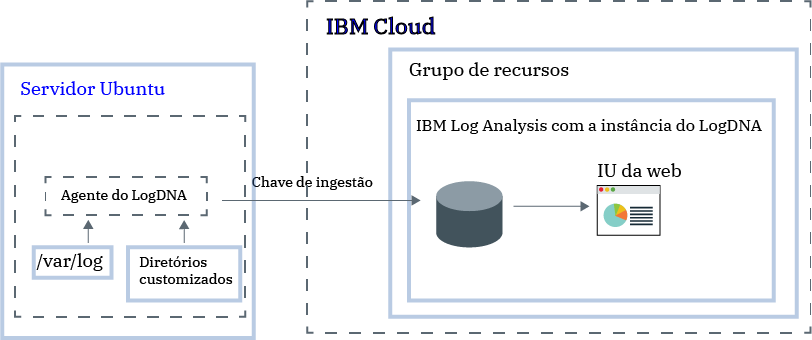

---

copyright:
  years:  2018, 2019
lastupdated: "2019-03-06"

keywords: LogDNA, IBM, Log Analysis, logging, ubuntu, tutorial

subcollection: LogDNA

---

{:new_window: target="_blank"}
{:shortdesc: .shortdesc}
{:screen: .screen}
{:pre: .pre}
{:table: .aria-labeledby="caption"}
{:codeblock: .codeblock}
{:tip: .tip}
{:download: .download}
{:important: .important}
{:note: .note}


# Gerenciando logs do Ubuntu com o  {{site.data.keyword.la_full_notm}}
{: #ubuntu}

Use o serviço {{site.data.keyword.la_full}} para monitorar e gerenciar os logs do Ubuntu em um sistema de criação de log centralizado no {{site.data.keyword.cloud_notm}}. 
{:shortdesc}

É possível coletar e monitorar logs do sistema e do aplicativo. 

Por padrão, o agente LogDNA para Ubuntu monitora arquivos de log no diretório **/var/log**. Por exemplo, o log do sistema Ubuntu (*/var/log/syslog*) é monitorado por padrão.

No {{site.data.keyword.cloud_notm}}, para configurar um servidor Ubuntu para encaminhar logs para uma instância do {{site.data.keyword.la_full_notm}}, deve-se concluir as etapas a seguir:

1. Provisão de uma instância do serviço  {{site.data.keyword.la_full_notm}} . 
2. Configure o agente LogDNA no servidor Ubuntu.
3. Opcionalmente, inclua mais diretórios para serem monitorados pelo agente.



Neste tutorial, você aprenderá como configurar um servidor Ubuntu para encaminhar logs para uma instância do {{site.data.keyword.la_full_notm}}.

## Antes de iniciar
{: #ubuntu_prereqs}

Leia sobre o {{site.data.keyword.la_full_notm}}. Para obter mais informações, consulte  [ Sobre o LogDNA ](/docs/services/Log-Analysis-with-LogDNA?topic=LogDNA-about#about).

Trabalhe na região Sul dos EUA. O {{site.data.keyword.la_full_notm}} está disponível atualmente na região Sul dos EUA. **Nota:** é possível enviar dados de um servidor Ubuntu que está localizado na mesma região ou em uma região diferente. 

Use um ID do usuário que seja um membro ou um proprietário de uma conta do {{site.data.keyword.cloud_notm}}. Para obter um ID do usuário do {{site.data.keyword.cloud_notm}}, acesse: [Registro ](https://cloud.ibm.com/login){:new_window}.

O seu {{site.data.keyword.IBM_notm}}id deve ter políticas do IAM designadas para cada um dos recursos a seguir: 

| Recurso                             | Escopo da política de acesso | Função    | Região    | Informações                  |
|--------------------------------------|----------------------------|---------|-----------|------------------------------|
| Grupo de recursos **Padrão**           |  Grupo de recursos            | Visualizador  | us-south  | Essa política é necessária para permitir que o usuário veja instâncias de serviço no Grupo de recursos padrão.    |
| Serviço {{site.data.keyword.la_full_notm}} |  Grupo de recursos            | Aplicativos  | us-south  | Essa política é necessária para permitir que o usuário provisione e administre o serviço do {{site.data.keyword.la_full_notm}} no Grupo de recursos padrão.   |
{: caption="Tabela 1. Lista de políticas do IAM necessárias para concluir o tutorial" caption-side="top"} 

Instale a CLI do {{site.data.keyword.cloud_notm}}. Para obter mais informações, consulte [Instalando a CLI do {{site.data.keyword.cloud_notm}}](/docs/cli/index.html#overview).


## Etapa 1. Provisão de uma instância do  {{site.data.keyword.la_full_notm}}
{: #ubuntu_step1}

Para fornecer uma instância do {{site.data.keyword.la_full_notm}} por meio da IU do {{site.data.keyword.cloud_notm}}, conclua as etapas a seguir:

1. Efetue login em sua conta do  {{site.data.keyword.cloud_notm}} .

    Clique em [ Painel do {{site.data.keyword.cloud_notm}}](https://cloud.ibm.com/login){:new_window} para ativar o painel do {{site.data.keyword.cloud_notm}}.

	Depois de efetuar login com seu ID de usuário e senha, a UI do {{site.data.keyword.cloud_notm}} é aberta.

2. Clique em  ** Catálogo **. A lista de serviços que estão disponíveis no {{site.data.keyword.cloud_notm}} é aberta.

3. Para filtrar a lista de serviços que são exibidos, selecione a categoria **Ferramentas do desenvolvedor**.

4. Clique no ladrilho  ** {{site.data.keyword.la_full_notm}} ** .

5. Insira um nome para a instância de serviço.

6. Selecione o grupo de recursos  ** Padrão ** . 

    Por padrão, o grupo de recursos **Padrão** é configurado.

7. Selecione o plano de serviço **Lite**. 

    Por padrão, o plano **Lite** é configurado.

    Para obter mais informações sobre outros planos de serviço, consulte [Planos de precificação](/docs/services/Log-Analysis-with-LogDNA?topic=LogDNA-about#overview_pricing_plans).

8. Para provisionar o serviço do {{site.data.keyword.la_full_notm}} no grupo de recursos do {{site.data.keyword.cloud_notm}} no qual você efetuou login, clique em **Criar**.

Depois de fornecer uma instância, o painel do {{site.data.keyword.la_full_notm}} se abre. 


**Nota:** para fornecer uma instância de LogDNA por meio da CLI, consulte [Fornecendo o LogDNA por meio da CLI do {{site.data.keyword.cloud_notm}} ](/docs/services/Log-Analysis-with-LogDNA?topic=LogDNA-provision#provision_cli).


## Etapa 2. Configurar o servidor Ubuntu para enviar logs para a sua instância
{: #ubuntu_step2}

Para configurar o seu servidor do Ubuntu para encaminhar logs para a sua instância do {{site.data.keyword.la_full_notm}}, deve-se instalar um `logdna-agent`. O agente do LogDNA lê arquivos de log por meio de */var/log* e encaminha os dados do log para a sua instância do LogDNA.

Para configurar o seu servidor do Ubuntu para encaminhar logs para a sua instância do LogDNA, conclua as etapas a seguir por meio de um terminal do Ubuntu:

1. Instale o agente LogDNA. Execute os comandos a seguir:

    ```
    echo "deb https://repo.logdna.com stable main" | sudo tee /etc/apt/sources.list.d/logdna.list 
    ```
    {: codeblock}

    ```
    wget -O- https://repo.logdna.com/logdna.gpg | sudo apt-key add - 
    ```
    {: codeblock}

    ```
    sudo apt-get update
    ```
    {: codeblock}

    ```
    sudo apt-get install logdna-agent < "/dev/null"
    ```
    {: codeblock}

2. Configure a chave de ingestão que o agente do LogDNA deve usar para encaminhar logs para a instância do {{site.data.keyword.la_full_notm}}.  

    ```
    sudo logdna-agent -k INGESTION_KEY
    ```
    {: codeblock}

    em que INGESTION_KEY contém a chave de ingestão ativa para a instância do {{site.data.keyword.la_full_notm}} para a qual você está configurando o encaminhamento dos logs.

3. Configure o terminal de autenticação. O agente do LogDNA usa esse host para autenticar e obter o token para encaminhar logs.

    ```
    sudo logdna-agent -s LOGDNA_APIHOST=api.us-south.logging.cloud.ibm.com
    ```
    {: codeblock}

4. Configure o terminal de ingestão.

    ```
    sudo logdna-agent -s LOGDNA_LOGHOST=logs.us-south.logging.cloud.ibm.com
    ```
    {: codeblock}

5. Defina mais caminhos de log a serem monitorados. Execute o comando a seguir: 

    ```
    sudo logdna-agent -d /path/to/log/folders
    ```
    {: codeblock}

    Por padrão,  ** /var/log **  é monitorado.

6. Opcionalmente, configure o agente do LogDNA para identificar os seus hosts. Execute os comandos a seguir:

    ```
    sudo logdna-agent -t TAG1, TAG2 
    ```
    {: codeblock}

    ```
    sudo update-rc.d logdna-agent defaults
    ```
    {: codeblock}

    ``` 
    sudo /etc/init.d/logdna-agent start
    ```
    {: codeblock}


## Etapa 3. Ativar a IU da web do LogDNA
{: #ubuntu_step3}

Para ativar o painel do IBM Log Analysis com LogDNA por meio da IU do {{site.data.keyword.cloud_notm}}, conclua as etapas a seguir:

1. Efetue login em sua conta do  {{site.data.keyword.cloud_notm}} .

    Clique em [ Painel do {{site.data.keyword.cloud_notm}}](https://cloud.ibm.com/login){:new_window} para ativar o painel do {{site.data.keyword.cloud_notm}}.

	Após você efetuar login com o seu ID do usuário e senha, o Painel do {{site.data.keyword.cloud_notm}} será aberto.

2. No menu de navegação, selecione  ** Observabilidade **. 

3. Selecione  ** Criação de log **. 

    A lista de instâncias do {{site.data.keyword.la_full_notm}} que estão disponíveis no {{site.data.keyword.cloud_notm}} é exibida.

3. Selecione uma instância. Em seguida, clique em  ** Visualizar LogDNA **.

    A IU da web do LogDNA é aberta e exibe os logs do cluster.


## Etapa 4. Visualizar seus logs
{: #ubuntu_step4}

Na IU da web do LogDNA, é possível visualizar os seus logs à medida que eles passam pelo sistema. Você visualiza logs usando o registro de log mais recente. 

**Nota:**com o plano de serviço **Grátis**, é possível seguir somente os seus logs mais recentes.

Para obter mais informações, consulte  [ Visualizando logs ](/docs/services/Log-Analysis-with-LogDNA?topic=LogDNA-view_logs#view_logs).


## Próximos passos
{: #ubuntu_next_steps}

[Filtrar logs](/docs/services/Log-Analysis-with-LogDNA?topic=LogDNA-view_logs#view_logs_step5), [procurar logs](/docs/services/Log-Analysis-with-LogDNA?topic=LogDNA-view_logs#view_logs_step6), [definir visualizações](/docs/services/Log-Analysis-with-LogDNA?topic=LogDNA-view_logs#view_logs_step7) e [configurar alertas](https://docs.logdna.com/docs/alerts). 

**Nota:** para usar qualquer um desses recursos, deve-se fazer upgrade do plano {{site.data.keyword.la_full_notm}} para um plano pago.

