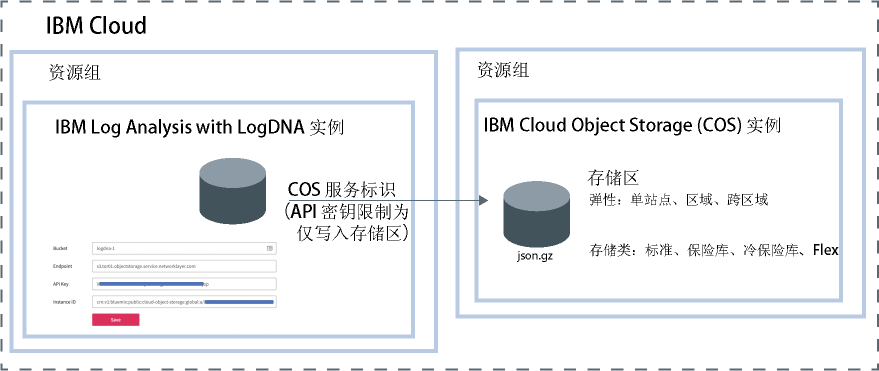

---

copyright:
  years:  2018, 2019
lastupdated: "2019-05-01"

keywords: LogDNA, IBM, Log Analysis, logging, archive logs, COS, cloud object storage

subcollection: LogDNA

---

{:new_window: target="_blank"}
{:shortdesc: .shortdesc}
{:screen: .screen}
{:pre: .pre}
{:table: .aria-labeledby="caption"}
{:codeblock: .codeblock}
{:tip: .tip}
{:download: .download}
{:important: .important}
{:note: .note}

 
# 将日志归档到 IBM Cloud Object Storage
{: #archiving}

您可以将 {{site.data.keyword.la_full_notm}} 实例中的日志归档到 {{site.data.keyword.cos_full_notm}} (COS) 实例中的存储区。
{:shortdesc}

要配置归档，您必须具有包含对 {{site.data.keyword.la_full_notm}} 服务的**查看者**平台角色和**管理者**服务角色的 IAM 策略。

您可将 {{site.data.keyword.la_full_notm}} 实例中的日志归档到 {{site.data.keyword.cos_full_notm}} (COS) 实例的存储区中。每个 {{site.data.keyword.la_full_notm}} 实例都有其自己的归档配置。 

日志以压缩格式 **(.json.gz)** 每天自动归档一次。每行都会保留其元数据。

日志会在您保存配置后的 24-48 小时内归档。 

{{site.data.keyword.cos_full_notm}} 实例在资源组的上下文中进行供应。{{site.data.keyword.la_full_notm}} 实例也在资源组的上下文中进行供应。这两种实例可以分组在同一资源组下，也可分组到不同的资源组中。 

{{site.data.keyword.la_full_notm}} 使用服务标识与 {{site.data.keyword.cos_full_notm}} 服务进行通信。

* 为 {{site.data.keyword.cos_full_notm}} 实例创建的服务标识将由 {{site.data.keyword.la_full_notm}} 用于对 {{site.data.keyword.cos_full_notm}} 实例进行认证和访问。 
* 可以向服务标识分配特定访问策略以限制对 {{site.data.keyword.cos_full_notm}} 实例的许可权。将服务标识限制为仅对计划在其中归档日志的存储区具有写许可权。

下图显示了归档日志时集成的不同组件的高级别视图：

要将 {{site.data.keyword.la_full_notm}} 实例归档到 {{site.data.keyword.cos_full_notm}} 实例中的存储区，请完成以下步骤：

## 步骤 1. 向用户授予 IAM 策略以使用 {{site.data.keyword.cos_full_notm}}
{: #archiving_step1}

**注：**此步骤必须由 {{site.data.keyword.cloud_notm}} 上 {{site.data.keyword.cos_full_notm}} 服务的帐户所有者或管理员来完成。

作为 {{site.data.keyword.cos_full_notm}} 服务的管理员，您必须能够供应服务的实例，向其他用户授予使用这些实例的许可权，以及创建服务标识。 

有不同的方式可向用户授予许可权，使其成为 {{site.data.keyword.cos_full_notm}} 服务的编辑者：

* 作为帐户中服务的管理员，用户必须具有包含对 {{site.data.keyword.cos_full_notm}} 服务的*管理员*平台角色的 IAM 策略。您必须为此用户分配对帐户中单个资源的访问权。 

* 作为资源组上下文中服务的管理员，用户必须在资源组的上下文中具有包含对 {{site.data.keyword.cos_full_notm}} 服务的*管理员*平台角色的 IAM 策略。 

下表列出了用户为了完成所列操作而可以具有的对 {{site.data.keyword.cos_full_notm}} 服务的角色：

|服务|平台角色|操作| 
|----------------------------|-------------------|-----------------------------------------------------------------------------------------------|       
|`Cloud Object Storage`|管理员|允许用户将策略分配给帐户中的用户以使用 {{site.data.keyword.cos_full_notm}} 服务。|
|`Cloud Object Storage`| 管理员  编辑器 |允许用户供应 {{site.data.keyword.cos_full_notm}} 服务的实例。|
|`Cloud Object Storage`| 管理员  编辑器  操作员 |允许用户创建服务标识。| 
{: caption="表 1. 角色和操作" caption-side="top"} 

要在资源组上下文中为用户分配对 {{site.data.keyword.cos_full_notm}} 服务的管理员角色，请完成以下步骤： 

1. 在菜单栏中，单击**管理** &gt; **访问权 (IAM)**，然后选择**用户**。
2. 在要为其分配访问权的用户所在的行中，选择**操作**菜单，然后单击**分配访问权**。
3. 选择**在资源组中分配访问权**。
4. 选择资源组。
5. 如果尚未向用户授予针对所选资源组的角色，请为**分配对资源组的访问权**字段选择角色。 

    根据选择的角色，用户可以在其仪表板上查看资源组，编辑资源组名称或管理用户对该组的访问权。 
    
    如果希望用户仅有权访问资源组中的 {{site.data.keyword.la_full_notm}} 服务，那么可以选择**无访问权**。

6. 选择 **Cloud Object Storage**。
7. 选择**管理员**平台角色。
8. 单击**分配**。

## 步骤 2. 供应 {{site.data.keyword.cos_full_notm}} 的实例
{: #archiving_step2}

**注：**此步骤必须由 {{site.data.keyword.cloud_notm}} 上 {{site.data.keyword.cos_full_notm}} 服务的编辑者或管理员来完成。 

要供应 {{site.data.keyword.cos_full_notm}} 实例，请完成以下步骤：

1. 登录到 {{site.data.keyword.cloud_notm}} 帐户。

    单击 [{{site.data.keyword.cloud_notm}} 仪表板 ](https://cloud.ibm.com/login){:new_window} 以启动 {{site.data.keyword.cloud_notm}}“仪表板”。

	使用用户标识和密码登录后，{{site.data.keyword.cloud_notm}} UI 即会打开。

2. 单击**目录**。这将打开 {{site.data.keyword.cloud_notm}} 中提供的服务的列表。

3. 要过滤显示的服务列表，请选择**存储器**类别。

4. 单击**对象存储器**磁贴。

5. 输入服务实例的名称。

6. 选择资源组。 

    缺省情况下，已设置 **Default** 资源组。

7. 选择服务套餐。 

    缺省情况下，已设置**轻量**套餐。

9. 单击**创建**。

## 步骤 3. 创建存储区
{: #archiving_step3}

存储区用于在 {{site.data.keyword.cos_full_notm}} 实例中组织数据。 

要管理存储区，必须向用户授予使用 {{site.data.keyword.cos_full_notm}} 实例上存储区的许可权。下表概述了用户为了使用存储区而可以具有的不同操作和角色：

|服务|角色|操作| 
|----------------------------|-------------------------|------------------------------------|       
|`Cloud Object Storage`|平台角色：查看者|允许用户通过 {{site.data.keyword.cloud_notm}} UI 查看所有存储区并列出其中的对象。|
|`Cloud Object Storage`|服务角色：管理者|允许用户将对象标记为公共。|
|`Cloud Object Storage`|服务角色：管理者  写入者 |允许用户创建和销毁存储区及对象。| 
|`Cloud Object Storage`|服务角色：读取者|允许用户列出和下载对象。|
{: caption="表 1. 用于使用存储区的角色和操作" caption-side="top"} 

**注：**要创建存储区，用户必须具有对 {{site.data.keyword.cos_full_notm}} 实例的管理者或写入者许可权。

要创建存储区，请完成以下步骤：

1. 登录到 {{site.data.keyword.cloud_notm}} 帐户。

    单击 [{{site.data.keyword.cloud_notm}} 仪表板 ](https://cloud.ibm.com/login){:new_window} 以启动 {{site.data.keyword.cloud_notm}}“仪表板”。

	使用用户标识和密码登录后，{{site.data.keyword.cloud_notm}}“仪表板”即会打开。

2. 在“仪表板”中，选择计划在其中创建存储区的 {{site.data.keyword.cos_full_notm}} 实例。

3. 选择**存储区**。然后，单击**创建存储区**。

4. 对于*唯一存储区名称*字段，输入存储区名称。

    **注：**全球所有区域中的所有存储区都共享一个名称空间。 

    可以将 {{site.data.keyword.la_full_notm}} 实例名称用作存储区名称的一部分。例如，对于名称为 *logdn-1* 的实例，可以使用 *accountN-logdn-1* 作为存储区名称。

    通过 {{site.data.keyword.la_full_notm}} Web UI 来配置归档时需要此名称。

5. 选择弹性类型和要物理存储数据的位置。

    弹性是指在其中分布数据的地理区域的范围和规模。 
    
    “跨区域”弹性将跨多个大都市区域分布数据。
    
    “区域”弹性将在一个大都市区域中分布数据。 
    
    “单个数据中心”将仅在单个站点内跨多个设备分布数据。

    有关更多信息，请参阅[选择区域和端点](/docs/services/cloud-object-storage?topic=cloud-object-storage-endpoints)。

6. 选择*存储类*的类型。

    可以创建具有不同存储类的存储区。根据检索数据的需求，选择存储区的存储类。有关更多信息，请参阅[使用存储类](/docs/services/cloud-object-storage?topic=cloud-object-storage-classes)。

    **注：**创建存储区后，即无法更改该存储区的存储类。如果对象需要重新分类，那么必须将数据移至具有所需存储类的其他存储区。

7. （可选）添加 Key Protect 密钥以对数据进行静态加密。

    缺省情况下，所有对象都会使用随机生成的密钥以及全有或全无变换进行加密。虽然此缺省加密模型提供了静态安全性，但某些工作负载需要拥有所使用的加密密钥。有关更多信息，请参阅[管理加密](/docs/services/cloud-object-storage?topic=cloud-object-storage-encryption)。

## 步骤 4. 为 {{site.data.keyword.cos_full_notm}} 实例创建服务标识
{: #archiving_step4}

服务标识用于标识服务，类似于用户标识标识用户的方式。服务标识并不与特定用户绑定。如果创建服务标识的用户离开组织并从帐户中删除，那么服务标识会保留。

您必须为 {{site.data.keyword.cos_full_notm}} 实例创建服务标识。此服务标识由 {{site.data.keyword.la_full_notm}} 实例用于向 {{site.data.keyword.cos_full_notm}} 实例进行认证。 

必须为服务标识分配特定的访问策略，用于限制使用特定服务的许可权，或者甚至可合并用于访问不同服务的许可权。例如，要限制对单个存储区的访问权，请使用控制台或 CLI 来确保服务标识没有任何实例级别的策略。

要创建具有对 {{site.data.keyword.cos_full_notm}} 实例的写许可权的服务标识，请完成以下步骤：

1. 登录到 {{site.data.keyword.cloud_notm}} 帐户。

    单击 [{{site.data.keyword.cloud_notm}} 仪表板 ](https://cloud.ibm.com/login){:new_window} 以启动 {{site.data.keyword.cloud_notm}}“仪表板”。

	使用用户标识和密码登录后，{{site.data.keyword.cloud_notm}}“仪表板”即会打开。

2. 在“仪表板”中，选择计划在其中创建存储区的 {{site.data.keyword.cos_full_notm}} 实例。

3. 选择**服务凭证**。然后，选择**新建凭证**。

4. 输入名称。 

5. 选择**写入者**角色。

6. 单击**添加**。

    新的服务标识会添加到列表中。 

对于刚才创建的服务标识，单击**查看凭证**。您可以查看与该服务标识相关的信息。 

* 复制 API 密钥。这是为 **apikey** 字段设置的值。
* 复制资源实例标识。这是为 **resource_instance_id** 字段设置的值。

## 步骤 5. 将服务标识限制为仅具有对存储区的写许可权
{: #archiving_step5}

如果要将服务标识限制为仅具有对存储区的写许可权，请完成以下步骤：

1. 阅读服务标识的信息，并记下 **iam_apikey_name** 字段和 **iam_apikey_name** 字段的值。 

2. 在“仪表板”中，选择**管理** &gt; **访问权 (IAM)**，然后选择**用户**。

3. 选择**服务标识**。

4. 查找具有以下名称的服务标识：**auto-generated-serviceId-<ID that is part of the iam_apikey_name value>。

5. 选择该服务标识。然后，在**访问策略**中，单击**写入者**。

6. 在*资源类型*字段中，输入**存储区**。

7. 在*资源标识*字段中，输入存储区的名称。

8. 单击**保存**。

**注：**如果使“资源类型”或“资源”字段保留空白，那么创建的策略为实例级别的策略。

## 步骤 6. 选择端点
{: #archiving_step6}

端点定义可查找存储区的位置。根据区域和弹性类型，有不同的端点。有关更多信息，请参阅[选择区域和端点](/docs/services/cloud-object-storage?topic=cloud-object-storage-endpoints#endpoints)。

要获取存储区的端点，请完成以下步骤：

1. 登录到 {{site.data.keyword.cloud_notm}} 帐户。

    单击 [{{site.data.keyword.cloud_notm}} 仪表板 ](https://cloud.ibm.com/login){:new_window} 以启动 {{site.data.keyword.cloud_notm}}“仪表板”。

	使用用户标识和密码登录后，{{site.data.keyword.cloud_notm}}“仪表板”即会打开。

2. 在“仪表板”中，选择计划在其中创建存储区的 {{site.data.keyword.cos_full_notm}} 实例。

3. 选择**存储区**。然后，选择已创建且要在其中归档日志的存储区。

4. 选择**配置**。

5. 复制其中一个专用端点。 

## 步骤 7. 向用户授予 IAM 策略以归档日志
{: #archiving_step7}

下表列出了用户在配置将 {{site.data.keyword.la_full_notm}} Web UI 中日志归档到 {{site.data.keyword.cos_full_notm}} 实例中的存储区时必须具有的策略：

|服务|角色 |授予的许可权| 
|--------------------------------|---------------------------|-------------------------------------|  
| `{{site.data.keyword.la_full_notm}}` |平台角色：查看者|允许用户在“可观察性 - 日志记录”仪表板中查看服务实例的列表。|
| `{{site.data.keyword.la_full_notm}}` |服务角色：管理者|允许用户启动 Web UI，并在 Web UI 中查看日志。|
{: caption="表 2. IAM 策略" caption-side="top"} 

有关如何为用户配置这些策略的更多信息，请参阅[向用户授予查看 LogDNA 中日志的许可权](/docs/services/Log-Analysis-with-LogDNA/work_iam.html#user_logdna)。

要为用户分配归档日志的许可权，请完成以下步骤： 

1. 在菜单栏中，单击**管理** &gt; **访问权 (IAM)**，然后选择**用户**。
2. 在要为其分配访问权的用户所在的行中，选择**操作**菜单，然后单击**分配访问权**。
3. 选择**在资源组中分配访问权**。
4. 选择资源组。
5. 如果尚未向用户授予针对所选资源组的角色，请为**分配对资源组的访问权**字段选择角色。 

    根据选择的角色，用户可以在其仪表板上查看资源组，编辑资源组名称或管理用户对该组的访问权。 
    
    如果希望用户仅有权访问资源组中的 {{site.data.keyword.la_full_notm}} 服务，那么可以选择**无访问权**。

6. 选择 **IBM Log Analysis with LogDNA**。
7. 选择**查看者**平台角色。
8. 选择**管理者**服务角色。
9. 单击**分配**。

## 步骤 8. 为 {{site.data.keyword.la_full_notm}} 实例配置归档
{: #archiving_step8}

要配置将 {{site.data.keyword.la_full_notm}} 实例归档到 COS 存储区中，请完成以下步骤：

1. 启动 {{site.data.keyword.la_full_notm}} Web UI。[了解更多信息](/docs/services/Log-Analysis-with-LogDNA/view_logs.html#view_logs_step2)。

2. 选择**配置**图标。然后选择**归档**。 

3. 选择 **IBM Cloud Object Storage**。

4. 设置要在其中归档日志的存储区、端点、API 密钥和实例标识。

    <table>
      <caption>表 3. COS 字段</caption>
      <tr>
         <th>字段</th>
         <th>值</th>
      </tr>
      <tr>
         <td>存储区</td>
         <td>设置为 COS 存储区名称。</td>
      </tr>
      <tr>
         <td>端点</td>
         <td>设置为 COS 存储区专用端点。</td>
      </tr>
      <tr>
         <td>API 密钥</td>
         <td>设置为与 COS 服务标识关联的 API 密钥。</td>
      </tr>
      <tr>
         <td>实例标识</td>
         <td>设置为 COS 实例标识。</td>
      </tr>
    </table>

5. 单击**保存**。

保存配置后，日志将每天归档一次。

