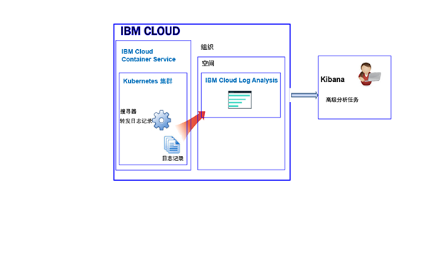
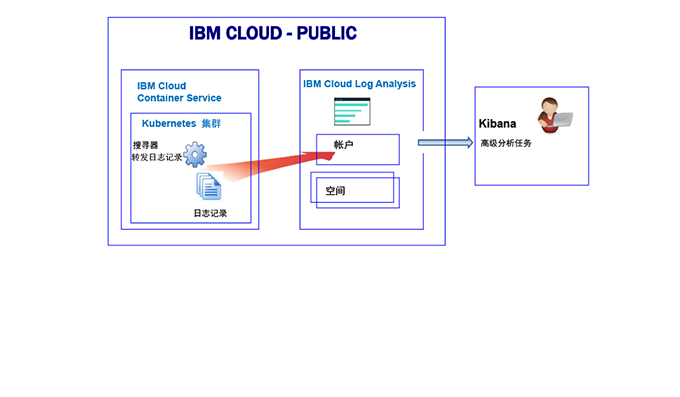
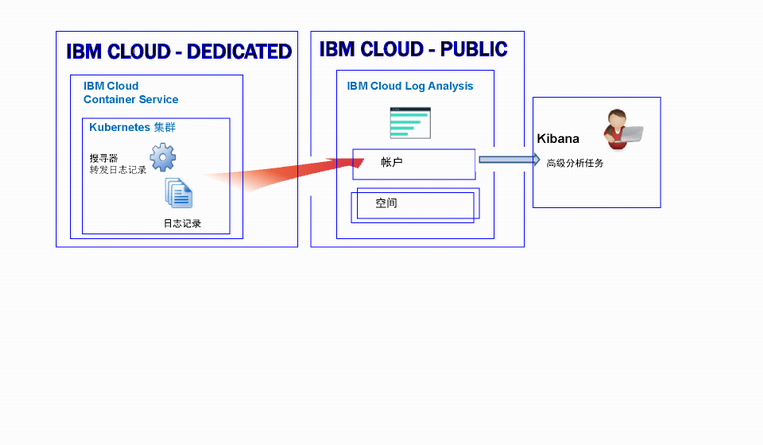

---

copyright:
  years: 2017, 2019

lastupdated: "2019-03-06"

keywords: IBM Cloud, logging

subcollection: cloudloganalysis

---

{:new_window: target="_blank"}
{:shortdesc: .shortdesc}
{:screen: .screen}
{:pre: .pre}
{:table: .aria-labeledby="caption"}
{:codeblock: .codeblock}
{:tip: .tip}
{:download: .download}
{:important: .important}
{:note: .note}


# {{site.data.keyword.containershort_notm}}
{: #containers_kubernetes}

在 {{site.data.keyword.Bluemix_notm}} 中，可以使用 {{site.data.keyword.loganalysisshort}} 服务来存储和分析 Public 和 Dedicated 中由 {{site.data.keyword.containershort}} 自动收集的容器日志和 Kubernetes 集群日志。
{:shortdesc}

在帐户中，您可以具有 1 个或多个 Kubernetes 集群。在供应集群时，{{site.data.keyword.containershort}} 会自动收集日志。 

* 在部署 Pod 时，系统会收集应用程序日志。 
* {{site.data.keyword.containershort}} 会自动收集容器进程输出至 stdout（标准输出）和 stderr（标准错误）的信息。

要使这些日志可在 {{site.data.keyword.loganalysisshort}} 服务中得到分析，必须配置集群以将日志转发到 {{site.data.keyword.loganalysisshort}}。可以将日志转发到 {{site.data.keyword.loganalysisshort}} 帐户域或您帐户中的空间域。缺省情况下：

* 在美国南部区域可用的集群会将日志发送到美国南部区域可用的 {{site.data.keyword.loganalysisshort}} 服务。
* 在美国东部区域可用的集群会将日志发送到美国南部区域可用的 {{site.data.keyword.loganalysisshort}} 服务。
* 在德国区域可用的集群会将日志发送到德国区域可用的 {{site.data.keyword.loganalysisshort}} 服务。
* 在悉尼区域可用的集群会将日志发送到悉尼区域可用的 {{site.data.keyword.loganalysisshort}} 服务。
* 在英国区域可用的集群会将日志发送到德国区域可用的 {{site.data.keyword.loganalysisshort}} 服务。

决定将日志转发到空间域还是帐户域时，请考虑以下信息：

* 将日志发送到帐户域时，搜索配额为每天 500 MB，并且无法在“日志收集”中长期存储日志。
* 将日志发送到空间域时，可以选择可定义每天搜索配额的 {{site.data.keyword.loganalysisshort}} 服务套餐，并且可以在“日志收集”中长期存储日志。

**注**：缺省情况下，不会自动启用将日志从集群发送到 {{site.data.keyword.loganalysisshort}} 服务的功能。要启用日志记录，必须在集群中创建一个或多个日志记录配置，以便将日志自动转发到 {{site.data.keyword.loganalysisshort}} 服务。您可以通过命令行使用 `ibmcloud cs logging-config-create` 命令或通过 {{site.data.keyword.Bluemix_notm}} UI 中提供的集群仪表板来启用日志记录。有关更多信息，请参阅[启用集群日志的自动收集](/docs/services/CloudLogAnalysis/containers/containers_kube_other_logs.html#containers_kube_other_logs)。

使用 Kubernetes 集群时，系统会保留 *ibm-system* 和 *kube-system* 名称空间。请勿创建、删除、修改或更改这些名称空间中可用的资源的许可权。这些名称空间的日志供 {{site.data.keyword.IBM_notm}} 使用。


## 将日志转发到空间域
{: #space}

配置集群以将集群日志转发到 {{site.data.keyword.loganalysisshort}} 时，请考虑以下信息：

* 必须定义要将这些日志转发到的 Cloud Foundry 组织和空间。 
* 可以在任何 {{site.data.keyword.IBM_notm}} Public Cloud 区域中使用组织和空间。

**注**：对于在 **{{site.data.keyword.Bluemix_notm}} Dedicated** 上供应的集群，无法配置集群以将集群日志转发到专用帐户上可用的 Cloud Foundry 空间。

对于将日志转发到空间域的集群，要在 Kibana 中分析其日志数据，请考虑以下信息：

* 必须在收集集群日志的组织和空间所在的 Public 区域中启动 Kibana。
* 要增加 Kibana 搜索配额并将日志存储在“日志收集”中以便长期存储，必须使用与您的需求匹配的套餐，在要将日志转发到的空间中供应 {{site.data.keyword.loganalysisshort}} 服务。 
* 您的用户标识必须具有查看日志的许可权。要查看空间域中的日志，用户需要 CF 角色。至少要为用户授予**审计员**角色，他们才能查看日志。有关更多信息，请参阅[用户查看日志所需的角色](/docs/services/CloudLogAnalysis/kibana/analyzing_logs_Kibana.html#roles)。

要管理长期存储（存储在“日志收集”中）的集群日志数据，您的用户标识必须具有 IAM 策略，以便使用 {{site.data.keyword.loganalysisshort}} 服务。您的用户标识必须具有**管理员**、**操作员**或**编辑者**许可权。有关更多信息，请参阅[用户管理日志所需的角色](/docs/services/CloudLogAnalysis/manage_logs.html#roles1)。


下图显示了集群将日志转发到空间域时，Public 中 {{site.data.keyword.containershort}} 的日志记录的高级别视图：



   

## 将日志转发到帐户域
{: #acc_public}

配置集群以将集群日志转发到帐户域时，请考虑以下信息：

* **{{site.data.keyword.Bluemix_notm}} Public 上供应的集群**：会将日志转发到同一 {{site.data.keyword.Bluemix_notm}} Public 区域中集群运行所在的帐户域。
* **{{site.data.keyword.Bluemix_notm}} Dedicated 上供应的集群**：会将日志转发到同一 {{site.data.keyword.Bluemix_notm}} Public 区域中 Dedicated 集群运行所在的帐户域。

对于将日志转发到帐户域的集群，要在 Kibana 中分析其日志数据，请考虑以下信息：

* 必须在集群将日志发送到 {{site.data.keyword.loganalysisshort}} 服务所在的 Public 区域中启动 Kibana。

    * 在美国南部区域可用的集群会将日志发送到美国南部区域可用的 {{site.data.keyword.loganalysisshort}} 服务。
    * 在美国东部区域可用的集群会将日志发送到美国南部区域可用的 {{site.data.keyword.loganalysisshort}} 服务。
    * 在德国区域可用的集群会将日志发送到德国区域可用的 {{site.data.keyword.loganalysisshort}} 服务。
    * 在悉尼区域可用的集群会将日志发送到悉尼区域可用的 {{site.data.keyword.loganalysisshort}} 服务。
    * 在英国区域可用的集群会将日志发送到德国区域可用的 {{site.data.keyword.loganalysisshort}} 服务。

* 您的用户标识必须具有查看日志的许可权。要查看帐户域中的日志，用户需要 {{site.data.keyword.loganalysisshort}} 服务的 IAM 策略。用户需要**查看者**许可权。 


下图显示了集群将日志转发到帐户域时，Public 中 {{site.data.keyword.containershort}} 的日志记录的高级别视图：



下图显示了 Dedicated 中针对 {{site.data.keyword.containershort}} 的日志记录的高级别视图：




## 配置集群以将日志转发到 {{site.data.keyword.loganalysisshort}}
{: #config_forward_logs}

可以选择将哪些集群日志转发到 {{site.data.keyword.loganalysisshort}} 服务。 

有关如何配置集群以将日志文件转发到 {{site.data.keyword.loganalysisshort}} 服务的更多信息，请参阅[启用集群日志的自动收集](/docs/services/CloudLogAnalysis/containers/containers_kube_other_logs.html#containers_kube_other_logs)部分。

* 要启用 stdout 和 stderr 的自动日志收集和转发，请参阅[启用容器日志的自动日志收集和转发](/docs/services/CloudLogAnalysis/containers/containers_kube_other_logs.html#containers)。
* 要启用应用程序日志的自动日志收集和转发，请参阅[启用应用程序日志的自动日志收集和转发](/docs/services/CloudLogAnalysis/containers/containers_kube_other_logs.html#apps)。 
* 要启用工作程序日志的自动日志收集和转发，请参阅[启用工作程序日志的自动日志收集和转发](/docs/services/CloudLogAnalysis/containers/containers_kube_other_logs.html#workers)。 
* 要启用 Kubernetes 系统组件日志的自动日志收集和转发，请参阅[启用 Kubernetes 系统组件日志的自动日志收集和转发](/docs/services/CloudLogAnalysis/containers/containers_kube_other_logs.html#system)。 
* 要启用 Kubernetes Ingress 控制器日志的自动日志收集和转发，请参阅[启用 Kubernetes Ingress 控制器日志的自动日志收集和转发](/docs/services/CloudLogAnalysis/containers/containers_kube_other_logs.html#controller)。


## 在 {{site.data.keyword.Bluemix_notm}} 中配置定制防火墙配置的网络流量
{: #ports}

当您设置有其他防火墙，或者您已在 {{site.data.keyword.Bluemix_notm}} 基础架构 (SoftLayer) 中定制防火墙设置时，您需要允许从工作程序节点到 {{site.data.keyword.loganalysisshort}} 服务的出局网络流量。 

您必须针对定制防火墙中的以下 IP 地址，从每个工作程序到 {{site.data.keyword.loganalysisshort}} 服务，打开 TCP 端口 443 和 TCP 端口 9091：

<table>
  <tr>
    <th>区域</th>
    <th>数据获取 URL</th>
	<th>公共 IP 地址</th>
  </tr>
  <tr>
    <td>德国</td>
	<td>ingest-eu-fra.logging.bluemix.net</td>
	<td>158.177.88.43 <br>159.122.87.107</td>
  </tr>
  <tr>
    <td>英国</td>
	<td>ingest.logging.eu-gb.bluemix.net</td>
	<td>169.50.115.113</td>
  </tr>
  <tr>
    <td>美国南部</td>
	<td>ingest.logging.ng.bluemix.net</td>
	<td>169.48.79.236 <br>169.46.186.113</td>
  </tr>
  <tr>
    <td>悉尼</td>
	<td>ingest-au-syd.logging.bluemix.net</td>
	<td>130.198.76.125 <br>168.1.209.20</td>
  </tr>
</table>


## 转发定制应用程序日志
{: #forward_app_logs}

要启用将集群中的定制应用程序日志转发到 {{site.data.keyword.loganalysisshort}} 服务的功能，必须定义一个集群日志记录配置，将其中的**日志源**设置为**应用程序**。可以使用 `ibmcloud cs logging-config-create` 命令或通过集群 UI 定义此配置。

配置集群以转发定制日志时，可以指定集群中运行的容器的列表，以便从这些容器中转发定制日志，还可以指定容器内部用于存放定制文件日志的路径。

* 必须指定 **app-paths** 参数来设置要监视的容器内部的路径列表。系统会将位于这些路径中的日志转发到 {{site.data.keyword.loganalysisshort}} 服务。 

    要设置此参数，请定义容器内部可用路径的列表（用逗号分隔）。可以使用通配符，如“/var/log/*.log”。

* （可选）可以设置 **app-containers** 参数来指定要从中收集日志并将日志转发到 {{site.data.keyword.loganalysisshort}} 服务的容器的列表。

    要设置此参数，请定义容器的列表（用逗号分隔）。

**提示**：可以在集群中定义多个集群日志记录配置，将其中的**日志源**设置为**应用程序**。如果集群中的容器使用不同的路径来托管日志，请考虑为日志路径相同的每组容器分别定义集群日志记录配置。 


## 日志源
{: #log_sources}


可以配置集群以将日志转发到 {{site.data.keyword.loganalysisshort}} 服务。下表列出了可启用以将日志转发到 {{site.data.keyword.loganalysisshort}} 服务的不同日志源：

<table>
  <caption>Kubernetes 集群的日志源</caption>
  <tr>
    <th>日志源</th>
	<th>描述</th>
	<th>日志路径</th>
  </tr>
  <tr>
    <td>容器</td>
	<td>容器日志。</td>
	<td>标准输出 (stdout) 和标准错误 (stderr) 日志。</td>
  </tr>
  <tr>
    <td>应用程序</td>
	<td>在 Kubernetes 集群中运行的自己的应用程序的日志。</td>
	<td>`/var/log/apps/**/*.log`</br>`/var/log/apps/**/*.err`</br>**注**：在 Pod 上，可将日志写入 `/var/logs/apps/` 中或 `/var/logs/apps/` 下的任何子目录中。在工作程序上，必须将 `/var/log/apps/` 安装到 Pod 中应用程序写入日志的目录中。</td>
  </tr>
  <tr>
    <td>工作程序</td>
	<td>Kubernetes 集群中虚拟机工作程序节点的日志。</td>
	<td>`/var/log/syslog` </br>`/var/log/auth.log`</td>
  </tr>
  <tr>
    <td>Kubernetes 系统组件</td>
	<td>Kubernetes 系统组件的日志。</td>
	<td>*/var/log/kubelet.log* </br>*/var/log/kube-proxy.log*</td>
  </tr>
  <tr>
    <td>Ingress 控制器</td>
	<td>管理流入 Kubernetes 集群的网络流量的 Ingress 控制器的日志。</td>
	<td>`/var/log/alb/ids/*.log`</br>`/var/log/alb/ids/*.err`</br>`/var/log/alb/customerlogs/*.log`</br>`/var/log/alb/customerlogs/*.err`</td>
  </tr>
</table>

## 搜索日志
{: #log_search}

缺省情况下，在 {{site.data.keyword.Bluemix_notm}} 中可以使用 Kibana 每天最多搜索 500 MB 日志。 

要搜索较大型的日志，您可以使用 {{site.data.keyword.loganalysisshort}} 服务。该服务提供了多种套餐。每种套餐有不同的日志搜索功能，例如*日志收集*套餐允许每天最多搜索 1 GB 数据。有关可用套餐的更多信息，请参阅[服务套餐](/docs/services/CloudLogAnalysis/log_analysis_ov.html#plans)。

当您搜索日志时，请考虑 Kibana 中可用的以下字段：

任何日志条目常用的字段：

<table>
  <caption>常用字段列表</caption>
  <tr>
    <th>字段名称</th>
	  <th>描述</th>
	  <th>值</th>
  </tr>
  <tr>
    <td>ibm-containers.region_str</td>
	  <td>可以使用集群的区域</td>
	  <td>例如，`us-south` 是在美国南部区域中可用的集群的值。</td>
  </tr>
  <tr>
    <td>ibm-containers.account_id_str</td>
	  <td>帐户标识</td>
	  <td></td>
  </tr>
  <tr>
    <td>ibm-containers.cluster_id_str</td>
	  <td>集群标识</td>
	  <td></td>
	</tr>
  <tr>
    <td>ibm-containers.cluster_name_str</td>
	  <td>集群名称</td>
	  <td></td>
  </tr>
</table>

分析容器 stdout 和 stderr 日志时可能会有用的字段：

<table>
  <caption>应用程序的字段列表</caption>
  <tr>
    <th>字段名称</th>
	<th>描述</th>
	<th>值</th>
  </tr>
  <tr>
    <td>kubernetes.container_name_str</td>
	<td>容器名称</td>
	<td></td>
  </tr>
  <tr>
    <td>kubernetes.namespace_name_str</td>
	<td>集群中运行应用程序的名称空间名称</td>
	<td></td>
  </tr>
  <tr>
    <td>stream_str</td>
	<td>日志类型</td>
	<td>*stdout* </br>*stderr*</td>
  </tr>
</table>

分析工作程序日志时可能会有用的字段：

<table>
  <caption>与工作程序相关的字段列表</caption>
  <tr>
    <th>字段名称</th>
	<th>描述</th>
	<th>值</th>
  </tr>
  
  <tr>
    <td>filename_str</td>
	<td>文件的路径和名称</td>
	<td>*/var/log/syslog*  </br>*/var/log/auth.log*</td>
  </tr>
  <tr>
    <td>tag_str</td>
	<td>日志类型</td>
	<td>*logfiles.worker.var.log.syslog* </br>*logfiles.worker.var.log.auth.log*</td>
  </tr>
  <tr>
    <td>worker_str</td>
	<td>工作程序名称</td>
	<td>例如，*w1*</td>
  </tr>
</table>

分析 Kubernetes 系统组件日志时可能会有用的字段：

<table>
  <caption>与 Kubernetes 系统组件相关的字段列表</caption>
  <tr>
    <th>字段名称</th>
	<th>描述</th>
	<th>值</th>
  </tr>
  <tr>
    <td>tag_str</td>
	<td>日志类型</td>
	<td>*logfiles.kubernetes.var.log.kubelet.log* </br>*logfiles.kubernetes.var.log.kube-proxy.log*</td>
  </tr>
  <tr>
    <td>filename_str</td>
	<td>文件的路径和名称</td>
	<td>*/var/log/kubelet.log* </br>*/var/log/kube-proxy.log*</td>
  </tr>
 </table>

分析 Ingress 控制器日志时可能会有用的字段：
 
<table>
  <caption>与 Ingress 控制器相关的字段列表</caption>
  <tr>
    <th>字段名称</th>
	<th>描述</th>
	<th>值</th>
  </tr>
 <tr>
    <td>tag_str</td>
	<td>日志类型</td>
	<td></td>
  </tr>
  <tr>
    <td>filename_str</td>
	<td>文件的路径和名称</td>
	<td>*/var/log/alb/ids/*.log* </br>*/var/log/alb/ids/*.err* </br>*/var/log/alb/customerlogs/*.log* </br>*/var/log/alb/customerlogs/*.err*</td>
  </tr>
</table>


## 发送日志以便可以将消息中的字段用作 Kibana 搜索字段
{: #send_data_in_json}

缺省情况下，会对容器自动启用日志记录。容器运行时日志文件中的每个条目都会显示在 Kibana 的 **message** 字段中。如果您需要使用容器日志条目中的特定字段在 Kibana 中过滤和分析数据，请配置应用程序以发送有效的 JSON 格式的输出。例如，以 JSON 格式将消息记录到 stdout（标准输出）和 stderr（标准错误）。

消息中可用的每个字段都会解析为与值相匹配的字段类型。例如，以下 JSON 消息中的每个字段：
    
```
{"field1":"string type",
 "field2":123,
 "field3":false,
 "field4":"4567"
}
```
{: codeblock}
    
可供您用于过滤和搜索的字段：
    
* `field1` 解析为字符串类型的 `field1_str`。
* `field2` 解析为整数类型的 `field1_int`。
* `field3` 解析为布尔类型的 `field3_bool`。
* `field4` 解析为字符串类型的 `field4_str`。
    


## 安全性
{: #security}


要将集群日志转发到 {{site.data.keyword.loganalysisshort}}，必须向 {{site.data.keyword.containershort}} 密钥所有者以及要配置日志记录集群配置的用户标识授予 {{site.data.keyword.Bluemix_notm}} 许可权。

要配置日志记录集群配置的用户标识必须具有以下许可权：

* {{site.data.keyword.containershort}} 的 IAM 策略，以及**查看者**许可权。
* 集群实例的 IAM 策略，以及**管理员**或**操作员**许可权。

要让集群将日志转发到 {{site.data.keyword.loganalysisshort}} **空间域**，{{site.data.keyword.containershort}} 密钥所有者必须具有以下许可权：

* {{site.data.keyword.containershort}} 的 IAM 策略，以及**管理员**角色。
* {{site.data.keyword.loganalysisshort}} 服务的 IAM 策略，以及**管理员**角色。
* 空间所在组织的 Cloud Foundry (CF) **orgManager** 角色。
* 将日志从集群转发到的空间的 CF **SpaceManager** 角色或 **Developer** 角色。


要让集群将日志转发到 {{site.data.keyword.loganalysisshort}} **帐户域**，{{site.data.keyword.containershort}} 密钥所有者必须具有以下许可权：

* {{site.data.keyword.containershort}} 的 IAM 策略，以及**管理员**角色。
* {{site.data.keyword.loganalysisshort}} 服务的 IAM 策略，以及**管理员**角色。


## 在日志收集中存储日志
{: #log_collection1}

使用日志时，请考虑有关 {{site.data.keyword.Bluemix_notm}} 中缺省行为的以下信息：

* {{site.data.keyword.Bluemix_notm}} 会将日志数据最长存储 3 天。
* 每天最多存储 500 MB 数据。超过 500 MB 上限的任何日志都会被废弃。每天凌晨 12:30 UTC 会重置分配的上限。
* 可搜索最长 3 天最多 1.5 GB 的数据。日志数据达到 1.5 GB 或超过 3 天后，会对数据进行滚动式覆盖（先进先出）。
* “日志收集”中不会长期存储日志。

{{site.data.keyword.loganalysisshort}} 服务提供了其他套餐，允许您根据自己的需要，将日志在“日志收集”中存储任意长的时间。有关每个套餐价格的更多信息，请参阅[服务套餐](/docs/services/CloudLogAnalysis/log_analysis_ov.html#plans)。 

要管理“日志收集”中的日志，请考虑以下信息：

* 可以配置日志保留时间策略，可用于定义您希望日志在“日志收集”中保留的天数。有关更多信息，请参阅[日志保留时间策略](/docs/services/CloudLogAnalysis/manage_logs.html#log_retention_policy)。
* 您可以使用日志收集 CLI 或日志收集 API 手动删除日志。 
* 要管理日志收集中的日志，用户需要 IAM 策略且具有使用 {{site.data.keyword.Bluemix_notm}} 中的 {{site.data.keyword.loganalysisshort}} 服务的许可权。有关更多信息，请参阅 [IAM 角色](/docs/services/CloudLogAnalysis/security_ov.html#iam_roles)。

## 查看和分析日志
{: #logging_containers_ov_methods}

要分析日志数据，请使用 Kibana 执行高级分析任务。Kibana 是一种开放式源代码分析和可视化平台，您可以使用它来通过各种图形（例如，图表和表）来对数据进行监视、搜索、分析和可视化表示。有关更多信息，请参阅[在 Kibana 中分析日志](/docs/services/CloudLogAnalysis/kibana/analyzing_logs_Kibana.html#analyzing_logs_Kibana)。

* 您可以通过 Web 浏览器直接启动 Kibana。有关更多信息，请参阅[通过 Web 浏览器导航至 Kibana](/docs/services/CloudLogAnalysis/kibana/launch.html#launch_Kibana_from_browser)。
* 您可以在集群上下文中通过 {{site.data.keyword.Bluemix_notm}} UI 来启动 Kibana。有关更多信息，请参阅[通过在 Kubernetes 集群中部署的容器的仪表板导航至 Kibana](/docs/services/CloudLogAnalysis/kibana/launch.html#launch_Kibana_for_containers_kube)。

如果您将在容器中运行的应用程序的日志数据以 JSON 格式转发到容器运行时日志收集器，那么可以使用 JSON 字段在 Kibana 中搜索和分析日志数据。有关更多信息，请参阅[发送日志以便可以将消息中的字段用作 Kibana 搜索字段](/docs/services/CloudLogAnalysis/containers/containers_kubernetes.html#send_data_in_json)。

要查看 Kibana 中的日志，请考虑以下信息：

* 要查看空间域中的日志，用户必须在与该集群相关联的空间中具有**审计员**角色或**开发者**角色。
* 要查看帐户域中的日志，用户必须具有 IAM 策略才能使用 {{site.data.keyword.loganalysisshort}} 服务。允许查看日志条目的最小角色是**查看者**。


## 教程：在 Kibana 中分析 Kubernetes 集群中部署的应用程序的日志
{: #tutorial1}

要了解如何使用 Kibana 来分析 Kubernetes 集群中部署的容器的日志，请参阅[在 Kibana 中分析 Kubernetes 集群中部署的应用程序的日志](/docs/services/CloudLogAnalysis/tutorials/container_logs.html#container_logs)。
