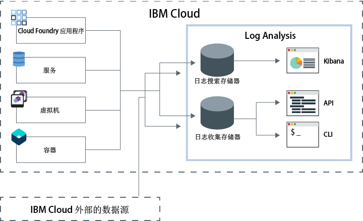

---

copyright:
  years: 2017, 2019

lastupdated: "2019-03-06"

keywords: IBM Cloud, logging

subcollection: cloudloganalysis

---

{:new_window: target="_blank"}
{:shortdesc: .shortdesc}
{:screen: .screen}
{:pre: .pre}
{:table: .aria-labeledby="caption"}
{:codeblock: .codeblock}
{:tip: .tip}
{:download: .download}
{:important: .important}
{:note: .note}

# IBM Cloud Log Analysis
{: #log_analysis_ov}

使用 {{site.data.keyword.loganalysisfull}} 服务可扩展 {{site.data.keyword.Bluemix}} 中的日志收集、日志保留时间和日志搜索功能。DevOps 团队将受益于多种功能，例如聚集应用程序和环境日志以获得综合性应用程序或环境洞察，加密日志，根据需要使日志数据保留任意长的时间，以及对问题进行快速检测和故障诊断。使用 Kibana 可执行高级分析任务。
{:shortdesc}

{{site.data.keyword.Bluemix_notm}} 日志记录功能集成在平台中：

* 对云资源自动启用了数据收集。缺省情况下，{{site.data.keyword.Bluemix_notm}} 会收集并显示应用程序、应用程序运行时以及运行这些应用程序的计算运行时的日志。 
* 每天最多可以搜索 500 MB 日志。 
* 最近 3 天的日志会存储在“日志搜索”（{{site.data.keyword.loganalysisshort}} 服务的一个组件）中。

您可以使用 {{site.data.keyword.Bluemix_notm}} 中的日志记录功能来了解云平台的行为以及其中所运行的资源。无需进行特殊检测，即可收集标准输出和标准错误日志。例如，可以使用日志来为应用程序提供审计跟踪，检测服务中的问题，识别漏洞，对应用程序部署和运行时行为进行故障诊断，检测运行应用程序的基础架构中的问题，在云平台中的组件之间跟踪应用程序，以及检测可用于提前制止可能影响服务 SLA 的操作的模式。

{{site.data.keyword.loganalysisfull}} 服务为 {{site.data.keyword.Bluemix_notm}} 平台提供日志收集和日志搜索服务，自动从选择的 {{site.data.keyword.Bluemix_notm}} 服务收集应用程序和 {{site.data.keyword.Bluemix_notm}} 服务的数据。

下图显示了 {{site.data.keyword.loganalysisshort}} 服务的高级别视图： 

要收集并搜索在空间中运行云资源的日志，必须在运行这些云资源的空间中供应 {{site.data.keyword.loganalysisshort}} 服务的实例。缺省情况下，会在“日志搜索”中收集并存储日志。选择包含扩展搜索和收集功能的服务套餐时，还会在“日志收集”组件中收集并存储日志。存储在“日志收集”中的日志数据会加密。

缺省情况下，{{site.data.keyword.Bluemix_notm}} 会在“日志搜索”中存储最长 3 天的日志数据：   

* 每天每个空间最多存储 500 MB 数据。超过 500 MB 上限的任何日志都会被废弃。每天凌晨 12:30 UTC 会重置分配的上限。
* 可搜索最长 3 天最多 1.5 GB 的数据。日志数据达到 1.5 GB 或超过 3 天后，会对数据进行滚动式覆盖（先进先出）。

{{site.data.keyword.loganalysisshort}} 服务提供了其他套餐，允许您根据自己的需要，将日志在“日志收集”中存储任意长的时间。可以在“日志收集”中收集并存储的日志大小由所选的服务套餐确定。您将按每月存储的每 GB 数据付费。日志会作为 JSON 存储在“日志收集”中。

可以使用 Kibana 5.1 来执行高级日志搜索分析任务：

* 每个套餐都会限制每天可以搜索的日志大小。 
* 搜索范围仅限于最近 3 天的数据。

要访问 3 天前的日志，可以使用“日志收集”CLI 或“日志收集”API 在本地下载日志，也可以通过管道将日志传递到其他应用程序或第三方云服务。 

可以通过设置保留时间策略来自动删除日志，也可以使用 {{site.data.keyword.loganalysisshort}} CLI 手动删除日志。

## 为什么使用 Log Analysis 服务
{: #value}

1. **减少应用程序检测时间，将更多时间用于增强应用程序的价值**

    {{site.data.keyword.loganalysislong_notm}} 会自动从所选 {{site.data.keyword.Bluemix_notm}} 服务收集数据，无需进行检测。
	
	可以选择每天可搜索的日志量。提供了不同的套餐，可分别用于每天搜索最多 500 MB、2 GB、5 GB 和 10 GB 日志。

2. **在云类经济型存储解决方案上，使日志数据保持在应用程序工作负载附近并保护其安全**

    收集来自 {{site.data.keyword.Bluemix_notm}} 中运行的传统应用程序和微服务驱动的应用程序的日志数据，并将其存储在集中式日志中。根据需要使日志数据保留任意长的时间。
	
	日志会存储在 {{site.data.keyword.IBM_notm}} Cloud 存储器中。可以在需要时下载日志。

3. **获取关于环境的洞察，以快速检测、诊断和识别问题**

    通过可定制仪表板对数据进行可视化和分析并与数据进行交互。日志搜索功能基于 Elastic 堆栈平台构建，借此您可利用 Kibana 的灵活性和对 Kibana 的熟悉程度，根据您的应用程序需求快速构建自己的仪表板。

4. **与 API 稳健集成**

    通过该服务的 API，将日志数据集成到应用程序和操作中。使用 {{site.data.keyword.loganalysisshort}} 服务 API 可管理保留的日志，并从 {{site.data.keyword.IBM_notm}} Cloud 外部发送日志数据。

## 区域
{: #regions}

{{site.data.keyword.loganalysisfull_notm}} 服务在以下区域中可用：

* 德国
* 英国
* 美国南部
* 悉尼

## 数据本地性
{: #data_location}

下表列出每个区域的日志位置：

<table>
  <caption>每个区域的日志位置</caption>
  <tr>
    <th>区域</th>
	<th>日志搜索日志</th>
	<th>日志收集日志</th>
  </tr>
  <tr>
    <td>德国</td>
	  <td>在德国托管</td>
	  <td>在德国托管</td>
  </tr>
  <tr>
    <td>英国</td>
	  <td>在英国托管</td>
	  <td>在英国托管</td>
  </tr>
  <tr>
    <td>美国南部</td>
	  <td>在美国南部托管</td>
	  <td>在美国南部托管</td>
  </tr>
  <tr>
    <td>悉尼</td>
	  <td>在悉尼托管</td>
	  <td>在美国南部托管 (*)</td>
  </tr>
</table>

(*) 对于悉尼，“日志收集”日志目前在美国南部托管。在悉尼，“日志收集”日志的数据本地性在套餐中。

## 服务套餐
{: #plans}

{{site.data.keyword.loganalysisshort}} 服务提供了多种套餐。每种套餐都有不同的日志收集和日志搜索功能。 

**注**：服务套餐中包含的功能仅在您向 {{site.data.keyword.loganalysisshort}} 服务供应该套餐的空间中启用。

可以通过 {{site.data.keyword.Bluemix_notm}} UI 或通过命令行来更改套餐。您可以随时升级或降级套餐。有关服务套餐升级的更多信息，请参阅[更改套餐](/docs/services/CloudLogAnalysis/how-to/change_plan.html#change_plan)。 

下表概括了可用的套餐：

<table>
    <caption>每种套餐的“日志搜索”和“日志收集”功能摘要</caption>
      <tr>
        <th>套餐</th>
        <th>日志获取</th>
        <th>日志保留时间</th>
        <th>数据加密</th>
        <th>日志搜索</th>
      </tr>
      <tr>
        <td>轻量（缺省）</td>
        <td>否</td>
        <td>最近 3 天</td>
        <td>否</td>
        <td>最多搜索 500 MB</td>
      </tr>
      <tr>
        <td>日志收集</td>
        <td>是</td>
        <td>可配置的天数。</td>
        <td>是</td>
        <td>每天最多搜索 500 MB</td>
      </tr>
      <tr>
        <td>日志收集，每天搜索 2 GB</td>
        <td>是</td>
        <td>可配置的天数。</td>
        <td>是</td>
        <td>每天最多搜索 2 GB</td>
      </tr>
      <tr>
        <td>日志收集，每天搜索 5 GB</td>
        <td>是</td>
        <td>可配置的天数。</td>
        <td>是</td>
        <td>每天最多搜索 5 GB</td>
      </tr>
       <tr>
        <td>日志收集，每天搜索 10 GB</td>
        <td>是</td>
        <td>可配置的天数。</td>
        <td>是</td>
        <td>每天最多搜索 10 GB</td>
      </tr>
</table>

**注**：“日志收集”存储器每月成本作为计费周期的平均值进行计算。

