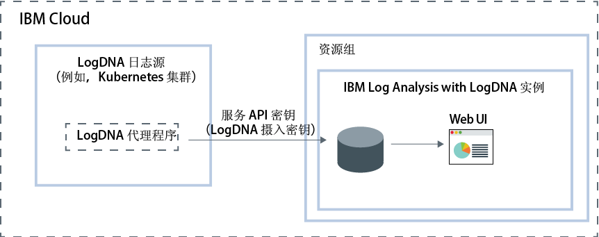

---

copyright:
  years:  2018, 2019
lastupdated: "2019-03-23"

keywords: LogDNA, IBM, Log Analysis, logging, overview

subcollection: LogDNA

---

{:new_window: target="_blank"}
{:shortdesc: .shortdesc}
{:screen: .screen}
{:pre: .pre}
{:table: .aria-labeledby="caption"}
{:codeblock: .codeblock}
{:tip: .tip}
{:download: .download}
{:important: .important}
{:note: .note}

# 关于 {{site.data.keyword.la_full_notm}}
{: #about}

{{site.data.keyword.la_full}} 是一种第三方服务，可以将其包含在 {{site.data.keyword.cloud_notm}} 体系结构中以添加日志管理功能。{{site.data.keyword.la_full_notm}} 由 LogDNA 与 {{site.data.keyword.IBM_notm}} 合作运行。
{:shortdesc}

可以使用 {{site.data.keyword.la_full_notm}} 来管理 {{site.data.keyword.cloud_notm}} 中的系统和应用程序日志。

{{site.data.keyword.la_full_notm}} 为管理员、DevOps 团队和开发者提供了高级功能，用于过滤、搜索和跟踪日志数据，定义警报和设计定制视图，以监视应用程序和系统日志。

## 概述
{: #ov}

要在 {{site.data.keyword.cloud_notm}} 中使用 LogDNA 添加日志记录功能，必须供应 {{site.data.keyword.la_full_notm}} 的实例。

供应 {{site.data.keyword.la_full_notm}} 的实例之前，请考虑以下信息：
* 日志数据在 {{site.data.keyword.cloud_notm}} 上托管。
* 日志数据会发送给第三方。
* 用户必须具有平台许可权，才能在 {{site.data.keyword.cloud_notm}} 中创建、查看和删除服务实例。
* 用户必须具有平台许可权，才能在计划供应 LogDNA 实例的资源组的上下文中创建资源。

在资源组的上下文中供应 {{site.data.keyword.la_full_notm}} 实例。使用资源组可组织服务以用于访问控制和计费。可以在 *default* 资源组或定制资源组中供应实例。

供应 {{site.data.keyword.la_full_notm}} 的实例后，会在 LogDNA 中创建一个帐户，并且您将收到该帐户的摄入密钥。

接下来，必须为每个日志源配置 LogDNA 代理程序。日志源是生成日志的云或内部部署资源。例如，日志源可以是 Kubernetes 集群。可使用摄入密钥来配置负责收集日志并将其转发到 {{site.data.keyword.la_full_notm}} 实例的 LogDNA 代理程序。

LogDNA 代理程序部署在日志源中后，将自动收集日志并将其转发到 {{site.data.keyword.la_full_notm}} 实例。

可以启动 {{site.data.keyword.la_full_notm}} Web UI 来查看、监视和管理日志。

下面显示了在 {{site.data.keyword.cloud_notm}} 上运行的 {{site.data.keyword.la_full_notm}} 服务的组件概览图：

## 日志数据
{: #overview_data}

{{site.data.keyword.la_full_notm}} 在一个集中式日志记录系统中收集和聚集日志。

* 日志数据在 {{site.data.keyword.cloud_notm}} 上托管。
* 数据在供应 {{site.data.keyword.la_full_notm}} 实例的区域中进行主机托管。例如，在美国南部供应的实例的日志数据在美国南部区域中进行托管。

为 {{site.data.keyword.la_full_notm}} 实例选择的服务套餐将定义数据在 LogDNA 中存储和保留的天数。例如，如果选择*免费*套餐，那么不会存储任何数据。但是，如果选择 7 天套餐，那么数据会存储 7 天，并且您有权通过 LogDNA Web UI 访问这些数据。

从 {{site.data.keyword.cloud_notm}} 中删除 {{site.data.keyword.la_full_notm}} 的实例时，将删除所有数据。

## 功能
{: #overview_features}

**实时对日志进行故障诊断，以诊断问题并识别问题。**

通过使用*实时流式跟踪*功能，开发者和 DevOps 团队可以诊断问题，分析堆栈跟踪和异常，识别错误来源，以及通过单个视图监视不同的日志源。此功能通过命令行和 Web 界面提供。

**发出警报以通知重要操作。**
 
为了对识别为严重或警告的应用程序和服务事件及时采取行动，DevOps 团队可以配置与以下系统的警报通知集成：电子邮件、Slack、HipChat、webHook、PagerDuty 和 OpsGenie。

**将日志导出为本地文件进行分析，或将日志导出到归档服务以满足审计需求。**

将特定日志行导出到本地副本，或将 {{site.data.keyword.la_full_notm}} 中的日志归档到 IBM Cloud Object Storage。日志行会以 JSON 行格式导出。日志以 JSON 格式归档，并保留与每一行关联的元数据。

**定制要通过 {{site.data.keyword.la_full_notm}} 来管理的日志，以控制日志记录基础架构成本。**

通过配置要收集和管理其日志的日志源，控制 IBM Cloud 中日志记录基础架构的成本。

## 价格套餐
{: #overview_pricing_plans}

有不同的定价套餐可选择用于 {{site.data.keyword.la_full_notm}} 实例。每个套餐都会定义保留数据供搜索的天数、允许管理数据的用户数以及启用的 LogDNA 功能。

|套餐| 
|--------------------------|
|`30 天日志搜索`|
|`14 天日志搜索`|
|`7 天日志搜索`|
|`轻量`|
{: caption="表 1. 服务套餐列表" caption-side="top"} 

{{site.data.keyword.la_full_notm}} 提供了`轻量`套餐，可用于在日志通过系统时查看日志。您可以使用日志跟踪来查看日志。还可以设计过滤器来准备升级为更长保留期的套餐。此套餐的保留期为 0 天。

以下各表概述了每个服务套餐中包含的不同功能：

|功能|`30 天日志搜索`套餐|`14 天日志搜索`套餐|`7 天日志搜索`套餐|`轻量`套餐| 
|----------------------------------|-------------------------|-------------------------------|-----------------------------|--------------|
|`日志会存储并可搜索`|是 - 30 天|是 - 14 天|是 - 7 天|否|
|`实时流式跟踪`|是|是|是|是|
|`归档`|是|是|是|否|
|`多通道警报`|是|是|是|否| 
{: caption="表 2. 可用于每个服务套餐的功能的列表" caption-side="top"} 

## 区域
{: #overview_regions}

使用 {{site.data.keyword.la_full_notm}} 进行日志记录在以下区域中可用：

|区域|位置|
|-----------------------|-----------|
|**US South**|达拉斯|
|**EU-DE**|法兰克福| 
{: caption="表 3. 服务可用的区域的列表" caption-side="top"} 

目前，**法兰克福****不是**欧盟管理的位置。有关更多信息，请参阅[启用欧盟支持设置](/docs/account?topic=account-eu-hipaa-supported#bill_eusupported)。
{: important}

