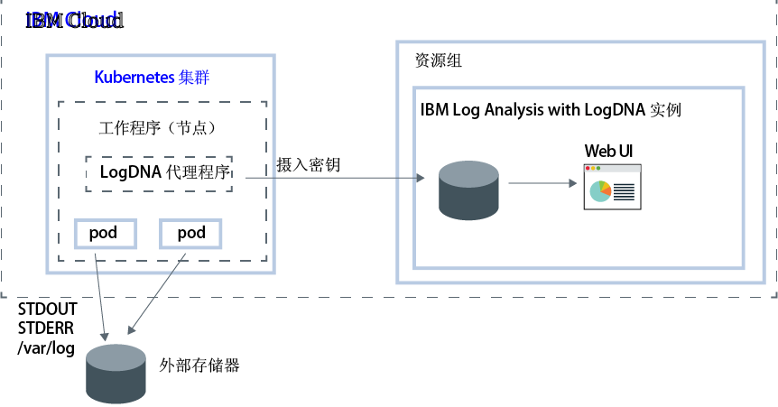

---

copyright:
  years:  2018, 2019
lastupdated: "2019-03-06"

keywords: LogDNA, IBM, Log Analysis, logging, kubernetes, tutorial

subcollection: LogDNA

---

{:new_window: target="_blank"}
{:shortdesc: .shortdesc}
{:screen: .screen}
{:pre: .pre}
{:table: .aria-labeledby="caption"}
{:codeblock: .codeblock}
{:tip: .tip}
{:download: .download}
{:important: .important}
{:note: .note}


# 使用 {{site.data.keyword.la_full_notm}} 管理 Kubernetes 集群日志
{: #kube}

使用 {{site.data.keyword.la_full_notm}} 服务可在 {{site.data.keyword.containerlong}} 中配置集群级别日志记录。
{:shortdesc}

您希望从使用 {{site.data.keyword.containerlong_notm}} 供应集群的那一刻开始，就了解集群内发生的情况。您需要访问日志来对问题进行故障诊断，并抢先一步预防问题发生。您希望随时有权访问不同类型的日志，例如工作程序日志、pod 日志、应用程序日志或网络日志。此外，您还希望监视 Kubernetes 集群中的不同日志数据源。因此，管理和访问来自其中任何源的日志记录的能力至关重要。成功管理和监视日志取决于如何为 Kubernetes 平台配置日志记录功能。

要配置 Kubernetes 集群的集群级别日志记录，请考虑以下信息：

* 必须能够将来自 Kubernetes 系统组件的日志数据、系统日志和容器化应用程序日志存储在单独的存储器上。
* 必须将日志记录代理程序部署到集群中的每个工作程序节点。此代理程序会收集日志，并将其转发到外部日志记录后端。
* 必须能够集中日志数据，以供在外部日志记录后端进行分析。


在 {{site.data.keyword.cloud_notm}} 上，要为 Kubernetes 集群配置集群级别日志记录，必须完成以下步骤：

1. 供应 {{site.data.keyword.la_full_notm}} 服务的实例。通过此步骤，可以在 {{site.data.keyword.cloud_notm}} 上配置用于托管日志数据的集中式日志管理系统。
2. 在 {{site.data.keyword.containerlong_notm}} 上供应集群。支持 Kubernetes V1.9 及更高版本的集群。
3. 在集群中的每个工作程序（节点）上配置 LogDNA 代理程序。



在本教程中，您将了解如何配置集群级别日志记录。

## 开始之前
{: #kube_prereqs}

在美国南部区域中工作。{{site.data.keyword.la_full_notm}} 目前在美国南部区域中可用。**注：**可以从位于同一区域或不同区域的 Kubernetes 集群发送数据。 

请阅读有关 {{site.data.keyword.la_full_notm}} 的信息。有关更多信息，请参阅[关于](/docs/services/Log-Analysis-with-LogDNA?topic=LogDNA-about#about)。

使用作为 {{site.data.keyword.cloud_notm}} 帐户的成员或所有者的用户标识。要获取 {{site.data.keyword.cloud_notm}} 用户标识，请转至：[注册 ](https://cloud.ibm.com/login){:new_window}。

您的 {{site.data.keyword.IBM_notm}} 标识必须分配有对以下每个资源的 IAM 策略： 

|资源|访问策略的作用域|角色 |区域|信息|
|--------------------------------------|----------------------------|---------|-----------|------------------------------|
|资源组 **Default**|资源组|查看者|us-south|要允许用户查看 Default 资源组中的服务实例，此策略是必需的。|
|{{site.data.keyword.la_full_notm}} 服务|资源组|编辑者|us-south|要允许用户在 Default 资源组中供应和管理 {{site.data.keyword.la_full_notm}} 服务，此策略是必需的。|
|Kubernetes 集群实例|资源|编辑者|us-south|要在 Kubernetes 集群中配置私钥和 LogDNA 代理程序，此策略是必需的。|
{: caption="表 1. 完成教程所需的 IAM 策略的列表" caption-side="top"} 

有关 {{site.data.keyword.containerlong}} IAM 角色的更多信息，请参阅[用户访问许可权](/docs/containers?topic=containers-access_reference#access_reference)。

安装 {{site.data.keyword.cloud_notm}} CLI 和 Kubernetes CLI 插件。有关更多信息，请参阅[安装 {{site.data.keyword.cloud_notm}} CLI](/docs/cli?topic=cloud-cli-ibmcloud-cli#ibmcloud-cli)。


## 目标
{: #kube_objectives}

在本教程中，您将使用 LogDNA 为 {{site.data.keyword.containerlong_notm}} 集群配置日志记录。特别是，您将执行以下操作：

- 供应 {{site.data.keyword.la_full_notm}}。 
- 在集群中配置 LogDNA 代理程序，以开始向 LogDNA 发送日志。 
- 打开 LogDNA 仪表板来查找日志。 


## 步骤 1. 供应 {{site.data.keyword.la_full_notm}} 服务实例
{: #kube_step1}

要通过 {{site.data.keyword.cloud_notm}} 控制台来供应 {{site.data.keyword.la_full_notm}} 服务实例，请完成以下步骤：

1. 登录到在其中创建了 Kubernetes 集群的 [{{site.data.keyword.cloud_notm}} 帐户 ](https://cloud.ibm.com/login)。

2. 单击**目录**。这将打开 {{site.data.keyword.cloud_notm}} 服务的列表。

3. 要过滤显示的服务列表，请选择 **Developer Tools** 类别。

4. 单击 **{{site.data.keyword.la_full_notm}}**。这将打开**可观察性**仪表板。

5. 单击**创建实例**。 

6. 输入服务实例的名称。

7. 选择集群所在的资源组。缺省情况下，已设置 **Default** 资源组。 

8. 为服务实例选择服务套餐。缺省情况下，已选择**轻量**套餐。有关其他服务套餐的更多信息，请参阅[价格套餐](/docs/services/Log-Analysis-with-LogDNA?topic=LogDNA-about#overview_pricing_plans)。

9. 要在您登录到的 {{site.data.keyword.cloud_notm}} 资源组中供应 {{site.data.keyword.la_full_notm}} 服务，请单击**创建**。**可观察性**仪表板将打开，并显示服务的详细信息。 

要通过 CLI 供应实例，请参阅[通过 {{site.data.keyword.cloud_notm}} CLI 供应实例](/docs/services/Log-Analysis-with-LogDNA?topic=LogDNA-provision#provision_cli)。
{: tip}

## 步骤 2. 获取摄入密钥
{: #kube_step2}

要获取摄入密钥，请完成以下步骤：

1. 登录到 {{site.data.keyword.cloud_notm}} 帐户。

    单击 [{{site.data.keyword.cloud_notm}} 仪表板 ](https://cloud.ibm.com/login){:new_window} 以启动 {{site.data.keyword.cloud_notm}}“仪表板”。

	使用用户标识和密码登录后，{{site.data.keyword.cloud_notm}} UI 即会打开。

2. 在导航菜单中，选择**可观察性**。 

3. 选择**日志记录**。这将打开 {{site.data.keyword.la_full_notm}} 仪表板。您可以查看 {{site.data.keyword.cloud_notm}} 上可用的日志记录实例的列表。

3. 确定要获取其摄入密钥的实例，然后单击**查看摄入密钥**。

4. 这将打开一个窗口，在其中可以单击**显示**以查看摄入密钥。


## 步骤 3：配置 Kubernetes 集群以将日志发送到 LogDNA 实例
{: #kube_step3}

要配置 Kubernetes 集群以将日志发送到 {{site.data.keyword.la_full_notm}} 实例，必须在集群的每个节点上安装 `logdna-agent` pod。LogDNA 代理程序会从安装了该代理程序的 pod 中读取日志文件，并将日志数据转发到 LogDNA 实例。

要配置 Kubernetes 集群以将日志转发到 LogDNA 实例，请通过命令行完成以下步骤：

1. 打开终端以登录到 {{site.data.keyword.cloud_notm}}。

   ```
   ibmcloud login -a api.ng.bluemix.net
   ```
   {: pre}

   选择已供应 {{site.data.keyword.la_full_notm}} 实例的帐户。

2. 将要配置日志记录的集群设置为此会话的上下文。

   ```
   ibmcloud ks cluster-config <cluster_name_or_ID>
   ```
   {: pre}

   配置文件下载完成后，会显示一个命令，您可以使用该命令将本地 Kubernetes 配置文件的路径设置为环境变量。复制并粘贴终端中显示的命令，以设置 `KUBECONFIG` 环境变量。

   每次登录到 {{site.data.keyword.containerlong_notm}} CLI 来使用集群时，都必须运行此设置以将集群的配置文件的路径设置为会话变量。{{site.data.keyword.containerlong_notm}} 使用此变量来查找与集群连接所必需的本地配置文件和证书。
   {: tip}

3. 创建 Kubernetes 私钥来存储服务实例的 logDNA 摄入密钥。LogDNA 摄入密钥用于打开安全 Web 套接字来连接 logDNA 摄入服务器，以及向 {{site.data.keyword.la_full_notm}} 服务认证日志记录代理程序。

    ```
    kubectl create secret generic logdna-agent-key --from-literal=logdna-agent-key=<logDNA_ingestion_key>
    ```
    {: pre}

4. 创建 Kubernetes 守护程序集，以用于在 Kubernetes 集群的每个工作程序节点上部署 LogDNA 代理程序。LogDNA 代理程序会收集在 pod 的 `/var/log` 目录中存储的扩展名为 `*.log` 的日志以及无扩展名的文件。缺省情况下，将从所有名称空间（包括 `kube-system`）收集日志，并自动将日志转发到 {{site.data.keyword.la_full_notm}} 服务。

   ```
   kubectl create -f https://repo.logdna.com/ibm/prod/logdna-agent-ds-us-south.yaml
   ```
   {: pre}

5. 验证 LogDNA 代理程序是否已成功部署。 

   ```
   kubectl get pods
   ```
   {: pre}
   
   当您看到一个或多个 LogDNA pod 时，说明部署成功。LogDNA pod 数等于集群中的工作程序节点数。所有 pod 都必须处于 `Running` 状态。


## 步骤 4：启动 LogDNA 仪表板并查看日志
{: #kube_step4}

要通过 {{site.data.keyword.cloud_notm}} 控制台启动 LogDNA 仪表板，请完成以下步骤：

1. 登录到 [{{site.data.keyword.cloud_notm}} 帐户 ](https://cloud.ibm.com/login)。

2. 从菜单  中，选择**可观察性**。

3. 选择**日志记录**。这将显示 {{site.data.keyword.cloud_notm}} 上可用的 {{site.data.keyword.la_full_notm}} 服务实例的列表。

4. 选择一个实例，然后单击**查看 LogDNA**。这将打开 LogDNA 仪表板。**注：**使用**免费**服务套餐时，只能跟踪最新的日志。有关更多信息，请参阅[查看日志](/docs/services/Log-Analysis-with-LogDNA?topic=LogDNA-view_logs#view_logs)。

## 后续步骤
{: #kube_next_steps}

- [过滤日志](/docs/services/Log-Analysis-with-LogDNA?topic=LogDNA-view_logs#view_logs_step5)
- [搜索日志](/docs/services/Log-Analysis-with-LogDNA?topic=LogDNA-view_logs#view_logs_step6)
- [定义视图](/docs/services/Log-Analysis-with-LogDNA?topic=LogDNA-view_logs#view_logs_step7)
- [配置警报](https://docs.logdna.com/docs/alerts)。 

**注：**其中一些功能需要升级套餐。


