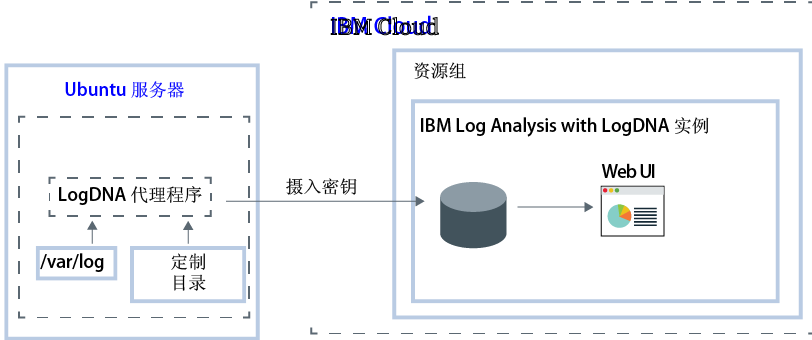

---

copyright:
  years:  2018, 2019
lastupdated: "2019-03-06"

keywords: LogDNA, IBM, Log Analysis, logging, ubuntu, tutorial

subcollection: LogDNA

---

{:new_window: target="_blank"}
{:shortdesc: .shortdesc}
{:screen: .screen}
{:pre: .pre}
{:table: .aria-labeledby="caption"}
{:codeblock: .codeblock}
{:tip: .tip}
{:download: .download}
{:important: .important}
{:note: .note}


# 使用 {{site.data.keyword.la_full_notm}} 管理 Ubuntu 日志
{: #ubuntu}

使用 {{site.data.keyword.la_full}} 服务可在 {{site.data.keyword.cloud_notm}} 上的集中式日志记录系统中监视和管理 Ubuntu 日志。
{:shortdesc}

可以收集和监视系统和应用程序日志。 

缺省情况下，Ubuntu 的 LogDNA 代理程序会监视 **/var/log** 目录中的日志文件。例如，缺省情况下会监视 Ubuntu 系统日志 (*/var/log/syslog*)。

在 {{site.data.keyword.cloud_notm}} 上，要配置 Ubuntu 服务器以将日志转发到 {{site.data.keyword.la_full_notm}} 实例，必须完成以下步骤：

1. 供应 {{site.data.keyword.la_full_notm}} 服务的实例。 
2. 在 Ubuntu 服务器中配置 LogDNA 代理程序。
3. （可选）添加要由代理程序监视的更多目录。



在本教程中，您将了解如何配置 Ubuntu 服务器以将日志转发到 {{site.data.keyword.la_full_notm}} 实例。

## 开始之前
{: #ubuntu_prereqs}

请阅读有关 {{site.data.keyword.la_full_notm}} 的信息。有关更多信息，请参阅[关于 LogDNA](/docs/services/Log-Analysis-with-LogDNA?topic=LogDNA-about#about)。

在美国南部区域中工作。{{site.data.keyword.la_full_notm}} 目前在美国南部区域中可用。**注：**可以从位于同一区域或不同区域的 Ubuntu 服务器发送数据。 

使用作为 {{site.data.keyword.cloud_notm}} 帐户的成员或所有者的用户标识。要获取 {{site.data.keyword.cloud_notm}} 用户标识，请转至：[注册 ](https://cloud.ibm.com/login){:new_window}。

您的 {{site.data.keyword.IBM_notm}} 标识必须分配有对以下每个资源的 IAM 策略： 

|资源|访问策略的作用域|角色 |区域|信息|
|--------------------------------------|----------------------------|---------|-----------|------------------------------|
|资源组 **Default**|资源组|查看者|us-south|要允许用户查看 Default 资源组中的服务实例，此策略是必需的。|
|{{site.data.keyword.la_full_notm}} 服务|资源组|编辑者|us-south|要允许用户在 Default 资源组中供应和管理 {{site.data.keyword.la_full_notm}} 服务，此策略是必需的。|
{: caption="表 1. 完成教程所需的 IAM 策略的列表" caption-side="top"} 

安装 {{site.data.keyword.cloud_notm}} CLI。有关更多信息，请参阅[安装 {{site.data.keyword.cloud_notm}} CLI](/docs/cli/index.html#overview)。


## 步骤 1. 供应 {{site.data.keyword.la_full_notm}} 实例
{: #ubuntu_step1}

要通过 {{site.data.keyword.cloud_notm}} UI 来供应 {{site.data.keyword.la_full_notm}} 的实例，请完成以下步骤：

1. 登录到 {{site.data.keyword.cloud_notm}} 帐户。

    单击 [{{site.data.keyword.cloud_notm}} 仪表板 ](https://cloud.ibm.com/login){:new_window} 以启动 {{site.data.keyword.cloud_notm}}“仪表板”。

	使用用户标识和密码登录后，{{site.data.keyword.cloud_notm}} UI 即会打开。

2. 单击**目录**。这将打开 {{site.data.keyword.cloud_notm}} 中提供的服务的列表。

3. 要过滤显示的服务列表，请选择 **Developer Tools** 类别。

4. 单击 **{{site.data.keyword.la_full_notm}}** 磁贴。

5. 输入服务实例的名称。

6. 选择 **Default** 资源组。 

    缺省情况下，已设置 **Default** 资源组。

7. 选择**轻量**服务套餐。 

    缺省情况下，已设置**轻量**套餐。

    有关其他服务套餐的更多信息，请参阅[价格套餐](/docs/services/Log-Analysis-with-LogDNA?topic=LogDNA-about#overview_pricing_plans)。

8. 要在您登录到的 {{site.data.keyword.cloud_notm}} 资源组中供应 {{site.data.keyword.la_full_notm}} 服务，请单击**创建**。

供应实例后，将打开 {{site.data.keyword.la_full_notm}} 仪表板。 


**注：**要通过 CLI 供应 LogDNA 的实例，请参阅[通过 {{site.data.keyword.cloud_notm}} CLI 供应 LogDNA](/docs/services/Log-Analysis-with-LogDNA?topic=LogDNA-provision#provision_cli)。


## 步骤 2. 配置 Ubuntu 服务器以向实例发送日志
{: #ubuntu_step2}

要配置 Ubuntu 服务器以将日志发送到 {{site.data.keyword.la_full_notm}} 实例，必须安装 `logdna-agent`。LogDNA 代理程序会从 */var/log* 中读取日志文件，并将日志数据转发到 LogDNA 实例。

要配置 Ubuntu 服务器以将日志转发到 LogDNA 实例，请通过 Ubuntu 终端完成以下步骤：

1. 安装 LogDNA 代理程序。运行以下命令：

    ```
    echo "deb https://repo.logdna.com stable main" | sudo tee /etc/apt/sources.list.d/logdna.list 
    ```
    {: codeblock}

    ```
    wget -O- https://repo.logdna.com/logdna.gpg | sudo apt-key add - 
    ```
    {: codeblock}

    ```
    sudo apt-get update
    ```
    {: codeblock}

    ```
    sudo apt-get install logdna-agent < "/dev/null"
    ```
    {: codeblock}

2. 设置 LogDNA 代理程序将日志转发到 {{site.data.keyword.la_full_notm}} 实例时必须使用的摄入密钥。  

    ```
    sudo logdna-agent -k INGESTION_KEY
    ```
    {: codeblock}

    其中，INGESTION_KEY 包含要配置为转发日志的 {{site.data.keyword.la_full_notm}} 实例的有效摄入密钥。

3. 设置认证端点。LogDNA 代理程序使用此主机来认证并获取用于转发日志的令牌。

    ```
    sudo logdna-agent -s LOGDNA_APIHOST=api.us-south.logging.cloud.ibm.com
    ```
    {: codeblock}

4. 设置摄入端点。

    ```
    sudo logdna-agent -s LOGDNA_LOGHOST=logs.us-south.logging.cloud.ibm.com
    ```
    {: codeblock}

5. 定义要监视的更多日志路径。运行以下命令： 

    ```
    sudo logdna-agent -d /path/to/log/folders
    ```
    {: codeblock}

    缺省情况下，将监视 **/var/log**。

6. （可选）配置 LogDNA 代理程序以标记主机。运行以下命令：

    ```
    sudo logdna-agent -t TAG1,TAG2 
    ```
    {: codeblock}

    ```
    sudo update-rc.d logdna-agent defaults
    ```
    {: codeblock}

    ``` 
    sudo /etc/init.d/logdna-agent start
    ```
    {: codeblock}


## 步骤 3. 启动 LogDNA Web UI
{: #ubuntu_step3}

要通过 {{site.data.keyword.cloud_notm}} UI 启动 IBM Log Analysis with LogDNA 仪表板，请完成以下步骤：

1. 登录到 {{site.data.keyword.cloud_notm}} 帐户。

    单击 [{{site.data.keyword.cloud_notm}} 仪表板 ](https://cloud.ibm.com/login){:new_window} 以启动 {{site.data.keyword.cloud_notm}}“仪表板”。

	使用用户标识和密码登录后，{{site.data.keyword.cloud_notm}}“仪表板”即会打开。

2. 在导航菜单中，选择**可观察性**。 

3. 选择**日志记录**。 

    这将显示 {{site.data.keyword.cloud_notm}} 上可用的 {{site.data.keyword.la_full_notm}} 实例的列表。

3. 选择一个实例。然后，单击**查看 LogDNA**。

    LogDNA Web UI 将打开并显示集群日志。


## 步骤 4. 查看日志
{: #ubuntu_step4}

在 LogDNA Web UI 中，可以在日志通过系统时查看这些日志。您可以使用日志跟踪来查看日志。 

**注：**使用**免费**服务套餐时，只能跟踪最新的日志。

有关更多信息，请参阅[查看日志](/docs/services/Log-Analysis-with-LogDNA?topic=LogDNA-view_logs#view_logs)。


## 后续步骤
{: #ubuntu_next_steps}

[过滤日志](/docs/services/Log-Analysis-with-LogDNA?topic=LogDNA-view_logs#view_logs_step5)、[搜索日志](/docs/services/Log-Analysis-with-LogDNA?topic=LogDNA-view_logs#view_logs_step6)、[定义视图](/docs/services/Log-Analysis-with-LogDNA?topic=LogDNA-view_logs#view_logs_step7)和[配置警报](https://docs.logdna.com/docs/alerts)。 

**注：**要使用其中任何功能，必须将 {{site.data.keyword.la_full_notm}} 套餐升级为付费套餐。

