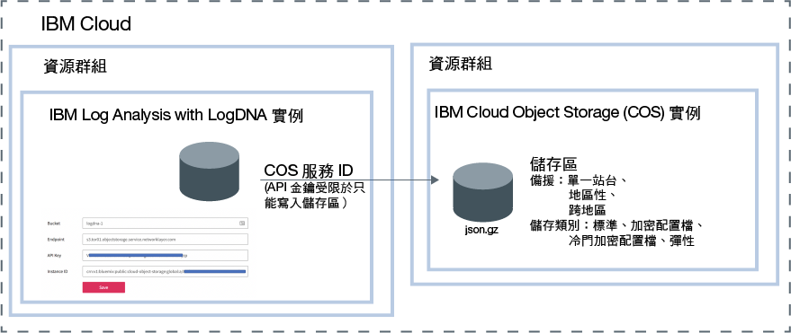

---

copyright:
  years:  2018, 2019
lastupdated: "2019-03-06"

keywords: LogDNA, IBM, Log Analysis, logging, archive logs, COS, cloud object storage

subcollection: LogDNA

---

{:new_window: target="_blank"}
{:shortdesc: .shortdesc}
{:screen: .screen}
{:pre: .pre}
{:table: .aria-labeledby="caption"}
{:codeblock: .codeblock}
{:tip: .tip}
{:download: .download}
{:important: .important}
{:note: .note}

 
# 將日誌保存至 IBM Cloud Object Storage
{: #archiving}

您可以將日誌從 {{site.data.keyword.la_full_notm}} 實例保存至 {{site.data.keyword.cos_full_notm}} (COS) 實例中的儲存區。
{:shortdesc}

若要配置保存，您必須具有平台角色**檢視者**及服務角色**管理員**對 {{site.data.keyword.la_full_notm}} 服務的 IAM 原則。

將日誌從 {{site.data.keyword.la_full_notm}} 實例保存至 {{site.data.keyword.cos_full_notm}} (COS) 實例中的儲存區。每個 {{site.data.keyword.la_full_notm}} 實例都有自己的保存配置。 

日誌會以壓縮格式 **(.json.gz)**，每日自動保存一次。每一行會保留其 meta 資料。

日誌會在您儲存配置之後的 24-48 小時內保存。 

{{site.data.keyword.cos_full_notm}} 實例佈建在資源群組的環境定義內。{{site.data.keyword.la_full_notm}} 實例也佈建在資源群組的環境定義內。這兩個實例可以分組在相同的資源群組中，或分組在不同的資源群組中。 

{{site.data.keyword.la_full_notm}} 使用服務 ID 來與 {{site.data.keyword.cos_full_notm}} 服務通訊。

* {{site.data.keyword.la_full_notm}} 會使用您為 {{site.data.keyword.cos_full_notm}} 實例所建立的服務 ID 來鑑別及存取 {{site.data.keyword.cos_full_notm}} 實例。 
* 您可以將限制 {{site.data.keyword.cos_full_notm}} 實例許可權的特定存取原則指派給服務 ID。將服務 ID 限制為只具有您計劃在其中保存日誌之儲存區的寫入權。

下圖顯示在保存日誌時整合的不同元件的高階視圖：

請完成下列步驟，以將 {{site.data.keyword.la_full_notm}} 實例保存至 {{site.data.keyword.cos_full_notm}} 實例中的儲存區：

## 步驟 1. 將 IAM 原則授與使用者以使用 {{site.data.keyword.cos_full_notm}}
{: #archiving_step1}

**附註：**這個步驟必須由 {{site.data.keyword.cloud_notm}} 上 {{site.data.keyword.cos_full_notm}} 服務的帳戶擁有者或管理者來完成。

身為 {{site.data.keyword.cos_full_notm}} 服務的管理者，您必須能夠佈建服務的實例、授與其他使用者許可權來使用這些實例，以及建立服務 ID。 

您可以利用不同的方式來授與使用者許可權，使其變成 {{site.data.keyword.cos_full_notm}} 服務的編輯者：

* 身為帳戶中服務的管理者，使用者必須具有平台角色*管理者*對 {{site.data.keyword.cos_full_notm}} 服務的 IAM 原則。您必須將此使用者存取權指派給帳戶中的個別資源。 

* 對於資源群組之環境定義內的服務，身為該服務的管理者，使用者在該資源群組的環境定義內，必須具有平台角色*管理者*對 {{site.data.keyword.cos_full_notm}} 服務的 IAM 原則。 

下表列出使用者可以擁有的角色，以完成針對 {{site.data.keyword.cos_full_notm}} 服務所列出的動作：

| 服務                    | 平台角色    | 動作                                                                                        | 
|----------------------------|-------------------|-----------------------------------------------------------------------------------------------|       
| `Cloud Object Storage`     | 管理者     | 容許使用者將原則指派給帳戶中的使用者，以使用 {{site.data.keyword.cos_full_notm}} 服務。|
| `Cloud Object Storage`     | 管理者  編輯者 | 容許使用者佈建 {{site.data.keyword.cos_full_notm}} 服務的實例。|
| `Cloud Object Storage`     | 管理者  編輯者  操作員 | 容許使用者建立服務 ID。| 
{: caption="表 1. 角色及動作" caption-side="top"} 

請完成下列步驟，將資源群組環境定義內 {{site.data.keyword.cos_full_notm}} 服務的管理者角色，指派給使用者： 

1. 從功能表列中，按一下**管理** &gt; **存取權 (IAM)**，然後選取**使用者**。
2. 從您要指派存取權的使用者列，選取**動作**功能表，然後按一下**指派存取權**。
3. 選取**指派資源群組內的存取權**。
4. 選取資源群組。
5. 如果未授與使用者所選資源群組的角色，請針對**指派資源群組的存取權**欄位，選擇一個角色。 

    根據您選取的角色，使用者可以在其儀表板上檢視資源群組、編輯資源群組名稱，或管理群組的使用者存取權。 
    
    如果您希望使用者只具有資源群組中對 {{site.data.keyword.la_full_notm}} 服務的存取權，可以選取**不存取**。

6. 選取 **Cloud Object Storage**。
7. 選取平台角色**管理者**。
8. 按一下**指派**。

## 步驟 2. 佈建 {{site.data.keyword.cos_full_notm}} 的實例
{: #archiving_step2}

**附註：**這個步驟必須由 {{site.data.keyword.cloud_notm}} 上 {{site.data.keyword.cos_full_notm}} 服務的編輯者或管理者來完成。 

請完成下列步驟來佈建 {{site.data.keyword.cos_full_notm}} 實例：

1. 登入您的 {{site.data.keyword.cloud_notm}} 帳戶。

    按一下 [{{site.data.keyword.cloud_notm}} 儀表板 ](https://cloud.ibm.com/login){:new_window}，以啟動 {{site.data.keyword.cloud_notm}} 儀表板。

	使用您的使用者 ID 和密碼登入之後，即會開啟 {{site.data.keyword.cloud_notm}} 使用者介面。

2. 按一下**型錄**。即會開啟 {{site.data.keyword.cloud_notm}} 中可用的服務清單。

3. 若要過濾顯示的服務清單，請選取**儲存空間**種類。

4. 按一下 **Object Storage** 磚。

5. 輸入服務實例的名稱。

6. 選取資源群組。 

    依預設，會設定 **Default** 資源群組。

7. 選取服務方案。 

    依預設，會設定**精簡**方案。

9. 按一下**建立**。

## 步驟 3. 建立儲存區
{: #archiving_step3}

儲存區是一種在 {{site.data.keyword.cos_full_notm}} 實例中組織資料的方法。 

若要管理儲存區，您必須授與您的使用者許可權，才能在 {{site.data.keyword.cos_full_notm}} 實例上使用儲存區。下表概述使用者可以擁有以便使用儲存區的不同動作和角色：

| 服務                    | 角色                   | 動作                             | 
|----------------------------|-------------------------|------------------------------------|       
| `Cloud Object Storage`     | 平台角色：檢視者     | 容許使用者檢視所有儲存區，並透過 {site.data.keyword.Bluemix_notm}} 使用者介面來列出其中的物件。|
| `Cloud Object Storage`     | 服務角色：管理員   | 容許使用者將物件設為公用。|
| `Cloud Object Storage`     | 服務角色：管理員  作者 | 容許使用者建立及破壞儲存區與物件。| 
| `Cloud Object Storage`     | 服務角色：讀者    | 容許使用者列出及下載物件。|
{: caption="表 1. 要使用儲存區的角色和動作" caption-side="top"} 

**附註：**若要建立儲存區，您的使用者必須具有 {{site.data.keyword.cos_full_notm}} 實例的管理者或作者許可權。

請完成下列步驟來建立儲存區：

1. 登入您的 {{site.data.keyword.cloud_notm}} 帳戶。

    按一下 [{{site.data.keyword.cloud_notm}} 儀表板 ](https://cloud.ibm.com/login){:new_window}，以啟動 {{site.data.keyword.cloud_notm}} 儀表板。

	使用您的使用者 ID 和密碼登入之後，即會開啟 {{site.data.keyword.cloud_notm}} 儀表板。

2. 從「儀表板」中，選取計劃在其中建立儲存區的 {{site.data.keyword.cos_full_notm}} 實例。

3. 選取**儲存區**。然後，按一下**建立儲存區**。

4. 在*唯一儲存區名稱* 欄位中，輸入儲存區名稱。

    **附註：**全球所有地區的所有儲存區都共用單一名稱空間。 

    您可以使用您的 {{site.data.keyword.la_full_notm}} 實例名稱作為儲存區名稱的一部分。例如，對於名稱為 *logdna-1* 的實例，您可以使用 *accountN-logdna-1* 作為您的儲存區名稱。

    您需要此名稱，才能透過 {{site.data.keyword.la_full_notm}} Web 使用者介面來配置保存。

5. 選擇備援類型及您想要實際儲存資料的位置。

    備援是指資料分散的地理區域範圍及規模。 
    
    跨區域備援會將資料分散到數個都會區。
    
    區域性備援會將資料分散到單一都會區。 
    
    「單一資料中心」只會在單一網站內的各個裝置之間分散存放資料。

    如需相關資訊，請參閱[選取地區和端點](/docs/services/cloud-object-storage?topic=cloud-object-storage-endpoints#endpoints)。

6. 選擇*儲存空間類別* 的類型。

    您可以建立不同儲存空間類別的儲存區。根據您的擷取資料需求，選擇儲存區的儲存空間類別。如需相關資訊，請參閱[使用儲存空間類別](/docs/services/cloud-object-storage?topic=cloud-object-storage-use-storage-classes#use-storage-classes)。

    **附註：**建立儲存區之後，無法變更儲存區的儲存空間類別。如果物件需要重新分類，則必須將資料移至具有想要之儲存空間類別的另一個儲存區。

7. 選擇性地新增「Key Protect 金鑰」，以加密靜態資料。

    依預設，所有物件都使用隨機產生的金鑰和 all-or-nothing-transform 來加密。雖然這個預設加密模型提供靜態安全，但是有些工作負載需要擁有已使用的加密金鑰。如需相關資訊，請參閱[管理加密](/docs/services/cloud-object-storage?topic=cloud-object-storage-manage-encryption#manage-encryption)。

## 步驟 4. 建立 {{site.data.keyword.cos_full_notm}} 實例的服務 ID
{: #archiving_step4}

服務 ID 識別服務，類似於使用者 ID 識別使用者。服務 ID 不會與特定的使用者關聯。如果建立服務 ID 的使用者離開您的組織，並從帳戶中刪除，該服務 ID 仍會保留。

您必須為 {{site.data.keyword.cos_full_notm}} 實例建立服務 ID。此服務 ID 由 {{site.data.keyword.la_full_notm}} 實例使用，以對您的 {{site.data.keyword.cos_full_notm}} 實例進行鑑別。 

您必須將特定的存取原則指派給服務 ID，該存取原則限制用於使用特定服務的許可權，或甚至結合用於存取不同服務的許可權。例如，若要限制存取單一儲存區，請確定服務 ID 沒有任何實例層次原則使用主控台或 CLI。

請完成下列步驟來建立具有 {{site.data.keyword.cos_full_notm}} 實例寫入權的服務 ID：

1. 登入您的 {{site.data.keyword.cloud_notm}} 帳戶。

    按一下 [{{site.data.keyword.cloud_notm}} 儀表板 ](https://cloud.ibm.com/login){:new_window}，以啟動 {{site.data.keyword.cloud_notm}} 儀表板。

	使用您的使用者 ID 和密碼登入之後，即會開啟 {{site.data.keyword.cloud_notm}} 儀表板。

2. 從「儀表板」中，選取計劃在其中建立儲存區的 {{site.data.keyword.cos_full_notm}} 實例。

3. 選取**服務認證**。然後，選取**新建認證**。

4. 輸入名稱。 

5. 選取**作者**角色。

6. 按一下**新增**。

    這時會在清單中新增一個新的服務 ID。 

針對您剛剛建立的服務 ID，按一下**檢視認證**。您可以查看與該服務 ID 相關的資訊。 

* 複製 API 金鑰。這是針對 **apikey** 欄位所設定的值。
* 複製資源實例 ID。這是針對 **resource_instance_id** 欄位所設定的值。

## 步驟 5. 將服務 ID 限制為僅具有儲存區的寫入權
{: #archiving_step5}

如果您要將服務 ID 限制為僅具有儲存區的寫入權，請完成下列步驟：

1. 閱讀服務 ID 的資訊，並寫下 **iam_apikey_name** 欄位與 **iam_apikey_name** 欄位的值。 

2. 從「儀表板」中，選取**管理** &gt; **存取權 (IAM)**，然後選取**使用者**。

3. 選取**服務 ID**。

4. 尋找具有下列名稱的服務 ID：**auto-generated-serviceId-<ID，其為 iam_apikey_name 值的一部分>。

5. 選取服務 ID。然後，在**存取原則**中，按一下**作者**。

6. 在*資源類型* 欄位中，輸入 **bucket**。

7. 在*資源 ID* 欄位中，輸入儲存區的名稱。

8. 按一下**儲存**。

**附註：**如果您將「資源類型」或「資源」欄位保留空白，則建立的原則為實例層次原則。

## 步驟 6. 選取端點
{: #archiving_step6}

端點定義儲存區尋找位置。有不同的端點，視地區及備援類型而定。如需相關資訊，請參閱[選取地區和端點](/docs/services/cloud-object-storage?topic=cloud-object-storage-endpoints#endpoints)。

請完成下列步驟來取得儲存區的端點：

1. 登入您的 {{site.data.keyword.cloud_notm}} 帳戶。

    按一下 [{{site.data.keyword.cloud_notm}} 儀表板 ](https://cloud.ibm.com/login){:new_window}，以啟動 {{site.data.keyword.cloud_notm}} 儀表板。

	使用您的使用者 ID 和密碼登入之後，即會開啟 {{site.data.keyword.cloud_notm}} 儀表板。

2. 從「儀表板」中，選取計劃在其中建立儲存區的 {{site.data.keyword.cos_full_notm}} 實例。

3. 選取**儲存區**。然後，選取您已建立且要在其中保存日誌的儲存區。

4. 選取**配置**。

5. 複製其中一個專用端點。 

## 步驟 7. 將 IAM 原則授與使用者以保存日誌
{: #archiving_step7}

下表列出使用者必須擁有的原則，以從 {{site.data.keyword.la_full_notm}} Web 使用者介面，將日誌的保存配置到 {{site.data.keyword.cos_full_notm}} 實例中的儲存區：

| 服務                        | 角色                      | 授與的許可權                  | 
|--------------------------------|---------------------------|-------------------------------------|  
| `{{site.data.keyword.la_full_notm}}` | 平台角色：檢視者     | 容許使用者檢視「觀察記載」儀表板中的服務實例清單。|
| `{{site.data.keyword.la_full_notm}}` | 服務角色：管理員   | 容許使用者啟動 Web 使用者介面，以及在 Web 使用者介面中檢視日誌。|
{: caption="表 2. IAM 原則" caption-side="top"} 

如需如何為使用者配置這些原則的相關資訊，請參閱[將許可權授與使用者以在 LogDNA 中檢視日誌](/docs/services/Log-Analysis-with-LogDNA/work_iam.html#user_logdna)。

請完成下列步驟，將保存日誌的許可權，指派給使用者： 

1. 從功能表列中，按一下**管理** &gt; **存取權 (IAM)**，然後選取**使用者**。
2. 從您要指派存取權的使用者列，選取**動作**功能表，然後按一下**指派存取權**。
3. 選取**指派資源群組內的存取權**。
4. 選取資源群組。
5. 如果未授與使用者所選資源群組的角色，請針對**指派資源群組的存取權**欄位，選擇一個角色。 

    根據您選取的角色，使用者可以在其儀表板上檢視資源群組、編輯資源群組名稱，或管理群組的使用者存取權。 
    
    如果您希望使用者只具有資源群組中對 {{site.data.keyword.la_full_notm}} 服務的存取權，可以選取**不存取**。

6. 選取 **IBM Log Analysis with LogDNA**。
7. 選取平台角色**檢視者**。
8. 選取服務角色**管理員**。
9. 按一下**指派**。

## 步驟 8. 配置 {{site.data.keyword.la_full_notm}} 實例的保存
{: #archiving_step8}

請完成下列步驟，以將 {{site.data.keyword.la_full_notm}} 實例的保存配置到 COS 儲存區：

1. 啟動 {{site.data.keyword.la_full_notm}} Web 使用者介面。[進一步瞭解](/docs/services/Log-Analysis-with-LogDNA/view_logs.html#view_logs_step2)。

2. 選取**配置**圖示。然後，選取**保存**。 

3. 選取 **IBM Cloud Object Storage**。

4. 設定要保存日誌的儲存區、端點、API 金鑰及實例 ID。

    <table>
      <caption>表 3. COS 欄位</caption>
      <tr>
         <th>欄位</th>
         <th>值</th>
      </tr>
      <tr>
         <td>儲存區</td>
         <td>設為 COS 儲存區名稱。</td>
      </tr>
      <tr>
         <td>端點</td>
         <td>設為 COS 儲存區專用端點。</td>
      </tr>
      <tr>
         <td>API 金鑰</td>
         <td>設為與 COS 服務 ID 相關聯的 API 金鑰。</td>
      </tr>
      <tr>
         <td>實例 ID</td>
         <td>設為 COS 實例 ID。</td>
      </tr>
    </table>

5. 按一下**儲存**。

在您儲存配置之後，日誌會一天保存一次。

