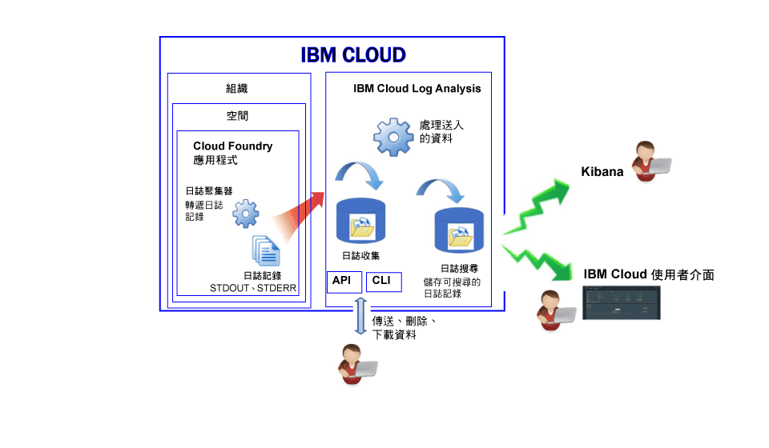

---

copyright:
  years: 2017, 2019

lastupdated: "2019-03-06"

keywords: IBM Cloud, logging

subcollection: cloudloganalysis

---

{:new_window: target="_blank"}
{:shortdesc: .shortdesc}
{:screen: .screen}
{:pre: .pre}
{:table: .aria-labeledby="caption"}
{:codeblock: .codeblock}
{:tip: .tip}
{:download: .download}
{:important: .important}
{:note: .note}

# Cloud Foundry 應用程式
{: #logging_cf_apps}

在 {{site.data.keyword.Bluemix}} 中，您可以透過 {{site.data.keyword.Bluemix_notm}} 儀表板、Kibana 及指令行介面，來檢視、過濾及分析 Cloud Foundry (CF) 日誌。此外，您還可以將日誌記錄串流到外部日誌管理工具。
{:shortdesc}

{{site.data.keyword.Bluemix_notm}} 會記錄 Cloud Foundry 平台和 Cloud Foundry 應用程式所產生的日誌資料。在日誌中，您可以檢視針對應用程式所產生的錯誤、警告及參考訊息。 

當您在 {{site.data.keyword.Bluemix_notm}} 上的雲端平台即服務 (PaaS)（如 Cloud Foundry）中執行應用程式時，無法透過 SSH 或 FTP 連接至執行應用程式的基礎架構來存取日誌。該平台是由雲端提供者控制。在 {{site.data.keyword.Bluemix_notm}} 上執行的 Cloud Foundry 應用程式，使用「日誌聚集器」元件來轉遞 Cloud Foundry 基礎架構中的日誌記錄。「日誌聚集器」會自動拾取 STDOUT 和 STDERR 資料。您可以透過 {{site.data.keyword.Bluemix_notm}} 儀表板、Kibana 和指令行介面來視覺化及分析這些日誌。

下圖顯示 {{site.data.keyword.Bluemix_notm}} 中 Cloud Foundry 應用程式記載功能的高階視圖：

 
當您在 {{site.data.keyword.Bluemix_notm}} 上使用 Cloud Foundry 基礎架構來執行應用程式時，會自動啟用 Cloud Foundry 應用程式的記載功能。若要檢視 Cloud Foundry 運行環境日誌，您必須將日誌寫入 STDOUT 和 STDERR。如需相關資訊，請參閱[透過 CF 應用程式的運行環境應用程式記載](/docs/services/CloudLogAnalysis/cfapps?topic=cloudloganalysis-logging_writing_to_log_from_cf_app#logging_writing_to_log_from_cf_app)。

{{site.data.keyword.Bluemix_notm}} 會保留有限的日誌資訊量。在記載資訊時，舊資訊會取代為較新的資訊。如果您必須遵守組織或業界原則，保存部分或所有日誌資訊以供審核或其他用途，您可以將日誌串流至外部日誌主機，例如協力廠商日誌管理服務或其他主機。如需相關資訊，請參閱[配置外部日誌主機](/docs/services/CloudLogAnalysis/external?topic=cloudloganalysis-thirdparty_logging#thirdparty_logging)。

## 日誌汲取
{: #log_ingestion1}

您可以使用「多方承租戶 Logstash 轉遞程式」，將日誌傳送至 {{site.data.keyword.loganalysisshort}}。如需相關資訊，請參閱[使用多方承租戶 Logstash 轉遞程式 (mt-logstash-forwarder) 傳送日誌資料](/docs/services/CloudLogAnalysis/how-to/send-data?topic=cloudloganalysis-send_data_mt#send_data_mt)。

{{site.data.keyword.loganalysisshort}} 服務提供不同的方案。所有方案（不含*精簡* 方案）都可以將日誌傳送至「日誌收集」。如需方案的相關資訊，請參閱[服務方案](/docs/services/CloudLogAnalysis?topic=cloudloganalysis-log_analysis_ov#plans)。

## 日誌收集
{: #log_collection}

依預設，{{site.data.keyword.loganalysisshort}} 服務會在「日誌搜尋」中儲存最多 3 天的日誌資料：   

* 每個空間每天最多可儲存 500 MB 的資料。超過該 500 MB 上限的任何日誌都會被捨棄。上限配額會在每天凌晨 12:30（世界標準時間）重設。
* 可搜尋最多 3 天、最多 1.5 GB 的資料。達到 1.5 GB 資料或在 3 天之後，日誌資料就會輪替（先進先出）。

{{site.data.keyword.loganalysisshort}} 服務提供其他方案，讓您依所需將日誌儲存在「日誌收集」。 

* 您可以配置日誌保留原則，以定義您要將日誌保留在「日誌收集」中的天數。如需相關資訊，請參閱[日誌保留原則](/docs/services/CloudLogAnalysis?topic=cloudloganalysis-manage_logs#log_retention_policy)。
* 您可以使用指令行或 API，手動刪除日誌。

如需每一個方案價格的相關資訊，請參閱[服務方案](/docs/services/CloudLogAnalysis?topic=cloudloganalysis-log_analysis_ov#plans)。

## 日誌搜尋
{: #log_search1}

依預設，在 {{site.data.keyword.Bluemix_notm}} 中，您可以使用 Kibana 每天最多搜尋 500 MB 的日誌。 

{{site.data.keyword.loganalysisshort}} 服務提供多個方案。每一個方案都有不同的日誌搜尋功能，例如，*日誌收集* 方案可讓您每天最多搜尋 1 GB 的資料。如需方案的相關資訊，請參閱[服務方案](/docs/services/CloudLogAnalysis?topic=cloudloganalysis-log_analysis_ov#plans)。

## 分析 CF 應用程式日誌的方法
{: #logging_bluemix_cf_apps_log_methods}

您可以選擇下列任何方法來分析 Cloud Foundry 應用程式的日誌：

* 在 {{site.data.keyword.Bluemix_notm}} 使用者介面中分析日誌，以檢視應用程式的最新活動。
    
    在 {{site.data.keyword.Bluemix_notm}} 中，您可以透過每一個 Cloud Foundry 應用程式都有的**日誌**標籤，來檢視、過濾及分析日誌。如需相關資訊，請參閱[透過 CF 應用程式儀表板分析 CF 應用程式日誌](/docs/services/CloudLogAnalysis/cfapps?topic=cloudloganalysis-launch_logs_cloud_ui_cf#cfapp_ui)。
    
* 在 Kibana 中分析日誌，以執行進階分析作業。
    
    在 {{site.data.keyword.Bluemix_notm}} 中，您可以使用 Kibana（一種開放程式碼分析與視覺化平台），以各種圖形（例如圖表和表格）監視、搜尋、分析及視覺化您的資料。如需相關資訊，請參閱[透過 {{site.data.keyword.loganalysisshort}} 使用者介面分析 CF 應用程式日誌](/docs/services/CloudLogAnalysis/cfapps?topic=cloudloganalysis-launch_logs_cloud_ui_cf#cfapp_la)。
	
	**提示：**若要啟動 Kibana，請參閱[從 CF 應用程式的儀表板導覽至 Kibana](/docs/services/CloudLogAnalysis/kibana?topic=cloudloganalysis-launch#launch_Kibana_from_cf_app)。

* 透過 CLI 使用指令來分析日誌，從而以程式設計方式管理日誌。
    
    在 {{site.data.keyword.Bluemix_notm}} 中，您可以透過指令行介面，使用 **cf logs** 指令來檢視、過濾及分析日誌。如需相關資訊，請參閱[從指令行介面分析 Cloud Foundry 應用程式日誌](/docs/services/CloudLogAnalysis/cfapps?topic=cloudloganalysis-analyzing_logs_cli#analyzing_logs_cli)。

## Diego 上所部署 CF 應用程式的日誌來源
{: #cf_apps_log_sources_diego}

針對以 Diego 為基礎的 Cloud Foundry 架構中所部署的 Cloud Foundry (CF) 應用程式，可以使用下列日誌來源：
    
|日誌來源 |元件名稱 |說明 | 
|------------|----------------|-------------|
|LGR |日誌聚集器|LGR 元件提供用來轉遞 Cloud Foundry 內日誌之 Cloud Foundry 日誌聚集器的相關資訊。|
|RTR |路由器|RTR 元件提供向應用程式發出之 HTTP 要求的相關資訊。| 
|STG |編譯打包|STG 元件提供應用程式如何編譯打包或重新編譯打包的相關資訊。| 
|APP |應用程式 |APP 元件提供來自應用程式的日誌。此日誌將顯示您程式碼中的 stderr 和 stdout。| 
|API |Cloud Foundry API |API 元件提供使用者要求變更應用程式狀態後，所產生之內部動作的相關資訊。| 
|CELL |Diego Cell |CELL 元件提供應用程式啟動、停止或當機的相關資訊。|
|SSH |SSH |SSH 元件會在使用者每次使用 **cf ssh** 指令來存取應用程式時，提供資訊。|
{: caption="表 1. 以 Diego 為基礎的 CF 架構中所部署 CF 應用程式的日誌來源" caption-side="top"}

下圖顯示以 Diego 為基礎的 Cloud Foundry 架構中的不同元件（日誌來源）： 

	
## DEA 上所部署 CF 應用程式的日誌來源
{: #logging_bluemix_cf_apps_log_sources}

針對 Droplet Execution Agent (DEA) 架構上所部署的 Cloud Foundry (CF) 應用程式，可以使用下列日誌來源：
    
|日誌來源 |元件名稱 |說明 | 
|------------|----------------|-------------|
|LGR |日誌聚集器|LGR 元件提供用來轉遞 Cloud Foundry 內日誌之 Cloud Foundry 日誌聚集器的相關資訊。|
|RTR |路由器|RTR 元件提供向應用程式發出之 HTTP 要求的相關資訊。| 
|STG |編譯打包|STG 元件提供應用程式如何編譯打包或重新編譯打包的相關資訊。| 
|APP |應用程式 |APP 元件提供來自應用程式的日誌。此日誌將顯示您程式碼中的 stderr 和 stdout。| 
|API |Cloud Foundry API |API 元件提供使用者要求變更應用程式狀態後，所產生之內部動作的相關資訊。| 
|DEA |Droplet Execution Agent|DEA 元件提供應用程式啟動、停止或當機的相關資訊。  只有在應用程式部署在以 DEA 為基礎的 Cloud Foundry 架構中時，此元件才可供使用。| 
{: caption="表 2. 以 DEA 為基礎的 CF 架構中所部署 CF 應用程式的日誌來源" caption-side="top"}

下圖顯示以 DEA 為基礎的 Cloud Foundry 架構中的不同元件（日誌來源）： 

 為基礎的 Cloud Foundry 架構中的元件（日誌來源）。")

## 透過 {{site.data.keyword.Bluemix_notm}} 使用者介面檢視的 CF 應用程式日誌的日誌格式
{: #log_format_cf}

{{site.data.keyword.Bluemix_notm}} CF 應用程式的日誌會以固定格式顯示，與下列型樣類似：

<code><var class="keyword varname">Component</var>/<var class="keyword varname">instanceID</var>/<var class="keyword varname">message</var>/<var class="keyword varname">timestamp</var></code>

每個日誌項目都包含下列欄位：

|欄位 |說明 |
|-------|-------------|
|時間戳記 |日誌陳述文字的時間。時間戳記最多定義到毫秒。|
|元件 |產生日誌的元件。如需不同元件的清單，請參閱 [CF 應用程式的日誌來源](/docs/services/CloudLogAnalysis/cfapps?topic=cloudloganalysis-logging_cf_apps#logging_bluemix_cf_apps_log_sources)。  每一個元件類型後面都接著一個斜線，以及一個指出應用程式實例用的數字。數字 0 配置給第一個實例，數字 1 配置給第二個實例，依此類推。|
|訊息 |元件所發出的訊息。訊息會視環境定義而改變。|
{: caption="表 1. CF 應用程式日誌項目欄位" caption-side="top"}

## 指導教學：在 Kibana 中分析 Cloud Foundry 應用程式的日誌
{: #tutorial}  

若要瞭解如何使用 Kibana 來分析 Cloud Foundry 應用程式的日誌，請參閱[在 Kibana 中分析 Cloud Foundry 應用程式的日誌](https://console.bluemix.net/docs/tutorials/application-log-analysis.html#generate-access-and-analyze-application-logs)。
