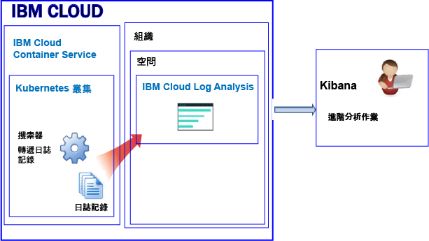
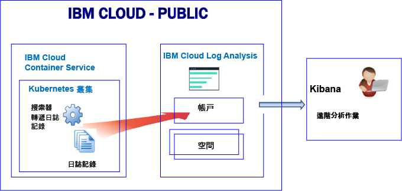
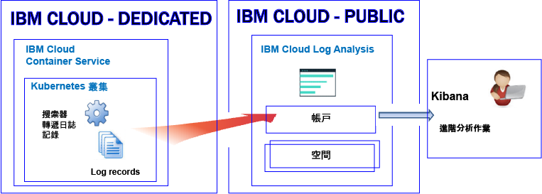

---

copyright:
  years: 2017, 2019

lastupdated: "2019-03-06"

keywords: IBM Cloud, logging

subcollection: cloudloganalysis

---

{:new_window: target="_blank"}
{:shortdesc: .shortdesc}
{:screen: .screen}
{:pre: .pre}
{:table: .aria-labeledby="caption"}
{:codeblock: .codeblock}
{:tip: .tip}
{:download: .download}
{:important: .important}
{:note: .note}


# {{site.data.keyword.containershort_notm}}
{: #containers_kubernetes}

在 {{site.data.keyword.cloud_notm}} 中，您可以使用 {{site.data.keyword.loganalysisshort}} 服務來儲存及分析 {{site.data.keyword.containershort}} 在「公用」及「專用」中自動收集的容器日誌和 Kubernetes 叢集日誌。
{:shortdesc}

在帳戶中，您可以有一個以上的 Kubernetes 叢集。一旦佈建叢集，{{site.data.keyword.containershort}} 就會自動收集日誌。 

若要從 {{site.data.keyword.containershort}} 轉遞日誌給 {{site.data.keyword.loganalysisshort}}，您必須建立記載配置。您可以透過[指令行](/docs/containers/cs_health.html#logging)啟用記載功能，或透過 {{site.data.keyword.containershort}} 儀表板中的叢集概觀頁面。配置就緒之後，在佈建叢集時或是部署 Pod 時，{{site.data.keyword.containershort}} 便會收集日誌。容器列印至 `stdout` 或 `stderr` 的資訊也會自動收集。依預設，日誌會根據叢集的位置而轉遞至特定的地區。

* 一旦部署 Pod，就會收集應用程式日誌。 
* {{site.data.keyword.containershort}} 會自動收集容器處理程序列印到 stdout（標準輸出）及 stderr（標準錯誤）的資訊。

請參閱下表以查看根據叢集的部署位置，{{site.data.keyword.loganalysisshort}} 會將日誌傳送到哪些地區。
 * {{site.data.keyword.containershort}} 會自動收集容器處理程序列印到 stdout（標準輸出）及 stderr（標準錯誤）的資訊。
 
 <table>
   <tr>
     <th>叢集地區</th>
     <th>服務地區</th>
   </tr>
   <tr>
     <td>美國南部</td>
     <td>美國南部</td>
   </tr>
   <tr>
     <td>美國東部</td>
     <td>美國南部</td>
   </tr>
   <tr>
     <td>德國</td>
     <td>德國</td>
   </tr>
   <tr>
     <td>雪梨</td>
     <td>雪梨</td>
   </tr>
   <tr>
     <td>英國</td>
     <td>德國</td>
   </tr>
 </table>
 
 試圖檢視日誌時，請務必將目標設為正確的地區、組織及空間。您也可以透過 {{site.data.keyword.loganalysisshort}} GUI 確認您將目標設為正確的組織及空間。
 {: tip}

您可以將日誌轉遞至 {{site.data.keyword.loganalysisshort}} 帳戶或是帳戶中的空間網域。決定將日誌轉遞至何處時，請考量下列資訊：

* 當您將日誌傳送至帳戶網域時，每天的搜尋配額為 500 MB，而且您無法將日誌儲存至「日誌收集」來進行長期儲存。
* 當您將日誌傳送至空間網域時，可以選擇定義每天搜尋配額的 {{site.data.keyword.loganalysisshort}} 服務方案，而且您可以將日誌儲存至「日誌收集」來進行長期儲存。

**附註：**依預設，不會自動啟用將日誌從叢集傳送至 {{site.data.keyword.loganalysisshort}} 服務。若要啟用記載功能，您必須在叢集中建立一個以上的記載配置，以自動將日誌轉遞至 {{site.data.keyword.loganalysisshort}} 服務。您可以透過指令行啟用記載功能，方法是使用 `ibmcloud cs logging-config-create` 指令，或是透過 {{site.data.keyword.cloud_notm}} 使用者介面中提供的叢集儀表板。如需相關資訊，請參閱[啟用自動收集叢集日誌](/docs/services/CloudLogAnalysis/containers?topic=cloudloganalysis-containers_kube_other_logs#containers_kube_other_logs)。

當您使用 Kubernetes 叢集時，會保留名稱空間 *ibm-system* 及 *kube-system*。請不要在這些名稱空間中建立、刪除、修改或變更可用資源的許可權。這些名稱空間的日誌適用於 {{site.data.keyword.IBM_notm}}。
{: tip}


### 將日誌轉遞至空間網域
{: #space}

當您配置叢集以將日誌轉遞至 {{site.data.keyword.loganalysisshort}} 時，請考量下列資訊：

* 您必須定義這些日誌要轉遞至其中的 Cloud Foundry 組織及空間。 
* 組織及空間可以在任何「{{site.data.keyword.IBM_notm}} 公用雲端」地區中使用。

**附註：**對於佈建在 **{{site.data.keyword.cloud_notm}} Dedicated** 上的叢集，無法配置您的叢集，來將叢集日誌轉遞至您專用帳戶上可用的 Cloud Foundry 空間。

若要在 Kibana 中分析用於將日誌轉遞至空間網域之叢集的日誌資料，請考量下列資訊：

* 您必須在收集叢集日誌的組織及空間可用的「公用」地區中啟動 Kibana。
* 若要增加 Kibana 搜尋配額，並且將日誌儲存在「日誌收集」以進行長期儲存，您必須在以符合您需求的方案轉遞日誌的空間中佈建 {{site.data.keyword.loganalysisshort}} 服務。 
* 使用者 ID 必須具有檢視日誌的許可權。若要查看空間網域中的日誌，使用者需要 CF 角色。**審核員**是可授與檢視日誌的最低角色。如需相關資訊，請參閱[使用者檢視日誌所需的角色](/docs/services/CloudLogAnalysis/kibana?topic=cloudloganalysis-analyzing_logs_Kibana#roles)。

若要管理長期儲存（日誌收集）的叢集日誌資料，使用者 ID 必須具有 IAM 原則，才能使用 {{site.data.keyword.loganalysisshort}} 服務。使用者 ID 必須具有 **Administrator**、**Operator** 或 **Editor** 許可權。如需相關資訊，請參閱[使用者管理日誌所需的角色](/docs/services/CloudLogAnalysis?topic=cloudloganalysis-manage_logs#roles1)。


下圖顯示叢集將日誌轉遞至空間網域時，{{site.data.keyword.containershort}}「公用」中的高階記載視圖：



   

### 將日誌轉遞至帳戶網域
{: #acc_public}

不論您的帳戶在 {{site.data.keyword.cloud_notm}} 公用或專用環境，您都可以配置叢集，以將日誌轉遞至帳戶網域。
{: shortdesc}


若要在 Kibana 中分析用於將日誌轉遞至帳戶網域之叢集的日誌資料，請考量下列資訊：

* 您必須在叢集將日誌傳送至 {{site.data.keyword.loganalysisshort}} 服務的地區中啟動 Kibana。
* 若要管理長期儲存在「日誌收集」的叢集日誌資料，您必須具有允許您使用 {{site.data.keyword.loganalysisshort}} 服務的 IAM 角色。使用者 ID 必須具有 **Administrator**、**Operator** 或 **Editor** 許可權。若要查看日誌，您需要 **Viewer** 許可權。


在下列影像中，您可以看到公用環境中轉遞日誌至帳戶如何運作的高階視圖。



在下列影像中，您可以看到專用環境中轉遞日誌至帳戶如何運作的高階視圖。




## 配置叢集以將日誌轉遞至 {{site.data.keyword.loganalysisshort}}
{: #config_forward_logs}

您可以選擇要轉遞至 {{site.data.keyword.loganalysisshort}} 服務的叢集日誌。 

如需如何配置叢集以將日誌檔轉遞至 {{site.data.keyword.loganalysisshort}} 服務的相關資訊，請參閱[啟用自動收集叢集日誌](/docs/services/CloudLogAnalysis/containers?topic=cloudloganalysis-containers_kube_other_logs#containers_kube_other_logs)小節。

* 若要啟用 stdout 及 stderr 的自動日誌收集及轉遞，請參閱[啟用容器日誌的自動日誌收集及轉遞](/docs/services/CloudLogAnalysis/containers?topic=cloudloganalysis-containers_kube_other_logs#containers)。
* 若要啟用應用程式日誌的自動日誌收集及轉遞，請參閱[啟用應用程式日誌的自動日誌收集及轉遞](/docs/services/CloudLogAnalysis/containers?topic=cloudloganalysis-containers_kube_other_logs#apps)。 
* 若要啟用工作者日誌的自動日誌收集及轉遞，請參閱[啟用工作者日誌的自動日誌收集及轉遞](/docs/services/CloudLogAnalysis/containers?topic=cloudloganalysis-containers_kube_other_logs#workers)。 
* 若要啟用 Kubernetes 系統元件日誌的自動日誌收集及轉遞，請參閱[啟用 Kubernetes 系統元件日誌的自動日誌收集及轉遞](/docs/services/CloudLogAnalysis/containers?topic=cloudloganalysis-containers_kube_other_logs#system)。 
* 若要啟用 Kubernetes Ingress 控制器日誌的自動日誌收集及轉遞，請參閱[啟用 Kubernetes Ingress 控制器日誌的自動日誌收集及轉遞](/docs/services/CloudLogAnalysis/containers?topic=cloudloganalysis-containers_kube_other_logs#controller)。


## 配置 {{site.data.keyword.cloud_notm}} 中自訂防火牆配置的網路資料流量
{: #ports}

如果您已設定其他防火牆，或已在 {{site.data.keyword.cloud_notm}} 基礎架構 (SoftLayer) 中自訂防火牆設定，則必須容許從工作者節點到 {{site.data.keyword.loganalysisshort}} 服務的送出網路資料流量。

您必須針對自訂防火牆中的下列 IP 位址，開啟從每一個工作者到 {{site.data.keyword.loganalysisshort}} 服務的 TCP 埠 443 及 TCP 埠 9091：

<table>
  <tr>
    <th>地區</th>
    <th>汲取 URL</th>
	<th>公用 IP 位址</th>
  </tr>
  <tr>
    <td>德國</td>
	<td>ingest-eu-fra.logging.bluemix.net</td>
	<td>158.177.88.43 <br>159.122.87.107</td>
  </tr>
  <tr>
    <td>英國</td>
	<td>ingest.logging.eu-gb.bluemix.net</td>
	<td>169.50.115.113</td>
  </tr>
  <tr>
    <td>美國南部</td>
	<td>ingest.logging.ng.bluemix.net</td>
	<td>169.48.79.236 <br>169.46.186.113</td>
  </tr>
  <tr>
    <td>雪梨</td>
	<td>ingest-au-syd.logging.bluemix.net</td>
	<td>130.198.76.125 <br>168.1.209.20</td>
  </tr>
</table>


## 轉遞自訂應用程式日誌
{: #forward_app_logs}

若要啟用將叢集中的自訂應用程式日誌轉遞至 {{site.data.keyword.loganalysisshort}} 服務，您必須定義將**日誌來源**設為**應用程式**的叢集記載配置。您可以使用 `ibmcloud cs logging-config-create` 指令或是透過叢集使用者介面，來定義此配置。

當您配置叢集以轉遞自訂日誌時，您可以指定在您要從中轉遞自訂日誌之叢集中執行的容器清單，以及自訂檔案日誌所在的那些容器內的路徑。

* 您必須指定 **app-paths** 參數，才能設定您要監看之容器內的路徑清單。位於這些路徑中日誌即會轉遞至 {{site.data.keyword.loganalysisshort}} 服務。 

    若要設定此參數，請定義容器內可用路徑的逗點區隔清單。接受 '/var/log/*.log' 之類的萬用字元。

* 您可以選擇設定 **app-containers** 參數，以指定從中收集日誌並將其轉遞至 {{site.data.keyword.loganalysisshort}} 服務的容器清單。

    若要設定此參數，請定義容器的逗點區隔清單。

**提示：**您可以在叢集中定義多個將**日誌來源**設為**應用程式**的叢集記載配置。如果叢集中的容器具有不同的管理日誌路徑，請考量為每一組容器（其日誌位於相同的路徑）定義一個叢集記載配置。 


## 日誌來源
{: #log_sources}


您可以配置叢集，以將日誌轉遞至 {{site.data.keyword.loganalysisshort}} 服務。下表列出可啟用以將日誌轉遞至 {{site.data.keyword.loganalysisshort}} 服務的不同日誌來源：

<table>
  <caption>Kuberenetes 叢集的日誌來源</caption>
  <tr>
    <th>日誌來源 </th>
	<th>說明</th>
	<th>日誌路徑</th>
  </tr>
  <tr>
    <td>容器</td>
	<td>容器日誌。</td>
	<td>標準輸出 (stdout) 及標準錯誤 (stderr) 日誌。</td>
  </tr>
  <tr>
    <td>應用程式 </td>
	<td>您在 Kubernetes 叢集中執行的專屬應用程式的日誌。</td>
	<td>`/var/log/apps/**/*.log`  </br>`/var/log/apps/**/*.err`</br>**附註：**在 Pod 上，日誌可以寫入 `/var/logs/apps/` 或 `/var/logs/apps/` 的任何子目錄中。在工作者上，您必須將 `/var/log/apps/` 裝載至 Pod 中應用程式要在其中寫入日誌的目錄。</td>
  </tr>
  <tr>
    <td>工作者節點</td>
	<td>Kubernetes 叢集內虛擬機器工作者節點的日誌。</td>
	<td>`/var/log/syslog` </br>`/var/log/auth.log`</td>
  </tr>
  <tr>
    <td>Kubernetes 系統元件</td>
	<td>Kubernetes 系統元件的日誌。</td>
	<td>*/var/log/kubelet.log* </br>*/var/log/kube-proxy.log*</td>
  </tr>
  <tr>
    <td>Ingress 控制器</td>
	<td>管理傳入 Kubernetes 叢集之網路資料流量的 Ingress 控制器的日誌。</td>
	<td>`/var/log/alb/ids/*.log` </br>`/var/log/alb/ids/*.err` </br>`/var/log/alb/customerlogs/*.log` </br>`/var/log/alb/customerlogs/*.err`</td>
  </tr>
</table>

## 搜尋日誌
{: #log_search}

依預設，在 {{site.data.keyword.cloud_notm}} 中，您可以使用 Kibana 每天最多搜尋 500 MB 的日誌。 

若要搜尋較大的日誌，您可以使用 {{site.data.keyword.loganalysisshort}} 服務。此服務提供多個方案。每一個方案都有不同的日誌搜尋功能，例如，*日誌收集* 方案可讓您每天最多搜尋 1 GB 的資料。如需可用方案的相關資訊，請參閱[服務方案](/docs/services/CloudLogAnalysis?topic=cloudloganalysis-log_analysis_ov#plans)。

當您搜尋日誌時，請考慮 Kibana 中的下列可用欄位：

任何日誌項目通用的欄位：

<table>
  <caption>通用欄位清單</caption>
  <tr>
    <th>欄位名稱</th>
	  <th>說明</th>
	  <th>值</th>
  </tr>
  <tr>
    <td>ibm-containers.region_str </td>
	  <td>叢集可用的地區</td>
	  <td>例如，`us-south` 是美國南部地區中可用叢集的值。</td>
  </tr>
  <tr>
    <td>ibm-containers.account_id_str</td>
	  <td>帳戶 ID</td>
	  <td></td>
  </tr>
  <tr>
    <td>ibm-containers.cluster_id_str </td>
	  <td>叢集 ID</td>
	  <td></td>
	</tr>
  <tr>
    <td>ibm-containers.cluster_name_str</td>
	  <td>叢集名稱</td>
	  <td></td>
  </tr>
</table>

分析容器 stdout 及 stderr 日誌時可能有用的欄位：

<table>
  <caption>應用程式的欄位清單</caption>
  <tr>
    <th>欄位名稱</th>
	<th>說明</th>
	<th>值</th>
  </tr>
  <tr>
    <td>kubernetes.container_name_str </td>
	<td>容器的名稱</td>
	<td></td>
  </tr>
  <tr>
    <td>kubernetes.namespace_name_str </td>
	<td>叢集中應用程式執行所在的名稱空間名稱</td>
	<td></td>
  </tr>
  <tr>
    <td>stream_str </td>
	<td>日誌類型</td>
	<td>*stdout* </br>*stderr *</td>
  </tr>
</table>

分析工作者日誌時可能有用的欄位：

<table>
  <caption>工作者的相關欄位清單</caption>
  <tr>
    <th>欄位名稱</th>
	<th>說明</th>
	<th>值</th>
  </tr>
  
  <tr>
    <td>filename_str</td>
	<td>檔案的路徑及名稱</td>
	<td>*/var/log/syslog*  </br>*/var/log/auth.log*</td>
  </tr>
  <tr>
    <td>tag_str </td>
	<td>日誌類型</td>
	<td>*logfiles.worker.var.log.syslog* </br>*logfiles.worker.var.log.auth.log*</td>
  </tr>
  <tr>
    <td>worker_str</td>
	<td>工作者名稱</td>
	<td>例如，*w1*</td>
  </tr>
</table>

分析 Kubernetes 系統元件日誌時可能有用的欄位：

<table>
  <caption>Kubernetes 系統元件的相關欄位清單</caption>
  <tr>
    <th>欄位名稱</th>
	<th>說明</th>
	<th>值</th>
  </tr>
  <tr>
    <td>tag_str </td>
	<td>日誌類型</td>
	<td>*logfiles.kubernetes.var.log.kubelet.log* </br>*logfiles.kubernetes.var.log.kube-proxy.log*</td>
  </tr>
  <tr>
    <td>filename_str</td>
	<td>檔案的路徑及名稱</td>
	<td>*/var/log/kubelet.log* </br>*/var/log/kube-proxy.log*</td>
  </tr>
 </table>

分析 Ingress 控制器日誌時可能有用的欄位：
 
<table>
  <caption>Ingress 控制器的相關欄位清單</caption>
  <tr>
    <th>欄位名稱</th>
	<th>說明</th>
	<th>值</th>
  </tr>
 <tr>
    <td>tag_str </td>
	<td>日誌類型</td>
	<td></td>
  </tr>
  <tr>
    <td>filename_str</td>
	<td>檔案的路徑及名稱</td>
	<td>*/var/log/alb/ids/*.log* </br>*/var/log/alb/ids/*.err* </br>*/var/log/alb/customerlogs/*.log* </br>*/var/log/alb/customerlogs/*.err*</td>
  </tr>
</table>


## 傳送日誌，讓您可以使用訊息中的欄位作為 Kibana 搜尋欄位
{: #send_data_in_json}

依預設，會自動啟用容器的記載功能。Docker 日誌檔中的每個項目都會顯示在 Kibana 的 **message** 欄位中。如果您需要在 Kibana 中，使用屬於容器日誌項目一部分的特定欄位來過濾及分析資料，請配置應用程式以傳送有效的 JSON 格式化輸出。例如，將訊息以 JSON 格式記載到 `stdout` 及 `stderr`。
 
訊息中可用的每一個欄位都會剖析成符合值的欄位類型。
 
例如，下列 JSON 訊息中的每一個欄位可作為用於過濾及搜尋的欄位：訊息中可用的每一個欄位都會剖析成符合值的欄位類型。例如，下列 JSON 訊息中的每一個欄位：
    
```
    {"field1":"string type",
     "field2":123,
     "field3":false,
     "field4":"4567"
     }
    ```
{: codeblock}
    
可作為用於過濾及搜尋的欄位：
    
* `field1` 剖析為 string 類型的 `field1_str`。
* `field2` 剖析為 integer 類型的 `field1_int`。
* `field3` 剖析為 boolean 類型的 `field3_bool`。
* `field4` 剖析為 string 類型的 `field4_str`。
    


## 安全
{: #security}


若要將叢集日誌轉遞至 {{site.data.keyword.loganalysisshort}}，您必須將 {{site.data.keyword.cloud_notm}} 許可權授與 {{site.data.keyword.containershort}} 金鑰擁有者及用於配置記載叢集配置的使用者 ID。

用於配置記載叢集配置的使用者 ID 必須具有下列許可權：

* {{site.data.keyword.containershort}} 的 IAM 原則與 **Viewer** 許可權。
* 叢集實例的 IAM 原則與 **Administrator** 或 **Operator** 許可權。

對於將日誌轉遞至 {{site.data.keyword.loganalysisshort}} **空間網域**的叢集，{{site.data.keyword.containershort}} 金鑰擁有者需要有下列許可權：

* {{site.data.keyword.containershort}} 的 IAM 原則與 **Administartor** 角色。
* {{site.data.keyword.loganalysisshort}} 服務的 IAM 原則與 **Administrator** 角色。
* 可使用空間的組織的 Cloud Foundry (CF) **orgManager** 角色。
* 從叢集中轉遞日誌的空間的 CF **SpaceManager** 角色或 **Developer** 角色。


對於將日誌轉遞至 {{site.data.keyword.loganalysisshort}} **帳戶網域**的叢集，{{site.data.keyword.containershort}} 金鑰擁有者需要有下列許可權：

* {{site.data.keyword.containershort}} 的 IAM 原則與 **Administartor** 角色。
* {{site.data.keyword.loganalysisshort}} 服務的 IAM 原則與 **Administrator** 角色。


## 在日誌收集中儲存日誌
{: #log_collection1}

請考量在使用日誌時 {{site.data.keyword.cloud_notm}} 中預設行為的下列資訊：

* 日誌資料會儲存最多 3 天。
* 每天最多可儲存 500 MB 的資料。超過該 500 MB 上限的任何日誌都會被捨棄。上限配額會在每天凌晨 12:30（世界標準時間）重設。
* 可搜尋最多 3 天、最多 1.5 GB 的資料。達到 1.5 GB 資料或在 3 天之後，日誌資料就會輪替（先進先出）。
* 日誌不會儲存至「日誌收集」來進行長期儲存。

{{site.data.keyword.loganalysisshort}} 服務提供其他方案，讓您依所需將日誌儲存在「日誌收集」。如需每一個方案價格的相關資訊，請參閱[服務方案](/docs/services/CloudLogAnalysis?topic=cloudloganalysis-log_analysis_ov#plans)。 

若要在「日誌收集」中管理日誌，請考量下列資訊：

* 您可以配置日誌保留原則，用來定義您要將日誌保留在「日誌收集」中的天數。如需相關資訊，請參閱[日誌保留原則](/docs/services/CloudLogAnalysis?topic=cloudloganalysis-manage_logs#log_retention_policy)。
* 您可以使用「日誌收集 CLI」或「日誌收集 API」，手動刪除日誌。 
* 若要在日誌收集中管理日誌，使用者需要具有在 {{site.data.keyword.cloud_notm}} 中使用 {{site.data.keyword.loganalysisshort}} 服務之許可權的 IAM 原則。如需相關資訊，請參閱 [IAM 角色](/docs/services/CloudLogAnalysis?topic=cloudloganalysis-security_ov#iam_roles)。

## 檢視及分析日誌
{: #logging_containers_ov_methods}

若要分析日誌資料，請使用 Kibana 執行進階分析作業。Kibana 是一種開放程式碼分析與視覺化平台，可用來以各種圖形（例如圖表和表格）監視、搜尋、分析及視覺化您的資料。如需相關資訊，請參閱[在 Kibana 中分析日誌](/docs/services/CloudLogAnalysis/kibana?topic=cloudloganalysis-analyzing_logs_Kibana#analyzing_logs_Kibana)。

* 您可以直接從 Web 瀏覽器啟動 Kibana。如需相關資訊，請參閱[從 Web 瀏覽器導覽至 Kibana](/docs/services/CloudLogAnalysis/kibana/launch.html#launch_Kibana_from_browser)。
* 您可以在叢集環境定義內從 {{site.data.keyword.cloud_notm}} 使用者介面中啟動 Kibana。如需相關資訊，請參閱[從 Kubernetes 叢集中所部署容器的儀表板導覽至 Kibana](/docs/services/CloudLogAnalysis/kibana?topic=cloudloganalysis-launch#launch_Kibana_for_containers_kube)。

如果您將容器中所執行應用程式的日誌資料以 JSON 格式轉遞至容器運行環境日誌收集器，則可以在 Kibana 中使用 JSON 欄位來搜尋及分析日誌資料。如需相關資訊，請參閱[傳送日誌，讓您可以使用訊息中的欄位作為 Kibana 搜尋欄位](/docs/services/CloudLogAnalysis/containers?topic=cloudloganalysis-containers_kubernetes#send_data_in_json)。

若要在 Kibana 中檢視日誌，請考量下列資訊：

* 若要查看空間網域中的日誌，使用者必須具有與叢集相關聯之空間中的 **auditor** 角色或 **developer** 角色。
* 若要查看帳戶網域中的日誌，使用者必須具有 IAM 原則，才能使用 {{site.data.keyword.loganalysisshort}} 服務。容許檢視日誌項目的最低角色是**檢視者**。


## 指導教學：針對 Kubernetes 叢集中所部署的應用程式，在 Kibana 中分析日誌
{: #tutorial1}

若要瞭解如何使用 Kibana 來分析 Kubernetes 叢集中所部署容器的日誌，請參閱[針對 Kubernetes 叢集中所部署的應用程式，在 Kibana 中分析日誌](/docs/services/CloudLogAnalysis/tutorials?topic=cloudloganalysis-container_logs#container_logs)。
