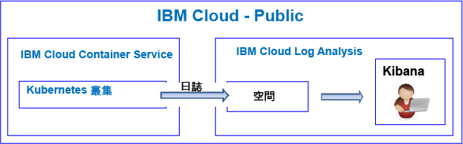
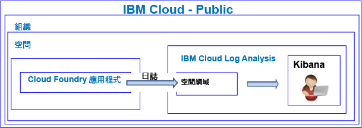

---

copyright:
  years: 2017, 2019

lastupdated: "2019-03-06"

keywords: IBM Cloud, logging

subcollection: cloudloganalysis

---

{:new_window: target="_blank"}
{:shortdesc: .shortdesc}
{:screen: .screen}
{:pre: .pre}
{:table: .aria-labeledby="caption"}
{:codeblock: .codeblock}
{:tip: .tip}
{:download: .download}
{:important: .important}
{:note: .note}

# 入門指導教學
{: #getting-started-with-cla}

使用此指導教學，瞭解如何在 {{site.data.keyword.Bluemix}} 中開始使用 {{site.data.keyword.loganalysislong}} 服務。
{:shortdesc}

依預設，{{site.data.keyword.Bluemix_notm}} 提供所選取服務的整合式記載功能。使用日誌時，您可以使用 {{site.data.keyword.loganalysisshort}} 服務來擴展收集及保留功能。

## 開始之前
{: #prereqs}

您的使用者 ID 必須是 {{site.data.keyword.Bluemix_notm}} 帳戶的成員或擁有者。若要取得 {{site.data.keyword.Bluemix_notm}} 使用者 ID，請移至：[登錄 ](https://console.bluemix.net/registration/){:new_window}

## 步驟 1：選擇您要查看其日誌的雲端資源
{: #step1}

在 {{site.data.keyword.Bluemix_notm}} 中，CF 應用程式、在 {{site.data.keyword.containershort}} 上執行的容器，以及選取的服務會自動收集日誌，並且會將日誌轉遞至 {{site.data.keyword.loganalysisshort}} 服務。

下表列出不同的雲端資源。完成此指導教學，以取得開始使用 {{site.data.keyword.loganalysisshort}} 服務的資源：

<table>
  <caption>開始使用 {{site.data.keyword.loganalysisshort}} 服務的指導教學</caption>
  <tr>
    <th>資源</th>
    <th>指導教學</th>
    <th>雲端環境</th>
    <th>情境</th>
  </tr>
  <tr>
    <td>在 {{site.data.keyword.containershort}} 上執行的容器</td>
    <td>[針對 Kubernetes 叢集中所部署的應用程式，在 Kibana 中分析日誌](/docs/services/CloudLogAnalysis/tutorials/container_logs.html#container_logs)</td>
    <td>公用</br>專用</td>
    <td></td>
  </tr>
  <tr>
    <td>CF 應用程式</td>
    <td>[在 Kibana 中分析 Cloud Foundry 應用程式的日誌](https://console.bluemix.net/docs/tutorials/application-log-analysis.html#generate-access-and-analyze-application-logs)</td>
    <td>公用</td>
    <td></td>
  </tr>
</table>


## 步驟 2：設定使用者檢視日誌的許可權
{: #step24}

若要控制容許使用者執行的 {{site.data.keyword.loganalysisshort}} 動作，您可以將角色及原則指派給使用者。 

{{site.data.keyword.Bluemix_notm}} 中有兩種類型的安全許可權可控制使用者在使用 {{site.data.keyword.loganalysisshort}} 服務時可執行的動作：

* Cloud Foundry (CF) 角色：您可以將 CF 角色授與使用者，而 CF 角色定義使用者必須要有才能檢視空間中日誌的許可權。
* IAM 角色：您可以將 IAM 原則授與使用者，而 IAM 原則定義使用者必須要有才能檢視帳戶網域中日誌的許可權。

### 設定使用者在空間網域中檢視日誌的許可權
{: #step42a}

請完成下列步驟，以將檢視空間中日誌的許可權授與使用者：

1. 登入 {{site.data.keyword.Bluemix_notm}} 主控台。

    開啟 Web 瀏覽器，並啟動 {{site.data.keyword.Bluemix_notm}} 儀表板：[http://bluemix.net ](http://bluemix.net){:new_window}
	
	使用您的使用者 ID 和密碼登入之後，{{site.data.keyword.Bluemix_notm}} 使用者介面隨即開啟。

2. 從功能表列中，按一下**管理 > 帳戶 > 使用者**。 

    *使用者* 視窗會顯示目前所選取帳戶的使用者及其電子郵件位址的清單。
	
3. 如果使用者是帳戶成員，請從清單選取使用者名稱，或按一下*動作* 功能表中的**管理使用者**。

    如果使用者不是帳戶成員，請參閱[邀請使用者](/docs/iam/iamuserinv.html#iamuserinv)。

4. 選取 **Cloud Foundry 存取權**，然後選取組織。

    即會列出該組織中可用的空間清單。

5. 選擇已佈建 {{site.data.keyword.loganalysisshort}} 服務的空間。然後，從功能表動作中選取**編輯空間角色**。

6. 選取*審核員*。 

    您可以選取 1 個以上的空間角色。所有下列角色都容許使用者檢視日誌：*管理員*、*開發人員* 及*審核員*
	
7. 按一下**儲存角色**。


### 設定使用者在帳戶網域中檢視日誌的許可權
{: #step24b}


請完成下列步驟，以將檢視帳戶日誌的許可權授與使用者：

1. 登入 {{site.data.keyword.Bluemix_notm}} 主控台。

    開啟 Web 瀏覽器，並啟動 {{site.data.keyword.Bluemix_notm}} 儀表板：[http://bluemix.net ](http://bluemix.net){:new_window}
	
	使用您的使用者 ID 和密碼登入之後，{{site.data.keyword.Bluemix_notm}} 使用者介面隨即開啟。

2. 從功能表列中，按一下**管理 > 帳戶 > 使用者**。 

    *使用者* 視窗會顯示目前所選取帳戶的使用者及其電子郵件位址的清單。
	
3. 如果使用者是帳戶成員，請從清單選取使用者名稱，或按一下*動作* 功能表中的**管理使用者**。

    如果使用者不是帳戶成員，請參閱[邀請使用者](/docs/iam/iamuserinv.html#iamuserinv)。

4. 在**存取原則**區段中，按一下**指派存取權**，然後選取**指派資源的存取權**。

    即會開啟*將資源存取權指派給使用者* 視窗。

5. 輸入原則的相關資訊。下表列出可定義原則的必要欄位： 

    <table>
	  <caption>可配置 IAM 原則的欄位清單。</caption>
	  <tr>
	    <th>欄位</th>
		<th>值</th>
	  </tr>
	  <tr>
	    <td>服務</td>
		<td>*IBM Cloud Log Analysis*</td>
	  </tr>	  
	  <tr>
	    <td>地區</td>
		<td>您可以指定使用者將獲授與日誌使用存取權的地區。個別選取一個以上的地區，或選取**所有現行地區**以將存取權授與所有地區。</td>
	  </tr>
	  <tr>
	    <td>服務實例</td>
		<td>選取*所有服務實例*。</td>
	  </tr>
	  <tr>
	    <td>角色</td>
		<td>選取一個以上的 IAM 角色。<br>有效的角色為：*管理者*、*操作員*、*編輯者* 及*檢視者*。<br>如需每個角色所容許動作的相關資訊，請參閱 [IAM 角色](/docs/services/CloudLogAnalysis/security_ov.html#iam_roles)。</td>
	  </tr>
     </table>
	
6. 按一下**指派**。
	
您配置的原則即適用於選取的地區。 


## 後續步驟 
{: #next_steps}

**附註：**使用者必須存取可使用日誌資料的「雲端公用」地區中的 Kibana，才能檢視及分析日誌資料。 

例如，若要在美國南部地區中啟動 Kibana，請開啟 Web 瀏覽器，然後輸入下列 URL：

```
https://logging.ng.bluemix.net/ 
```
{: codeblock}


如需如何在其他地區中啟動 Kibana 的相關資訊，請參閱[從 Web 瀏覽器導覽至 Kibana](/docs/services/CloudLogAnalysis/kibana/launch.html#launch_Kibana_from_browser)。

**附註：**當您啟動 Kibana 時，如果所收到的訊息指出*載送記號無效*，則請檢查您在帳戶中的許可權。此訊息指出您的使用者 ID 沒有查看日誌的許可權。

接下來，自訂 Kibana，以檢視及分析日誌資料。如需相關資訊，請參閱[檢視及分析日誌](/docs/services/CloudLogAnalysis/kibana/analyzing_logs_Kibana.html#analyzing_logs_Kibana)。
    


