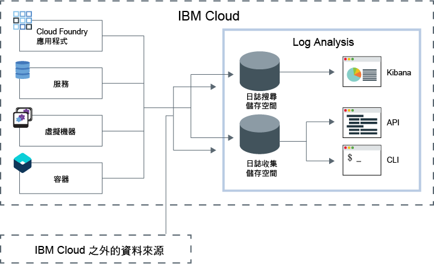

---

copyright:
  years: 2017, 2019

lastupdated: "2019-03-06"

keywords: IBM Cloud, logging

subcollection: cloudloganalysis

---

{:new_window: target="_blank"}
{:shortdesc: .shortdesc}
{:screen: .screen}
{:pre: .pre}
{:table: .aria-labeledby="caption"}
{:codeblock: .codeblock}
{:tip: .tip}
{:download: .download}
{:important: .important}
{:note: .note}

# IBM Cloud Log Analysis
{: #log_analysis_ov}

使用 {{site.data.keyword.loganalysisfull}} 服務可擴展 {{site.data.keyword.Bluemix}} 中的日誌收集、日誌保留及日誌搜尋能力。使用下列這類特性強化 DevOps 團隊：聚集應用程式及環境日誌以獲得合併的應用程式環境見解、加密日誌、視需要保留日誌資料，以及快速偵測及疑難排解問題。使用 Kibana 進行進階分析作業。
{:shortdesc}

{{site.data.keyword.Bluemix_notm}} 記載功能已整合在平台中：

* 自動啟用雲端資源的資料收集。依預設，{{site.data.keyword.Bluemix_notm}} 會收集並顯示應用程式、應用程式運行環境以及這些應用程式執行所在運算運行環境的日誌。 
* 您每天最多可以搜尋 500 MB 的日誌。 
* 過去 3 天的日誌會儲存在「日誌搜尋」中，這是 {{site.data.keyword.loganalysisshort}} 服務的元件。

您可以使用 {{site.data.keyword.Bluemix_notm}} 中的記載功能來瞭解雲端平台的行為，以及在其中執行的資源。不需要特殊檢測，即可收集標準輸出和標準錯誤日誌。例如，您可以使用日誌來提供應用程式的審核追蹤、在服務中偵測問題、識別漏洞、對應用程式部署和運行環境行為進行疑難排解、在應用程式執行所在的基礎架構中偵測問題、在雲端平台中的各元件之間追蹤應用程式，以及偵測可用來提前處理可能影響服務 SLA 之動作的型樣。

{{site.data.keyword.loganalysisfull}} 服務提供 {{site.data.keyword.Bluemix_notm}} 平台的日誌收集及日誌搜尋服務，並自動從精選的 {{site.data.keyword.Bluemix_notm}} 服務中收集應用程式及 {{site.data.keyword.Bluemix_notm}} 服務的資料。

下圖顯示 {{site.data.keyword.loganalysisshort}} 服務的高階視圖： 

若要收集及搜尋空間中所執行雲端資源的日誌，您必須在這些雲端資源執行所在的相同空間中佈建 {{site.data.keyword.loganalysisshort}} 服務實例。依預設，會收集日誌，並將其儲存在「日誌搜尋」中。當您選取包括擴充搜尋及收集功能的服務方案時，也會收集日誌，並將其儲存在「日誌收集」元件中。「日誌收集」中儲存的日誌資料會進行加密。

依預設，{{site.data.keyword.Bluemix_notm}} 會在「日誌搜尋」中儲存最多 3 天的日誌資料：   

* 每個空間每天最多可儲存 500 MB 的資料。超過該 500 MB 上限的任何日誌都會被捨棄。上限配額會在每天凌晨 12:30（世界標準時間）重設。
* 可搜尋最多 3 天、最多 1.5 GB 的資料。達到 1.5 GB 資料或在 3 天之後，日誌資料就會輪替（先進先出）。

{{site.data.keyword.loganalysisshort}} 服務提供其他方案，讓您依所需將日誌儲存在「日誌收集」。您可收集並儲存在「日誌收集」中的日誌大小取決於您選擇的服務方案。針對儲存的資料，以每個月每 GB 的資料為單位來支付費用。這些日誌以 JSON 形式儲存在「日誌收集」裡。

您可以使用 Kibana 5.1 來進行進階日誌搜尋分析作業：

* 每一個方案都會限制您每天可搜尋的日誌大小。 
* 搜尋只會涵蓋過去 3 天的資料。

若要存取超過 3 天以前的日誌，您可以使用「日誌收集 CLI」或「日誌收集 API」在本端下載日誌，也可以透過管道將日誌傳送至其他應用程式或協力廠商雲端服務。 

您可以設定保留原則來自動刪除日誌，或使用 {{site.data.keyword.loganalysisshort}} CLI 來手動刪除日誌。

## 為何使用 Log Analysis 服務
{: #value}

1. **用較少的時間來檢測應用程式，而將更多的時間用在加強其價值**

    {{site.data.keyword.loganalysislong_notm}} 會自動從選取的 {{site.data.keyword.Bluemix_notm}} 服務中收集資料，而不需要任何檢測。
	
	您可以選擇每天可搜尋的日誌數量。有不同的方案可用，您可以用來搜尋每天最多 500 MB、2 GB、5 GB 和 10 GB 的日誌。

2. **讓日誌資料保持接近應用程式工作負載，並安全保護在雲端等級的經濟儲存空間解決方案上**

    從 {{site.data.keyword.Bluemix_notm}} 中所執行的傳統及微服務驅動應用程式，收集日誌資料並將其儲存在集中化日誌內。視需要保留日誌資料。
	
	日誌儲存在 {{site.data.keyword.IBM_notm}} Cloud 儲存空間。您可以在需要時下載日誌。

3. **瞭解環境，以快速偵測、診斷及識別問題**

    透過可自訂的儀表板，視覺化及分析資料，並與之互動。日誌搜尋特性以 Elastic Stack 平台為建置基礎，可提供您 Kibana 的彈性及熟悉度，快速建置符合您應用程式需求的儀表板。

4. **與 API 的強固整合**

    透過服務的 API，將日誌資料整合到應用程式及作業。使用 {{site.data.keyword.loganalysisshort}} 服務 API 來管理已保留的日誌，以及從 {{site.data.keyword.IBM_notm}} Cloud 之外傳送日誌資料。

## 地區
{: #regions}

下列地區提供 {{site.data.keyword.loganalysisfull_notm}} 服務：

* 德國
* 英國
* 美國南部
* 雪梨

## 資料地區
{: #data_location}

下表列出每個地區的日誌位置：

<table>
  <caption>每個地區的日誌位置</caption>
  <tr>
    <th>地區</th>
	<th>日誌搜尋日誌</th>
	<th>日誌收集日誌</th>
  </tr>
  <tr>
    <td>德國</td>
	  <td>在德國進行管理</td>
	  <td>在德國進行管理</td>
  </tr>
  <tr>
    <td>英國</td>
	  <td>在英國進行管理</td>
	  <td>在英國進行管理</td>
  </tr>
  <tr>
    <td>美國南部</td>
	  <td>在美國南部進行管理</td>
	  <td>在美國南部進行管理</td>
  </tr>
  <tr>
    <td>雪梨</td>
	  <td>在雪梨進行管理</td>
	  <td>在美國南部進行管理 (*)</td>
  </tr>
</table>

(*) 針對雪梨，目前在美國南部管理「日誌收集」日誌。雪梨之「日誌收集」日誌的資料地區已在規劃中。

## 服務方案
{: #plans}

{{site.data.keyword.loganalysisshort}} 服務提供多個方案。每一個方案都會有不同的日誌收集及日誌搜尋功能。 

**附註：**只有在使用服務方案佈建 {{site.data.keyword.loganalysisshort}} 服務的空間中才會啟用該方案中所含的特性。

您可以透過 {{site.data.keyword.Bluemix_notm}} 使用者介面或透過指令行來變更方案。您隨時可以升級或降低方案。如需服務方案升級的相關資訊，請參閱[變更方案](/docs/services/CloudLogAnalysis/how-to/change_plan.html#change_plan)。 

下表概述可用的方案：

<table>
    <caption>每個方案的「日誌搜尋」及「日誌收集」功能摘要</caption>
      <tr>
        <th>方案</th>
        <th>日誌汲取</th>
        <th>日誌保留</th>
        <th>資料加密</th>
        <th>日誌搜尋</th>
      </tr>
      <tr>
        <td>精簡（預設值）</td>
        <td>否</td>
        <td>過去 3 天</td>
        <td>否</td>
        <td>最多搜尋 500 MB</td>
      </tr>
      <tr>
        <td>日誌收集</td>
        <td>是</td>
        <td>可配置的天數。</td>
        <td>是</td>
        <td>每天最多搜尋 500 MB</td>
      </tr>
      <tr>
        <td>日誌收集，每天搜尋 2 GB</td>
        <td>是</td>
        <td>可配置的天數。</td>
        <td>是</td>
        <td>每天最多搜尋 2 GB</td>
      </tr>
      <tr>
        <td>日誌收集，每天搜尋 5 GB</td>
        <td>是</td>
        <td>可配置的天數。</td>
        <td>是</td>
        <td>每天最多搜尋 5 GB</td>
      </tr>
       <tr>
        <td>日誌收集，每天搜尋 10 GB</td>
        <td>是</td>
        <td>可配置的天數。</td>
        <td>是</td>
        <td>每天最多搜尋 10 GB</td>
      </tr>
</table>

**附註：**日誌收集儲存空間的每月成本是以計費週期的平均值來計算。

