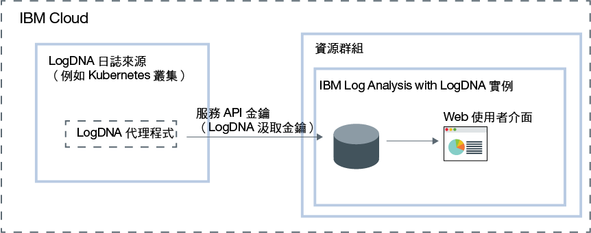

---

copyright:
  years:  2018, 2019
lastupdated: "2019-03-23"

keywords: LogDNA, IBM, Log Analysis, logging, overview

subcollection: LogDNA

---

{:new_window: target="_blank"}
{:shortdesc: .shortdesc}
{:screen: .screen}
{:pre: .pre}
{:table: .aria-labeledby="caption"}
{:codeblock: .codeblock}
{:tip: .tip}
{:download: .download}
{:important: .important}
{:note: .note}

# 關於 {{site.data.keyword.la_full_notm}}
{: #about}

{{site.data.keyword.la_full}} 是協力廠商服務，可併入作為 {{site.data.keyword.cloud_notm}} 架構的一部分，來新增日誌管理功能。{{site.data.keyword.la_full_notm}} 由 LogDNA 所操作，其與 {{site.data.keyword.IBM_notm}} 存在夥伴關係。
{:shortdesc}

您可以使用 {{site.data.keyword.la_full_notm}}，來管理 {{site.data.keyword.cloud_notm}} 中的系統和應用程式日誌。

{{site.data.keyword.la_full_notm}} 提供管理者、DevOps 團隊以及開發人員進階功能，可過濾、搜尋、追蹤日誌資料、定義警示以及設計自訂視圖，以便監視應用程式與系統日誌。

## 概觀
{: #ov}

若要在 {{site.data.keyword.cloud_notm}} 中新增使用 LogDNA 的記載特性，您必須佈建 {{site.data.keyword.la_full_notm}} 的實例。

佈建 {{site.data.keyword.la_full_notm}} 的實例之前，請考量下列資訊：
* 日誌資料在 {{site.data.keyword.cloud_notm}} 上進行管理。
* 日誌資料會傳送至協力廠商。
* 您的使用者必須具有平台許可權，才能建立、檢視及刪除 {{site.data.keyword.cloud_notm}} 中的服務實例。
* 您的使用者必須具有平台許可權，才能在您計劃於其中佈建 LogDNA 實例的資源群組環境定義內建立資源。

在資源群組的環境定義內佈建 {{site.data.keyword.la_full_notm}} 實例。您可以使用資源群組，針對存取控制及計費目的，組織您的服務。您可以在 *default* 資源群組中，或在自訂的資源群組中，佈建實例。

佈建 {{site.data.keyword.la_full_notm}} 的實例之後，會在 LogDNA 中建立一個帳戶，且您會收到您帳戶的汲取金鑰。

然後，您必須為每個日誌來源配置 LogDNA 代理程式。日誌來源是產生日誌的「雲端」或內部部署資源。例如，日誌來源可以是 Kubernetes 叢集。使用汲取金鑰來配置 LogDNA 代理程式，其負責收集日誌並將其轉遞至您的 {{site.data.keyword.la_full_notm}} 實例。

在日誌來源中部署 LogDNA 代理程式之後，會自動收集及轉遞日誌至 {{site.data.keyword.la_full_notm}} 實例。

您可以啟動 {{site.data.keyword.la_full_notm}} Web 使用者介面，以檢視、監視及管理您的日誌。

下圖顯示正在 {{site.data.keyword.cloud_notm}} 上執行之 {{site.data.keyword.la_full_notm}} 服務的元件概觀：

## 日誌資料
{: #overview_data}

{{site.data.keyword.la_full_notm}} 會收集日誌，然後將其聚集在一個集中式記載系統中。

* 日誌資料在 {{site.data.keyword.cloud_notm}} 上進行管理。
* 資料位於在其中佈建 {{site.data.keyword.la_full_notm}} 實例的地區中。例如，在美國南部佈建的實例，其日誌資料便會在美國南部地區進行管理。

您為 {{site.data.keyword.la_full_notm}} 實例所選擇的服務方案會定義資料儲存並保留在 LogDNA 的天數。例如，若您選擇*免費* 方案，則完全不會儲存資料。不過，若您選擇 7 天的方案，則資料會儲存 7 天，而且您可以透過 LogDNA Web 使用者介面來存取該資料。

當您從 {{site.data.keyword.cloud_notm}} 刪除 {{site.data.keyword.la_full_notm}} 的實例時，會刪除所有資料。

## 特性
{: #overview_features}

**即時疑難排解日誌以診斷問題及識別問題。**

透過使用*即時多媒體串流追蹤* 特性，開發人員及 DevOps 團隊可以透過單一視圖來診斷問題、分析堆疊追蹤資料和異常狀況、識別錯誤來源，以及監視不同的日誌來源。可透過指令行及 Web 介面來使用此特性。

**發出要通知重要動作的警示。**
 
為了立即處理您識別為重要或警告的應用程式和服務事件，DevOps 團隊可以配置警示通知整合至下列系統：電子郵件、Slack、HipChat、webHook、PagerDuty 及 OpsGenie。

**將日誌匯出至本端檔案以進行分析，或匯出至保存服務以符合審核需求。**

將特定日誌行匯出至本端副本，或將保存日誌從 {{site.data.keyword.la_full_notm}} 匯出至 IBM Cloud Object Storage。
日誌行會以 JSON 行格式匯出。日誌會以 JSON 格式進行保存，並保留與每一行相關聯的 meta 資料。

**透過自訂要透過 {{site.data.keyword.la_full_notm}} 進行管理的日誌，來控制記載基礎架構成本。**

透過配置要收集並管理其日誌的日誌來源，來控制 IBM Cloud 中記載基礎架構的成本。

## 定價方案
{: #overview_pricing_plans}

您可以為 {{site.data.keyword.la_full_notm}} 實例選擇不同的定價方案。每個方案都定義保留資料以便搜尋的天數、容許管理資料的使用者數目，以及已啟用的 LogDNA 特性。

| 方案                     | 
|--------------------------|
| `30 天日誌搜尋`      |
| `14 天日誌搜尋`      |
| `7 天日誌搜尋`       |
| `精簡`               |
{: caption="表 1. 服務方案清單" caption-side="top"} 

{{site.data.keyword.la_full_notm}} 提供`精簡`方案，可用來檢視通過系統的日誌。您可以使用日誌追蹤來檢視日誌。您也可以設計過濾器，以準備升級至較長的保留期間方案。此方案的保留期間為 0 天。

下表概述各服務方案所包含的不同特性：

| 特性                          | `30 天日誌搜尋`方案 | `14 天日誌搜尋`方案 | `7 天日誌搜尋方案     | `精簡方案 | 
|----------------------------------|-------------------------|-------------------------------|-----------------------------|--------------|
| `日誌已儲存且可搜尋`             | 是 - 30 天       | 是 - 14 天             | 是 - 7 天            | 否  |
| `即時多媒體串流追蹤`             | 是                     | 是                           | 是                         | 是          |
| `保存`                           | 是                     | 是                           | 是                         | 否           |
| `多通道警示`                     | 是                     | 是                           | 是                         | 否           | 
{: caption="表 2. 各服務方案的可用特性清單" caption-side="top"} 

## 地區
{: #overview_regions}

下列地區可使用 {{site.data.keyword.la_full_notm}} 進行記載：

| 地區                | 位置  |
|-----------------------|-----------|
| **美國南部**          | 達拉斯    |
| **EU-DE**             | 法蘭克福 | 
{: caption="表 3. 可以使用服務的地區清單" caption-side="top"} 

目前，**法蘭克福**位置**不**受歐盟管理。如需相關資訊，請參閱[啟用歐盟支援設定](/docs/account?topic=account-eu-hipaa-supported#bill_eusupported)。
{: important}

