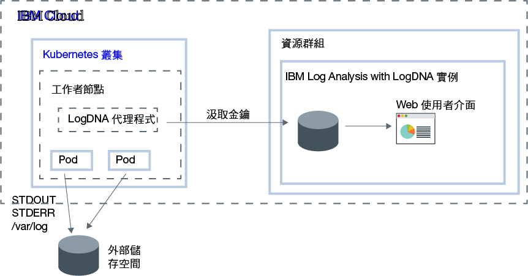

---

copyright:
  years:  2018, 2019
lastupdated: "2019-05-01"

keywords: LogDNA, IBM, Log Analysis, logging, kubernetes, tutorial

subcollection: LogDNA

---

{:new_window: target="_blank"}
{:shortdesc: .shortdesc}
{:screen: .screen}
{:pre: .pre}
{:table: .aria-labeledby="caption"}
{:codeblock: .codeblock}
{:tip: .tip}
{:download: .download}
{:important: .important}
{:note: .note}


# 使用 {{site.data.keyword.la_full_notm}} 管理 Kubernetes 叢集日誌
{: #kube}

使用 {{site.data.keyword.la_full_notm}} 服務來配置 {{site.data.keyword.containerlong}} 中的叢集層次記載。
{:shortdesc}

從您使用 {{site.data.keyword.containerlong_notm}} 來佈建叢集的時候開始，您想要瞭解叢集內發生什麼狀況。您需要存取日誌，以疑難排解問題及預先解決問題。您隨時想要有不同類型日誌的存取權，例如，工作者節點日誌、Pod 日誌、應用程式日誌或網路日誌。此外，您想要監視 Kubernetes 叢集中不同來源的日誌資料。因此，您可以管理和存取來自這些來源之日誌記錄的能力非常重要。您是否可以成功管理及監視日誌，視您如何配置 Kubernetes 平台的記載功能而定。

若要配置 Kubernetes 叢集的叢集層次記載，請考量下列資訊：

* 您必須能夠將日誌資料、系統日誌及儲存器型應用程式日誌，儲存在 Kubernetes 系統元件的個別儲存空間上。
* 您必須將記載代理程式部署至叢集中的每個工作者節點。此代理程式會收集日誌，並將日誌轉遞至外部記載後端系統。
* 您必須能夠集中日誌資料，以在外部記載後端系統進行分析。


在 {{site.data.keyword.cloud_notm}} 上，若要配置 Kubernetes 叢集的叢集層次記載，您必須完成下列步驟：

1. 佈建 {{site.data.keyword.la_full_notm}} 服務的實例。使用此步驟，您可以配置集中式日誌管理系統，其中日誌資料在 {{site.data.keyword.cloud_notm}} 上進行管理。
2. 在 {{site.data.keyword.containerlong_notm}} 上佈建叢集。支援 Kubernetes 1.9+ 版叢集。
3. 在叢集中的每個工作者（節點）上配置 LogDNA 代理程式。



在本指導教學中，您將學習如何配置叢集層次記載。

## 開始之前
{: #kube_prereqs}

在[支援的地區](/docs/services/Log-Analysis-with-LogDNA/tutorials?topic=LogDNA-about#overview_regions)工作。**附註：**您可以從位於相同地區或不同地區的 Kubernetes 叢集中傳送資料。 

閱讀 {{site.data.keyword.la_full_notm}} 的相關資訊。如需相關資訊，請參閱[關於](/docs/services/Log-Analysis-with-LogDNA?topic=LogDNA-about#about)。

使用 {{site.data.keyword.cloud_notm}} 帳戶之成員或擁有者的使用者 ID。若要取得 {{site.data.keyword.cloud_notm}} 使用者 ID，請移至：[登錄 ](https://cloud.ibm.com/login){:new_window}。

您的 {{site.data.keyword.IBM_notm}} ID 必須已為 {{site.data.keyword.la_full_notm}} 實例所在地區中的下列每一個資源指派 IAM 原則：  

| 資源                             | 存取原則的範圍 | 角色    | 資訊                  |
|--------------------------------------|----------------------------|---------|------------------------------|
| 資源群組 **Default**           |  資源群組            | 檢視者  | 需要此原則，以容許使用者查看 Default 資源群組中的服務實例。|
| {{site.data.keyword.la_full_notm}} 服務 |  資源群組            | 編輯者  | 需要此原則，以容許使用者在 Default 資源群組中佈建及管理 {{site.data.keyword.la_full_notm}} 服務。|
| Kubernetes 叢集實例          |  資源                 | 編輯者  | 需要有此原則，才能在 Kubernetes 叢集中配置密碼和 LogDNA 代理程式。|
{: caption="表 1. 完成指導教學所需的 IAM 原則清單" caption-side="top"} 

如需 {{site.data.keyword.containerlong}} IAM 角色的相關資訊，請參閱[使用者存取權](/docs/containers?topic=containers-access_reference#access_reference)。

安裝 {{site.data.keyword.cloud_notm}} CLI 及 Kubernetes CLI 外掛程式。如需相關資訊，請參閱[安裝 {{site.data.keyword.cloud_notm}} CLI](/docs/cli?topic=cloud-cli-ibmcloud-cli#ibmcloud-cli)。


## 目標
{: #kube_objectives}

在本指導教學中，您會使用您 {{site.data.keyword.containerlong_notm}} 叢集的 LogDNA 來配置記載。特別是，您將：

- 佈建 {{site.data.keyword.la_full_notm}}。 
- 在叢集中配置 LogDNA 代理程式，以開始將日誌傳送至 LogDNA。 
- 開啟 LogDNA 儀表板來尋找您的日誌。 


## 步驟 1. 佈建 {{site.data.keyword.la_full_notm}} 服務實例
{: #kube_step1}

若要透過 {{site.data.keyword.cloud_notm}} 主控台來佈建 {{site.data.keyword.la_full_notm}} 的服務實例，請完成下列步驟：

1. 登入您在建立 Kubernetes 叢集時所使用的 [{{site.data.keyword.cloud_notm}} 帳戶 ](https://cloud.ibm.com/login)。

2. 按一下**型錄**。即會開啟 {{site.data.keyword.cloud_notm}} 服務的清單。

3. 若要過濾顯示的服務清單，請選取**開發人員工具**種類。

4. 按一下 **{{site.data.keyword.la_full_notm}}**。即會開啟**觀察**儀表板。

5. 選取**建立實例**。 

6. 輸入服務實例的名稱。

7. 選取您的叢集所在的資源群組。依預設，會為您設定 **Default** 資源群組。 

8. 選擇服務實例的服務方案。依預設，會為您選取**精簡**方案。如需其他服務方案的相關資訊，請參閱[定價方案](/docs/services/Log-Analysis-with-LogDNA?topic=LogDNA-about#overview_pricing_plans)。

9. 若要在您登入的 {{site.data.keyword.cloud_notm}} 資源群組中，佈建 {{site.data.keyword.la_full_notm}} 服務，請按一下**建立**。即會開啟**觀察**儀表板，並顯示服務的詳細資料。 

若要透過 CLI 來佈建實例，請參閱[透過 {{site.data.keyword.cloud_notm}} CLI 來佈建實例](/docs/services/Log-Analysis-with-LogDNA?topic=LogDNA-provision#provision_cli)。
{: tip}

## 步驟 2. 取得汲取金鑰
{: #kube_step2}

請完成下列步驟來取得汲取金鑰：

1. 登入您的 {{site.data.keyword.cloud_notm}} 帳戶。

    按一下 [{{site.data.keyword.cloud_notm}} 儀表板 ](https://cloud.ibm.com/login){:new_window}，以啟動 {{site.data.keyword.cloud_notm}} 儀表板。

	使用您的使用者 ID 和密碼登入之後，即會開啟 {{site.data.keyword.cloud_notm}} 使用者介面。

2. 在導覽功能表中，選取**觀察**。 

3. 選取**記載**。即會開啟 {{site.data.keyword.la_full_notm}} 儀表板。您可以看到 {{site.data.keyword.cloud_notm}} 上可用的記載實例清單。

3. 識別您要取得其汲取金鑰的實例，然後按一下**檢視汲取金鑰**。

4. 這時會開啟一個視窗，您可以在其中按一下**顯示**來檢視汲取金鑰。


## 步驟 3：配置您的 Kubernetes 叢集以將日誌傳送至 LogDNA 實例
{: #kube_step3}

若要將您的 Kubernetes 叢集配置為傳送日誌到您的 {{site.data.keyword.la_full_notm}} 實例，您必須在叢集的每個節點上安裝 `logdna-agent` Pod。LogDNA 代理程式會從安裝它的 Pod 中讀取日誌檔，並將日誌資料轉遞至 LogDNA 實例。

若要將您的 Kubernetes 叢集配置為將日誌轉遞至 LogDNA 實例，請從指令行完成下列步驟：

1. 開啟終端機，以登入 {{site.data.keyword.cloud_notm}}。

   ```
   ibmcloud login -a cloud.ibm.com
   ```
   {: pre}

   選取您已佈建 {{site.data.keyword.la_full_notm}} 實例的帳戶。

2. 將您要配置記載的叢集設為此階段作業的環境定義。

   ```
   ibmcloud ks cluster-config <cluster_name_or_ID>
   ```
   {: pre}

   配置檔下載完成之後，會顯示一個指令，可讓您用來將本端 Kubernetes 配置檔的路徑設為環境變數。複製並貼上終端機中顯示的指令，以設定 `KUBECONFIG` 環境變數。

   每次您登入 {{site.data.keyword.containerlong_notm}} CLI 來使用叢集時，您必須執行此設定，將叢集配置檔的路徑設為階段作業變數。{{site.data.keyword.containerlong_notm}} 使用此變數來尋找本端配置檔，以及尋找與您的叢集連接時所需的憑證。{: tip}

3. 建立 Kubernetes 密碼來儲存您服務實例的 logDNA 汲取金鑰。LogDNA 汲取金鑰用來開啟 logDNA 汲取伺服器的安全 Web Socket，以及與 {{site.data.keyword.la_full_notm}} 服務搭配使用，以鑑別記載代理程式。

    ```
    kubectl create secret generic logdna-agent-key --from-literal=logdna-agent-key=<logDNA_ingestion_key>
    ```
    {: pre}

4. 建立 Kubernetes 常駐程式集，以在 Kubernetes 叢集的每個工作者節點上，部署 LogDNA 代理程式。LogDNA 代理程式會收集副檔名為 `*.log` 的日誌，以及儲存在您 Pod 之 `/var/log` 目錄中的無副檔名檔案。依預設，會收集來自所有名稱空間中的日誌，包括 `kube-system`，並會自動轉遞至 {{site.data.keyword.la_full_notm}} 服務。

   ```
   kubectl create -f https://repo.logdna.com/ibm/prod/logdna-agent-ds-us-south.yaml
   ```
   {: pre}

5. 驗證是否已順利部署 LogDNA 代理程式。 

   ```
   kubectl get pods
   ```
   {: pre}
   
   當您看到一個以上的 LogDNA Pod 時，表示已成功部署。LogDNA Pod 的數量等於您叢集中的工作者節點數量。所有 Pod 都必須處於`執行中`狀態。


## 步驟 4：啟動 LogDNA 儀表板及檢視日誌
{: #kube_step4}

若要透過 {{site.data.keyword.cloud_notm}} 主控台來啟動 LogDNA 儀表板，請完成下列步驟：

1. 登入 [{{site.data.keyword.cloud_notm}} 帳戶 ](https://cloud.ibm.com/login)。

2. 從功能表  中，選取**觀察**。

3. 選取**記載**。即會顯示 {{site.data.keyword.cloud_notm}} 上可用的 {{site.data.keyword.la_full_notm}} 服務實例清單。

4. 選取一個實例，然後按一下**檢視 LogDNA**。即會開啟 LogDNA 儀表板。**附註：**如果使用**免費**服務方案，您只能追蹤最新的日誌。如需相關資訊，請參閱[檢視日誌](/docs/services/Log-Analysis-with-LogDNA?topic=LogDNA-view_logs#view_logs)。

## 後續步驟
{: #kube_next_steps}

- [過濾日誌](/docs/services/Log-Analysis-with-LogDNA?topic=LogDNA-view_logs#view_logs_step5)
- [搜尋日誌](/docs/services/Log-Analysis-with-LogDNA?topic=LogDNA-view_logs#view_logs_step6)
- [定義視圖](/docs/services/Log-Analysis-with-LogDNA?topic=LogDNA-view_logs#view_logs_step7)
- [配置警示](https://docs.logdna.com/docs/alerts)。 

**附註：**這些特性中有一些需要方案升級。


