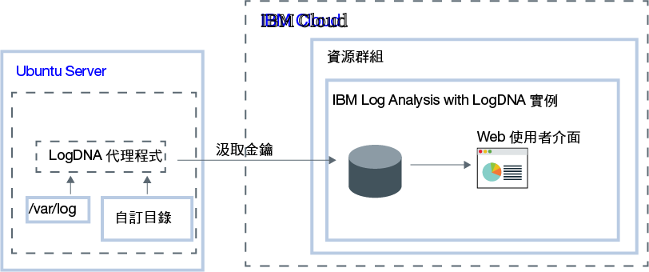

---

copyright:
  years:  2018, 2019
lastupdated: "2019-03-06"

keywords: LogDNA, IBM, Log Analysis, logging, ubuntu, tutorial

subcollection: LogDNA

---

{:new_window: target="_blank"}
{:shortdesc: .shortdesc}
{:screen: .screen}
{:pre: .pre}
{:table: .aria-labeledby="caption"}
{:codeblock: .codeblock}
{:tip: .tip}
{:download: .download}
{:important: .important}
{:note: .note}


# 使用 {{site.data.keyword.la_full_notm}} 管理 Ubuntu 日誌
{: #ubuntu}

使用 {{site.data.keyword.la_full}} 服務，監視及管理 {{site.data.keyword.cloud_notm}} 集中式記載系統中的 Ubuntu 日誌。
{:shortdesc}

您可以收集並監視系統和應用程式日誌。 

依預設，Ubuntu 的 LogDNA 代理程式會監視 **/var/log** 目錄中的日誌檔。例如，依預設會監視 Ubuntu 系統日誌 (*/var/log/syslog*)。

在 {{site.data.keyword.cloud_notm}} 上，若要將 Ubuntu 伺服器配置為將日誌轉遞至 {{site.data.keyword.la_full_notm}} 實例，您必須完成下列步驟：

1. 佈建 {{site.data.keyword.la_full_notm}} 服務的實例。 
2. 在 Ubuntu 伺服器中配置 LogDNA 代理程式。
3. 選擇性地新增要由代理程式監視的其他目錄。



在本指導教學中，您將學習如何配置 Ubuntu 伺服器，以將日誌轉遞至 {{site.data.keyword.la_full_notm}} 實例。

## 開始之前
{: #ubuntu_prereqs}

閱讀 {{site.data.keyword.la_full_notm}} 的相關資訊。如需相關資訊，請參閱[關於 LogDNA](/docs/services/Log-Analysis-with-LogDNA?topic=LogDNA-about#about)。

在美國南部地區工作。{{site.data.keyword.la_full_notm}} 目前可用於美國南部地區。**附註：**您可以從位於相同地區或不同地區的 Ubuntu 伺服器中傳送資料。 

使用 {{site.data.keyword.cloud_notm}} 帳戶之成員或擁有者的使用者 ID。若要取得 {{site.data.keyword.cloud_notm}} 使用者 ID，請移至：[登錄 ](https://cloud.ibm.com/login){:new_window}。

您的 {{site.data.keyword.IBM_notm}} ID 必須已為下列每一個資源指派 IAM 原則： 

| 資源                             | 存取原則的範圍 | 角色    | 地區    | 資訊                  |
|--------------------------------------|----------------------------|---------|-----------|------------------------------|
| 資源群組 **Default**           |  資源群組            | 檢視者  | 美國南部  | 需要此原則，以容許使用者查看 Default 資源群組中的服務實例。|
| {{site.data.keyword.la_full_notm}} 服務 |  資源群組            | 編輯者  | 美國南部  | 需要此原則，以容許使用者在 Default 資源群組中佈建及管理 {{site.data.keyword.la_full_notm}} 服務。|
{: caption="表 1. 完成指導教學所需的 IAM 原則清單" caption-side="top"} 

安裝 {{site.data.keyword.cloud_notm}} CLI。如需相關資訊，請參閱[安裝 {{site.data.keyword.cloud_notm}} CLI](/docs/cli/index.html#overview)。


## 步驟 1. 佈建 {{site.data.keyword.la_full_notm}} 實例
{: #ubuntu_step1}

若要透過 {{site.data.keyword.cloud_notm}} 使用者介面來佈建 {{site.data.keyword.la_full_notm}} 的實例，請完成下列步驟：

1. 登入您的 {{site.data.keyword.cloud_notm}} 帳戶。

    按一下 [{{site.data.keyword.cloud_notm}} 儀表板 ](https://cloud.ibm.com/login){:new_window}，以啟動 {{site.data.keyword.cloud_notm}} 儀表板。

	使用您的使用者 ID 和密碼登入之後，即會開啟 {{site.data.keyword.cloud_notm}} 使用者介面。

2. 按一下**型錄**。即會開啟 {{site.data.keyword.cloud_notm}} 中可用的服務清單。

3. 若要過濾顯示的服務清單，請選取**開發人員工具**種類。

4. 按一下 **{{site.data.keyword.la_full_notm}}** 磚。

5. 輸入服務實例的名稱。

6. 選取 **Default** 資源群組。 

    依預設，會設定 **Default** 資源群組。

7. 選取**精簡**服務方案。 

    依預設，會設定**精簡**方案。

    如需其他服務方案的相關資訊，請參閱[定價方案](/docs/services/Log-Analysis-with-LogDNA?topic=LogDNA-about#overview_pricing_plans)。

8. 若要在您登入的 {{site.data.keyword.cloud_notm}} 資源群組中，佈建 {{site.data.keyword.la_full_notm}} 服務，請按一下**建立**。

佈建實例之後，即會開啟 {{site.data.keyword.la_full_notm}} 儀表板。 


**附註：**若要透過 CLI 來佈建 LogDNA 的實例，請參閱[透過 {{site.data.keyword.cloud_notm}} CLI 來佈建 LogDNA](/docs/services/Log-Analysis-with-LogDNA?topic=LogDNA-provision#provision_cli)。


## 步驟 2. 將您的 Ubuntu 伺服器配置為傳送日誌到您的實例
{: #ubuntu_step2}

若要將您的 Ubuntu 伺服器配置為傳送日誌到您的 {{site.data.keyword.la_full_notm}} 實例，您必須安裝 `logdna-agent`。LogDNA 代理程式會讀取 */var/log* 中的日誌檔，並將日誌資料轉遞至 LogDNA 實例。

若要將您的 Ubuntu 伺服器配置為將日誌轉遞至 LogDNA 實例，請從 Ubuntu 終端機完成下列步驟：

1. 安裝 LogDNA 代理程式。請執行下列指令：

    ```
    echo "deb https://repo.logdna.com stable main" | sudo tee /etc/apt/sources.list.d/logdna.list 
    ```
    {: codeblock}

    ```
    wget -O- https://repo.logdna.com/logdna.gpg | sudo apt-key add - 
    ```
    {: codeblock}

    ```
    sudo apt-get update
    ```
    {: codeblock}

    ```
    sudo apt-get install logdna-agent < "/dev/null"
    ```
    {: codeblock}

2. 設定汲取金鑰，LogDNA 代理程式必須使用該金鑰才能將日誌轉遞至 {{site.data.keyword.la_full_notm}} 實例。  

    ```
    sudo logdna-agent -k INGESTION_KEY
    ```
    {: codeblock}

    其中，INGESTION_KEY 包含對您配置要轉遞日誌的 {{site.data.keyword.la_full_notm}} 實例有效的汲取金鑰。

3. 設定鑑別端點。LogDNA 代理程式會使用此主機進行鑑別，並使用記號轉遞日誌。

    ```
    sudo logdna-agent -s LOGDNA_APIHOST=api.us-south.logging.cloud.ibm.com
    ```
    {: codeblock}

4. 設定汲取端點。

    ```
    sudo logdna-agent -s LOGDNA_LOGHOST=logs.us-south.logging.cloud.ibm.com
    ```
    {: codeblock}

5. 定義更多要監視的日誌路徑。請執行下列指令： 

    ```
    sudo logdna-agent -d /path/to/log/folders
    ```
    {: codeblock}

    依預設，會監視 **/var/log**。

6. 選擇性地配置 LogDNA 代理程式，以標記您的主機。請執行下列指令：

    ```
    sudo logdna-agent -t TAG1,TAG2 
    ```
    {: codeblock}

    ```
    sudo update-rc.d logdna-agent defaults
    ```
    {: codeblock}

    ``` 
    sudo /etc/init.d/logdna-agent start
    ```
    {: codeblock}


## 步驟 3. 啟動 LogDNA Web 使用者介面
{: #ubuntu_step3}

若要透過 {{site.data.keyword.cloud_notm}} 使用者介面來啟動 IBM Log Analysis with LogDNA 儀表板，請完成下列步驟：

1. 登入您的 {{site.data.keyword.cloud_notm}} 帳戶。

    按一下 [{{site.data.keyword.cloud_notm}} 儀表板 ](https://cloud.ibm.com/login){:new_window}，以啟動 {{site.data.keyword.cloud_notm}} 儀表板。

	使用您的使用者 ID 和密碼登入之後，即會開啟 {{site.data.keyword.cloud_notm}} 儀表板。

2. 在導覽功能表中，選取**觀察**。 

3. 選取**記載**。 

    即會顯示 {{site.data.keyword.cloud_notm}} 上可用的 {{site.data.keyword.la_full_notm}} 實例清單。

3. 選取一個實例。然後，按一下**檢視 LogDNA**。

    即會開啟 LogDNA Web 使用者介面，並顯示您的叢集日誌。


## 步驟 4. 檢視日誌
{: #ubuntu_step4}

從 LogDNA Web 使用者介面，您可以檢視通過系統的日誌。您可以使用日誌追蹤來檢視日誌。 

**附註：**如果使用**免費**服務方案，您只能追蹤最新的日誌。

如需相關資訊，請參閱[檢視日誌](/docs/services/Log-Analysis-with-LogDNA?topic=LogDNA-view_logs#view_logs)。


## 後續步驟
{: #ubuntu_next_steps}

[過濾日誌](/docs/services/Log-Analysis-with-LogDNA?topic=LogDNA-view_logs#view_logs_step5)、[搜尋日誌](/docs/services/Log-Analysis-with-LogDNA?topic=LogDNA-view_logs#view_logs_step6)、[定義視圖](/docs/services/Log-Analysis-with-LogDNA?topic=LogDNA-view_logs#view_logs_step7)，以及[配置警示](https://docs.logdna.com/docs/alerts)。 

**附註：**若要使用這些特性中的任何特性，您必須將 {{site.data.keyword.la_full_notm}} 方案升級至付費方案。

