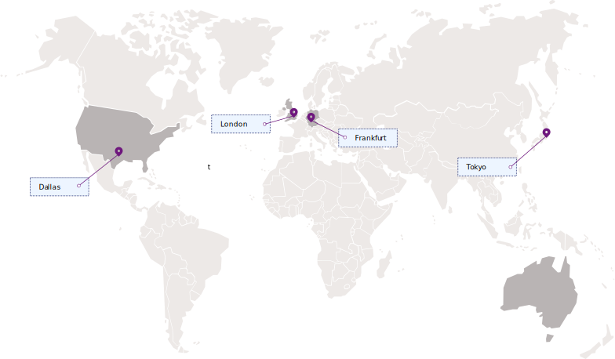

---

copyright:
  years: 2019
lastupdated: "2019-08-09"

keywords: IBM Cloud, LogDNA, Activity Tracker, regions
subcollection: logdnaat

---

{:new_window: target="_blank"}
{:shortdesc: .shortdesc}
{:screen: .screen}
{:pre: .pre}
{:table: .aria-labeledby="caption"}
{:codeblock: .codeblock}
{:tip: .tip}
{:download: .download}
{:important: .important}
{:note: .note}

# Locations
{: #regions}

{{site.data.keyword.la_full_notm}} is available in the following locations:
{:shortdesc}

| Geography             | Region                   | EU-Supported |
|-----------------------|--------------------------|--------------|
| `Asia Pacific`        | `Tokyo (jp-tok)`         | `N/A`        |
| `Europe`              | `Frankfurt (eu-de) (*)`  | `YES`        |
| `Europe`              | `London (eu-gb)`         | `NO`         |
| `North America`       | `Dallas (us-south)`      | `N/A`        |
{: caption="Table 1. List of locations where the service is available" caption-side="top"} 

Where
* A *geography* is a geographic area or larger political body that contains one or more regions.
* A *region* is a defined geographic territory. A region could be a specific postal code area, a town, a city, a state, a group of states, or even a group of countries. 
* `N/A` means feature that is not applicable to that geography.

`(*)` For more information, see [Enabling the EU Supported setting](/docs/account?topic=account-eu-hipaa-supported#bill_eusupported).

{: caption="Figure 1. Displays the regions where you can create and manage {{site.data.keyword.la_full_notm}} resources." caption-side="bottom"}

You can create {{site.data.keyword.la_full_notm}} resources in one of the supported {{site.data.keyword.cloud_notm}} locations, which represent the geographic area where your {{site.data.keyword.la_full_notm}} requests are handled and processed. 

