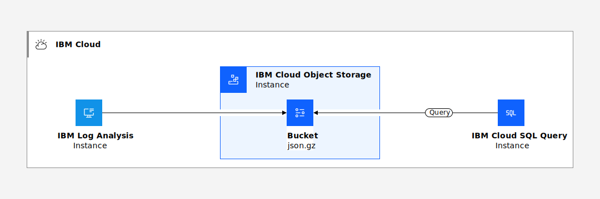

---

copyright:
  years:  2018, 2024
lastupdated: "2024-05-24"

keywords: IBM, Log Analysis, logging, overview

subcollection: log-analysis

---

{{site.data.keyword.attribute-definition-list}}

# Searching archive data by using the {{site.data.keyword.sqlquery_short}} service
{: #sqlquery}

You can use the {{site.data.keyword.sqlquery_short}} service to query {{site.data.keyword.la_short}} archive files that are stored in an {{site.data.keyword.cos_short}} (COS) bucket in {{site.data.keyword.cloud_notm}}.
{: shortdesc}


{{_include-segments/deprecation_notice.md}}

{: caption="Example services integration scenario." caption-side="bottom"}

Each {{site.data.keyword.la_short}} instance has a service plan associated that indicates the number of days that you can query data through the web UI. To have access to the data after this period, you must enable archiving in the {{site.data.keyword.la_short}} instance.
- When you enable archiving, you get an archive file hourly. This file contains information for that hour. Notice that UTC timestamps are used to determine which records are included in each file.
- The file name includes the ID of your {{site.data.keyword.la_short}} instance and the date of the records that are included in the file.
- You can archive logging data to a COS bucket that is available in the same account or in a different account in {{site.data.keyword.cloud_notm}}.

Once you have the {{site.data.keyword.sqlquery_short}} service running on {{site.data.keyword.cloud_notm}}, you can immediately start querying your data using the SQL Query user interface, programmatically by using either the REST API or the Python `ibmcloudsql` library, or write a serverless function by using {{site.data.keyword.openwhisk_short}}.

When you query logs, consider the following information:
* You must provision an instance of the {{site.data.keyword.sqlquery_short}} service.
* You must restrict user access to work with that instance. Users need the platform **viewer** role to launch the UI, and the service **writer** role to run queries. For more information about roles, see [Required user roles](/docs/sql-query?topic=sql-query-overview#user-roles).
* When you open the UI, the {{site.data.keyword.sqlquery_short}} service automatically generates a unique COS bucket that will store all of the results as CSV files from your SQL queries.

Use the {{site.data.keyword.sqlquery_short}} user interface (UI) to develop and test your queries, and the SQL Query REST API to automate them.
{: tip}

You can use the {{site.data.keyword.sqlquery_short}} to run SQL queries (that is, `SELECT` statements) to analyze, transform structured and semi-structured data, or clean up rectangular data. You cannot run actions such as `CREATE`, `DELETE`, `INSERT`, and `UPDATE`. The {{site.data.keyword.sqlquery_short}} service can process input data that is read from CSV, JSON, ORC, Parquet, or AVRO files.

The archive files from an {{site.data.keyword.la_short}} instance contain data in JSON format.
- If your log data consists of rectangular data with heterogeneous data types, you should transform the format to **partitioned JSON objects** to query successfully the data.
- If your log data consists of rectangular data with homogeneous data types, you should transform the format to **PARQUET** to query successfully the data and obtain better performance. Parquet is an open source file format that stores nested data structures into a flat columnar format, and preserves the schema of the original data.
- Each query result can be written to a `CSV`, `JSON`, `ORC`, `PARQUET`, or `AVRO` file in a {{site.data.keyword.cos_short}} instance of your choice.

For more information, see [{{site.data.keyword.sqlquery_short}} overview](/docs/sql-query?topic=sql-query-overview).


## Prerequisites
{: #sqlquery_prereq}

To be able to use the {{site.data.keyword.sqlquery_short}} service to query archived event files, check the following prerequisites:

* You must have access to the COS instance where the logging data is available.

    You must have access to a bucket that contains the {{site.data.keyword.la_short}} archive files and a bucket to use to store results from your queries.

* You must have an {{site.data.keyword.la_short}} instance provisioned in your account that has [archiving configured to a COS bucket in {{site.data.keyword.cloud_notm}}](/docs/log-analysis?topic=log-analysis-archiving-ov).

* You must have 1 or more archive files uploaded in the bucket.

* You must have a policy on the COS service with at least platform role **reader** so that you can view data in the COS bucket where the archive files are uploaded.

* You must have a policy on the COS instance with at least **Writer** access to one COS bucket so that result files (files containing output data) can be written there.

* You must have permissions to query the data by using the {{site.data.keyword.sqlquery_short}} service. For more information about roles, see [Required user roles](/docs/sql-query?topic=sql-query-overview#user-roles).


## Step 1. Provisioning an {{site.data.keyword.sqlquery_short}} instance
{: #sqlquery_step1}

To provision an instance, see [Create your {{site.data.keyword.sqlquery_short}} service instance](/docs/sql-query?topic=sql-query-getting-started).

To see the list of supported regions, see [Availability zones](/docs/sql-query?topic=sql-query-overview#availability).


## Step 2. Granting user permissions to run a query
{: #sqlquery_step2}

To run queries with the SQL query service, a user needs a platform role and a service role. For more information about roles, see [Required user roles](/docs/sql-query?topic=sql-query-overview#user-roles).

The following tables show the roles and actions that you can assign a user to run SQL queries:


| Platform actions                        | Administrator                                     | Editor | Operator | Viewer  |
|---------------------------------------------------------------------------|:-------------------------------------------------:|:-------:|:--------:|:------:|
| `View details of the {{site.data.keyword.sqlquery_short}} service instance`    |   |     |       |     |
{: caption="Platform roles" caption-side="top"}


| Service actions                 | Manager                                           | Writer                                            | Reader           |
|:-------------------------------:|:-------------------------------------------------:|:-------------------------------------------------:|:----------------:|
| `Run an SQL query`              |  |  |                  |
{: caption="Service roles" caption-side="top"}

Notice that users with the service role **reader** get an access error when they launch the SQL Query UI.

To manage access or assign new access for users by using IAM policies, you must be the account owner, administrator on all services in the account, or an administrator for the particular service or service instance.

Choose any of the following actions to manage IAM policies in the {{site.data.keyword.cloud_notm}}:

* To grant permissions to a user, see [Assigning access](/docs/account?topic=account-assign-access-resources#assign-new-access).
* To revoke permissions, see [Removing access](/docs/account?topic=account-assign-access-resources#removing-access-console)).
* To review a user's permissions, see [Reviewing your assigned access](/docs/account?topic=account-assign-access-resources#review-your-access-console).


## Step 3. Running a query through the {{site.data.keyword.sqlquery_short}} UI
{: #sqlquery_step3}

In SQL, the term *query* is just another way of saying *SELECT statement*.

To run a query, complete the following steps:

### Step 3.1. Launch the {{site.data.keyword.sqlquery_short}} query UI
{: #sqlquery_step3_1}

1. [Log in to your {{site.data.keyword.cloud_notm}} account](https://cloud.ibm.com/login){: external}.

	After you log in with your user ID and password, the {{site.data.keyword.cloud_notm}} dashboard opens.

2. Click the **Menu** icon  &gt; **Resource list** &gt; **Services**.

3. Select an {{site.data.keyword.sqlquery_short}} instance.

4. From the *Manage* tab, select **Launch {{site.data.keyword.sqlquery_short}} UI**.

When the {{site.data.keyword.sqlquery_short}} query UI opens, a COS bucket is automatically generated. This bucket is used by default by the {{site.data.keyword.sqlquery_short}} service to store the results from your SQL queries.

Wen you run queries, you can specify a custom bucket to store results in. If your query does not specify one, the default one is used.
{: note}

### Step 3.2. Get information on the file that you want to query in COS
{: #sqlquery_step3_2}

Complete the following steps:

1. In the {{site.data.keyword.cloud_notm}} dashboard, click the **Menu** icon  &gt; **Resource list** &gt; **Storage**.

2. Select the {{site.data.keyword.sqlquery_short}} instance that has the bucket with the archive files.

    Contact your {{site.data.keyword.la_short}} administrator to get the COS information.

3. Select **Buckets**.

4. Select the bucket name. You can see the list of archive files in the bucket.

5. Identify the file that you want to query.

    Notice that the file name has the ID of your {{site.data.keyword.la_short}} instance and the date, in UTC format.

6. For that file, copy the **Object Data Engine URL**.


### Step 3.3. Get information on the COS bucket that is used to store results from queries
{: #sqlquery_step3_3}

Complete the following steps:

1. In the COS instance UI, select **Buckets**.

2. Select the bucket name that you plan to use to store the results from queries.

3. For that bucket, select **SQL URL**.

    A window opens that shows the URL.

4. Copy the URL.


### Step 3.4. Transform an archive file
{: #sqlquery_step3_4}


Complete the following steps to run the query to transform content from JSON into partitioned JSON objects:

1. In the SQL editor field of the {{site.data.keyword.sqlquery_short}} UI, enter the following SELECT statement:

    ```text
    SELECT *, date_format(from_unixtime(_source._ts / 1000, 'yyyy-MM-dd HH:mm:ss'), 'yyyy') AS _year,
           dayofyear(from_unixtime(_source._ts / 1000, 'yyyy-MM-dd HH:mm:ss')) AS _dayofyear,
           date_format(from_unixtime(_source._ts / 1000, 'yyyy-MM-dd HH:mm:ss'), 'HH') AS _hour
    FROM SQL_URL STORED AS JSON
    INTO RESULTS_BUCKET STORED AS JSON PARTITIONED BY (_year, _dayofyear, _hour)
    ```
    {: codeblock}

    Where

    * **SQL_URL** is the SQL URL of the archive file in COS

    * **RESULTS_BUCKET** is the SQL URL of the custom COS bucket that you plan to use to upload the query results

    In the statement, the timestamp information is captured in the `_ts` entry of each row and is used to generate the year, day of year, and hour information. The result reflects the specified partitioning as Hive style partitioning. For example, you could see `_hour=00` in the object name, which means that all log data belonging to that hour is included in that object.

2. Click **Run**.

    You can see the query result in the *Result* area of the UI.

    You can see the target COS URL in the *Result location* area of the UI. This URL points to the object storage bucket used by {{site.data.keyword.sqlquery_short}} to store the results.

    With the lite plan, you can run only 1 query. You can run up to 5 queries simultaneously with a paid plan.

3. Copy the **Result location URL**. You need it to run other queries to analyze the data that is included in that archive file.


Complete the following steps to run the query to transform content from JSON into PARQUET:

1. In the SQL editor field of the {{site.data.keyword.sqlquery_short}} UI, enter the following SELECT statement:

    ```text
    SELECT * FROM cleancols(SQL_URL STORED AS JSON)
    INTO RESULTS_BUCKET STORED AS PARQUET
    ```
    {: codeblock}

    Where

    * **SQL_URL** is the SQL URL of the archive file in COS

    * **RESULTS_BUCKET** is the SQL URL of the custom COS bucket that you plan to use to upload the query results

    * Use [cleancols](/docs/sql-query?topic=sql-query-sql-reference) to avoid transformation problems into PARQUET format when the name of the columns include special characters or blanks.

    For example, the following query is used to transform an archive file:

    ```text
    SELECT * FROM cleancols(cos://ams03/at-eu-de/999999d8f1f.2019-06-03.62.json.gz STORED AS JSON)
    INTO cos://eu-de/results-at STORED AS PARQUET
    ```
    {: screen}

2. Click **Run**.

    You can see the query result in the *Result* area of the UI.

    You can see the target COS URL in the *Result location* area of the UI. This URL points to the object storage bucket used by {{site.data.keyword.sqlquery_short}} to store the results.

    With the lite plan, you can run only 1 query. You can run up to 5 queries simultaneously with a paid plan.

3. Copy the **Result location URL**. You need it to run other queries to analyze the data that is included in that archive file.


After you run the transformation query, three objects are written as a result set in your COS results bucket:

1. `jobid=<job_id>`
2. `jobid=<job_id>/_SUCCESS`
3. `jobid=<job_id>/<part-number>`

Only one object contains the result set (`jobid=<job_id>/<part-number>`), and the other two are empty and don't contain any data.

It is important not to delete any of the files if you want to use the result set.
{: important}

Each result is stored with an own job ID prefix that allows you to use the result directly in a query.

When you want to specify a result as input in your SQL query, specify the first (`jobid=<job_id>`) or the third one (`jobid=<job_id>/<part-number>`).

[Learn more about the result set created per query](/docs/services/sql-query?topic=sql-query-overview#result).


### Step 3.5. Run a query to find errors of the last 30 days
{: #sqlquery_step3_5_1}

For example, to find all ERROR log rows for the last 30 days, run the following command:

```text
SELECT _source.data
FROM RESULTS_BUCKET STORED AS JSON
where dayofyear(_dayofyear > current_date - INTERVAL 30 day) and _source.level = "ERROR"
LIMIT 50
INTO QUERY_RESULTS_BUCKET STORED AS JSON
```
{: codeblock}

Where

* **RESULTS_BUCKET** is the SQL URL of the custom COS bucket that you use to upload the query results after transforming the data into partitioned JSON objects

* **QUERY_RESULTS_BUCKET** is the SQL URL of the custom COS bucket that you use to upload the query results


### Step 3.6. Run a query to find all ERROR log rows within a time range
{: #sqlquery_step3_6}

For example, to find all ERROR log rows in the timeframe between 7 am and 8 am on July 17th, run the following command:

```text
SELECT _source.data
FROM RESULTS_BUCKET STORED AS JSON
where _dayofyear=198 and _hour=07 and _source.level = "ERROR"
LIMIT 50
INTO QUERY_RESULTS_BUCKET STORED AS JSON
```
{: codeblock}

Where

* **RESULTS_BUCKET** is the SQL URL of the custom COS bucket that you use to upload the query results after transforming the data into partitioned JSON objects

* **QUERY_RESULTS_BUCKET** is the SQL URL of the custom COS bucket that you use to upload the query results


## EU-managed accounts
{: #sqlquery_step3_5_2}


To manage logs that are generated in your **EU-supported account** by using the {{site.data.keyword.la_full_notm}} service, consider the following information:

{{site.data.keyword.sqlquery_short}} provides a serverless, no-ETL solution to easily query data stored in COS. [Learn more](/docs/sql-query?topic=sql-query-overview).

You can use this service to analyze data from logging archived files in COS.

Once you have the {{site.data.keyword.sqlquery_short}} service running on IBM Cloud, you can immediately start querying your data using the SQL Query user interface, programmatically by using either the REST API or the Python `ibmcloudsql` library, or write a serverless function by using {{site.data.keyword.openwhisk_short}}.

When you query logs, consider the following information:
* You must provision an instance of the {{site.data.keyword.sqlquery_short}} service in Frankfurt.
* You must restrict user access to work with that instance. Users need the platform **viewer** role to launch the UI, and the service **writer** role to run queries.
* When you open the UI, the {{site.data.keyword.sqlquery_short}} service automatically generates a unique COS bucket that will store all of the results as CSV files from your SQL queries. To make sure that you are using an EU-Supported bucket, create one. You can specify your custom bucket to store results in.
