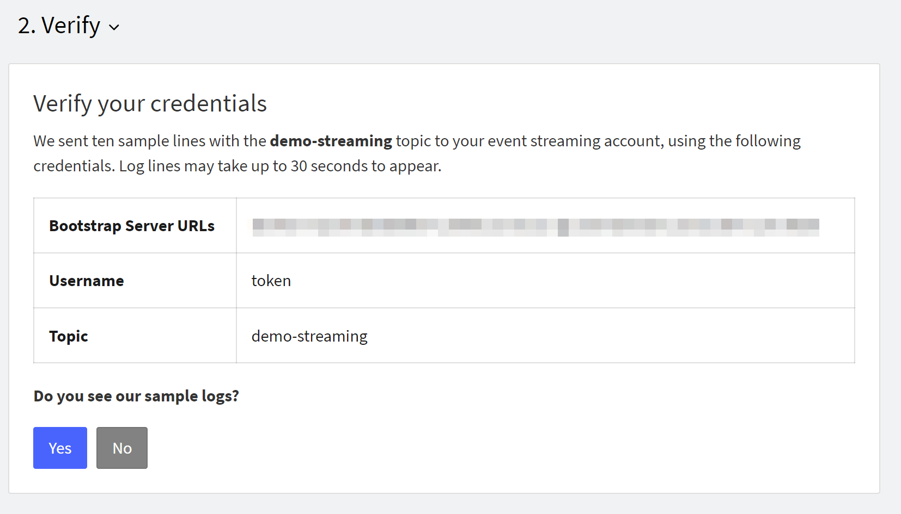

---

copyright:
  years: 2019, 2024
lastupdated: "2024-05-24"

keywords: IBM Cloud, Log Analysis, streaming

subcollection: log-analysis

---

{{site.data.keyword.attribute-definition-list}}

# Configuring streaming to {{site.data.keyword.messagehub}} through the UI
{: #streaming-configure}

Complete the following steps to configure streaming from a {{site.data.keyword.la_short}} instance to an {{site.data.keyword.messagehub}} instance:
{: shortdesc}

<!-- common deprecation notice -->
{{_include-segments/deprecation_notice.md}}

See [Configure streaming](/docs/log-analysis?topic=log-analysis-streaming#streaming-1) for more information on roles required for streaming.
{: note}

## Prereqs
{: #streaming-configure-prereqs}

* Create an {{site.data.keyword.messagehub}} instance.

    a. Log in to the {{site.data.keyword.cloud_notm}} console.

    b. Access the [{{site.data.keyword.messagehub}} service](https://cloud.ibm.com/catalog/event-streams){: external} in the **Catalog**.

    c. Select the plan on the service instance page.

    d. Enter a name for your service. You can use the default value.

    e. Click **Create**. The {{site.data.keyword.messagehub}} **Getting started** page opens.

* Check the limitations of the service plans. For more information, see [Limits and quotas](https://cloud.ibm.com/docs/EventStreams?topic=EventStreams-kafka_quotas).

## Step 1. Create a topic in {{site.data.keyword.messagehub}}
{: #streaming-step1-1}

Complete the following steps to create an Event Streams topic:

1. [Log in to your {{site.data.keyword.cloud_notm}} account](https://cloud.ibm.com/login){: external}.

	After you log in with your user ID and password, the {{site.data.keyword.cloud_notm}} dashboard opens.

2. Click the **Menu** icon  &gt; **Resource list**.

3. Look for the {{site.data.keyword.messagehub}} instance that you plan to use, and select it.

4. In the {{site.data.keyword.messagehub}} instance console, click **Manage** &gt; **Launch Dashboard**.

5. Click **Create a topic**.

    

6. Enter a topic name and click **Next**.

    

7. Enter the number of partitions and click **Next**.

    One or more partitions make up a topic. A partition is an ordered list of messages. Partitions are distributed across the brokers in order to increase the scalability of your topic. You can also use them to distribute messages across the members of a consumer group.
    {: note}

    

8.  Select a **Message retention** and click **Create Topic**.

    **Message retention** defines how long messages are retained before they are deleted. If your messages are not read by a consumer within this time, they will be missed.
    {: important}

## Step 2. Create credentials to authenticate the logging instance with {{site.data.keyword.messagehub}}
{: #streaming-step1-2}

You need the following information to connect the {{site.data.keyword.la_full_notm}} instance to the {{site.data.keyword.messagehub}} instance:
- Endpoint URLs to call the APIs
- Credentials for authentication

Complete the following steps to create service credentials that the {{site.data.keyword.la_full_notm}} instance needs to communicate with the {{site.data.keyword.messagehub}} instance:

1. In the {{site.data.keyword.cloud_notm}}, click the **Menu** icon  &gt; **Resource list**.

2. Look for the {{site.data.keyword.messagehub}} instance that you plan to use, and select it.

3. In the {{site.data.keyword.messagehub}} console, click **Service credentials**.

4. Select **New credential**.

5. Enter a name and select the **writer** role.

    

6. Click **Add**.

To restrict access to 1 topic, complete the following steps:

1. From the menu bar, click **Manage** &gt; **Access (IAM)**, and select **Service IDS**.

    

2. Select the service ID.
3. Select **Access policies**.
4. Select the policy and modify it to specify the topic.

    

    

5. [Get credentials using the IBM Cloud CLI](/docs/EventStreams?topic=EventStreams-connecting#connect_enterprise_external_cli) and make note of the api key and broker URL values.

## Step 3. Configure the connection in {{site.data.keyword.la_short}} to {{site.data.keyword.messagehub}}
{: #streaming-step1-3}

Complete the following steps to configure the connection in {{site.data.keyword.la_short}} to {{site.data.keyword.messagehub}}:

1. [Launch the {{site.data.keyword.la_short}} web UI](/docs/services/log-analysis?topic=log-analysis-launch).

2. Click the **Settings** icon . Then select **Streaming** &gt; **Configuration**.

3. Select **kafka** as the streaming type. Then, enter the following information:

    1. In the **Username** field, enter the value **token**.

    2. In the **Password** field, enter the API key that is associated with the service credential that you want to use to authenticate {{site.data.keyword.la_short}} with {{site.data.keyword.messagehub}}.

    3. In the **Bootstrap Server URL** section, enter the `kafka_brokers_sasl` values that are listed in the service credential.

       You must enter each URL as individual entries.  If you need to add additional URLs, click **Add another URL** to add each additional URL.
       {: note}

    4. Enter the name of a topic.

    5. Click **Save**.

    6. A message will be displayed indicating that sample lines are sent that can be used to verify your connection.

       

## Step 4. Verify sample data can reach the topic in {{site.data.keyword.messagehub}}
{: #streaming-step1-4}

To continue, you must verify that sample data can reach the topic in {{site.data.keyword.messagehub}}.

To verify that sample data is streaming, you can use {{site.data.keyword.mon_full_notm}}.

1. Check that you have an instance of {{site.data.keyword.mon_short}} in the same region as your {{site.data.keyword.messagehub}} instance. This instance must be configured to collect platform metrics. For more information, see [Enabling platform metrics](/docs/monitoring?topic=monitoring-platform_metrics_enabling).
2. [Launch the {{site.data.keyword.mon_short}} UI](/docs/monitoring?topic=monitoring-launch).
3. In the **Dashboards** section, go to **Dashboard templates** and select the template **IBM Event Streams (Enterprise)**.
4. Create a copy of the temnplate by clicking **Create custom dashboard**.
5. Edit the panel *Topic bytes in per second*.

    

6. Customize the metric to see data per topic.

    

7. Check that the resolution is set to **10M**.

If you do not see data, do 1 of the following:
- **Resend sample logs** to verify that sample data is streaming.
- **Check my setup** to go back to the configuration panel. After you make your changes, retry the verification steps.

If you see data, click **YES**.

After you provision an instance of {{site.data.keyword.messagehub}}, the {{site.data.keyword.mon_short}} dashboard may take up to 15 mins to show.
{: note}

## Step 5. Start streaming
{: #streaming-step1-5}

After you verify that sample data is reaching {{site.data.keyword.messagehub}}, click **Start stream**.

Streaming may take up to 15 minutes to begin.
{: note}
