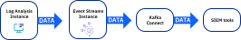
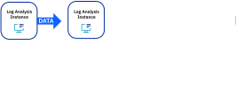

---

copyright:
  years: 2019, 2022
lastupdated: "2022-07-21"

keywords: IBM Cloud, Log Analysis, streaming

subcollection: log-analysis

---

{{site.data.keyword.attribute-definition-list}}

# Streaming data
{: #streaming}

Stream data from an {{site.data.keyword.la_full_notm}} instance to other corporate tools such as Security Information and Event Management (SIEM) tools. 
{: shortdesc}

When you stream data to data lakes, other analysis tools, or other SIEM tools, you can add additional capabilities to the ones provided by the {{site.data.keyword.la_full_notm}} service:
- You can gain visibility into enterprise data across on-premises and cloud-based environments. 
- You can identify and prioritize security threats that might affect your organization.
- You can detect vulnerabilities by using Artificial Intelligence (AI) to investigate threats and incidents. 

You can stream data to an {{site.data.keyword.messagehub}} instance or to an {{site.data.keyword.la_full_notm}} instance. For example, when you enable streaming on an {{site.data.keyword.la_full_notm}} instance, you configure {{site.data.keyword.la_short}} to send data to an {{site.data.keyword.messagehub}} instance. Then, you can configure Kafka Connect to consume the data and forward it to your destination tool. Once the data is persisted within {{site.data.keyword.messagehub}}, you can configure any application or service to create a subscription and take action on log data being streamed.

{: caption="Figure 1. Streaming example with Event Streams" caption-side="bottom"}

You can also also configure streaming from one {{site.data.keyword.la_full_notm}} instance to a second {{site.data.keyword.la_full_notm}} instance.

{: caption="Figure 2. Log Analysis to Log Analysis streaming" caption-side="bottom"}

You can only stream from one {{site.data.keyword.la_full_notm}} instance to one other {{site.data.keyword.la_full_notm}} instance. You cannot stream from the second {{site.data.keyword.la_full_notm}} instance to another {{site.data.keyword.la_full_notm}} instance.
{: important}

Currently, you can only stream up to 1TB of data per day.
{: note}

If you have any regulatory requirement for data residency and compliance needs, you must control the location where {{site.data.keyword.la_short}}, {{site.data.keyword.messagehub}}, Kafka Connect and the destination tool are available.
{: important}

## Configure streaming
{: #streaming-1}

For information on how to configure streaming, see [Configuring streaming](/docs/log-analysis?topic=log-analysis-streaming-configure).

Consider the following information when streaming data to an {{site.data.keyword.messagehub}} instance:
- You must have **manager** role to configure streaming in the {{site.data.keyword.la_short}} instance. This role includes the **logdna.dashboard.manage** IAM action role that allows a user to perform admin tasks such as configure streaming.
- When you configure streaming, the {{site.data.keyword.la_full_notm}} instance and the {{site.data.keyword.messagehub}} instance must be provisioned in the same account.
- To connect the {{site.data.keyword.la_full_notm}} instance to the {{site.data.keyword.messagehub}} instance, you need the following information:
    
    - Endpoint URLs to call the APIs
    
    - Credentials for authentication
- To create a topic in {{site.data.keyword.messagehub}}, you must have **manager** role. This role includes the **messagehub.topic.manage** IAM action role that allows an app or user to create or delete topic.
- The credential that {{site.data.keyword.la_short}} uses to publish data in {{site.data.keyword.messagehub}} must have **writer** role. This role includes the **messagehub.topic.write** IAM action role that allows an app or service to write data to 1 or more topics.

Consider the following information when streaming data to a {{site.data.keyword.la_short}} instance:
- You must have **manager** role to configure streaming in the {{site.data.keyword.la_short}} instance. This role includes the **logdna.dashboard.manage** IAM action role that allows a user to perform admin tasks such as configure streaming.
- When you configure streaming, the source {{site.data.keyword.la_full_notm}} instance and the destination {{site.data.keyword.la_full_notm}} instance can be provisioned in the same account or in different accounts.
- To connect the source {{site.data.keyword.la_full_notm}} instance to the destination {{site.data.keyword.la_full_notm}} instance, you need the following information:
    
    - Destination {{site.data.keyword.la_full_notm}} ingestion URL
    
    - Ingestion key for the destination {{site.data.keyword.la_full_notm}} for authentication

- If you configure your log sources to send data through private endpoints, make sure you configure a private ingestion endpoint for streaming.

- If you configure your log sources to send data through private and public endpoints, make sure you configure a private ingestion endpoint for streaming.

- If you have any regulatory restriction to keep data within specific regions, make sure streaming is only configured to a valid destination.

## Monitor streaming
{: #streaming-2}

To monitor streaming, you can use the following services:
- {{site.data.keyword.mon_full_notm}} service to monitor streaming to an {{site.data.keyword.messagehub}} instance: 

    {{site.data.keyword.messagehub}} is integrated with the {{site.data.keyword.mon_short}} service. {{site.data.keyword.mon_short}} provides a default template that you can customize to monitor the {{site.data.keyword.messagehub}} instance, how data is streamed out of {{site.data.keyword.la_short}} and consumed by any application or service that is subscribed to {{site.data.keyword.messagehub}}.

    For more information, see [Monitoring streaming by using {{site.data.keyword.mon_full_notm}}](/docs/log-analysis?topic=log-analysis-streaming-monitor#streaming-monitor-1).

- {{site.data.keyword.at_full_notm}}:

    Streaming generates {{site.data.keyword.at_short}} events with the action **logdna.streaming-logs.send** to notify of failures sending data. There are different reasons for failure such as invalid credentials and topic deleted.

    For more information, see [Monitoring streaming by using {{site.data.keyword.at_short}}](/docs/log-analysis?topic=log-analysis-streaming-monitor#streaming-monitor-2).

## Conditional streaming
{: #streaming-3}

You can configure exclusion rules to filter out data from streaming. For more information, see [Configuring conditional streaming](/docs/log-analysis?topic=log-analysis-streaming-conditional).

- You configure streaming exclusion rules through **Settings** &gt; **Streaming** &gt; **Exclusion rules**. 
- The exclusion rules that you define for streaming are different from the exclusion rules that you can define at the instance level through **Settings** &gt; **Usage** &gt; **Exclusion rules**. 

When you define exclusion rules, either at the instance level, or for streaming, they are applied as follows:
- Exclusion rules that you define at the instance level are applied first.
- Only the data that is retained and available for search is in scope of the exclusion rules that you define for streaming.
- After a streaming exclusion rule is active, data that matches the filter criteria is not streamed.
- Conditions that are applied by a query are enforced. 

## {{site.data.keyword.at_short}} events
{: #streaming-4}

The following {{site.data.keyword.at_short}} events are generated when you configure streaming:

| Action | Description |
|--------|-------------|
| `logdna.streaming-configuration.validate`   | This event is generated when you configure the connection in {{site.data.keyword.la_short}} to {{site.data.keyword.messagehub}}. |
| `logdna.streaming-samples.send`             | This event is generated when sample data is sent to verify the connection. |
| `logdna.account-streaming-setting.configure`| This event is generated when you start streaming. |
| `logdna.streaming-configuration.deactivate` | This event is generated when you stop streaming. |
| `logdna.streaming-logs.send`              | This event is generated when there is a failure streaming data. |
| `logdna.exclusion-rule.create`            | This event is generated when an streaming exclusion rule is configured. |
| `logdna.exclusion-rule.delete`            | This event is generated when an streaming exclusion rule is deleted. |

