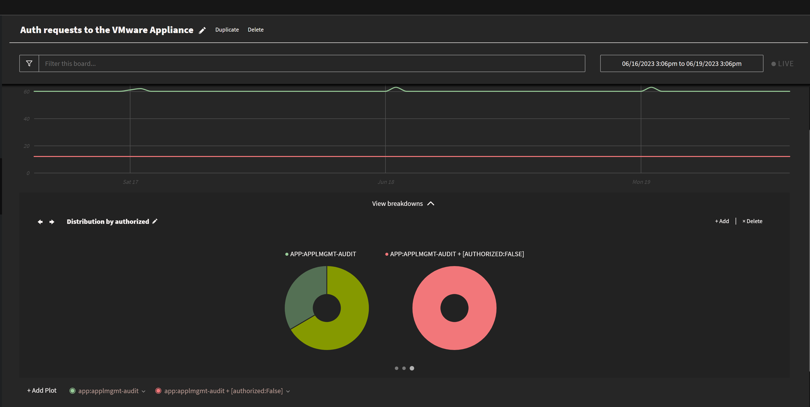

---

copyright:
  years: 2018, 2023
lastupdated: "2023-07-13"

keywords:

subcollection: log-analysis

---

{{site.data.keyword.attribute-definition-list}}

# Using the VMware template
{: #templates-vmware}

Use the {{site.data.keyword.la_full}} VMware templates to gain insight on your VMware environments.
{: shortdesc}

## Prereqs
{: #templates-vmware-prereqs}

The resources provided on this template require that you configure the logging agent with the tag `vmware`. For more information, see [Logging for VMware vCenter Server deployments](/docs/log-analysis?topic=log-analysis-vmware-vcenter).

## Deploying the VMware templates
{: #templates-vmware-deploy}

Complete the following steps to deploy the VMware template objects in 1 {{site.data.keyword.la_short}} instance:

### Step 1. Launch the template library
{: #templates-vmware-step1}

The {{site.data.keyword.la_short}} offering template library offers multiple tiles that group predefined views, dashboards, and screens by area. One of them is the **VMware** template.

Complete the following steps to launch the {{site.data.keyword.la_short}} template library:

1. [Log in to your {{site.data.keyword.cloud_notm}} account](https://cloud.ibm.com/login){: external}.

	After you log in with your user ID and password, the {{site.data.keyword.cloud_notm}} dashboard opens.

2. Click the **Menu** icon  &gt; **Observability**.

3. Select **Logging**.

    The list of {{site.data.keyword.la_short}} instances is displayed.

4. Select the {{site.data.keyword.la_short}} instance in the region where you want to deploy the template. Then, click **Open Dashboard**.

### Step 2. Install the template
{: #templates-vmware-step2}

Complete the following steps to deploy the **VMware** template:

1. From the {{site.data.keyword.la_short}} instance UI, click the **Settings** icon  &gt; **Template Library**. The tiles show the available template libraries.

2. In the Template library section, select the **VMware** tile.

3. Choose the views and screen resources that you want to deploy. Make sure you select the parsing templates.

4. Click **Apply template**.

    If you do not select one or more options within the template library, all options are deployed.
    {: note}

    What you deploy appears under the appropriate sections of the UI. For example, if you deploy a screen, it deploys under **Screens**.

5. Refresh your browser to see the template objects.

After you deploy the template, it might take a while for the parsing templates to be enabled. The new indexed fields that are included with the parsing templates are needed for the template to filter and display data.
{: important}

## Predefined views
{: #templates-vmware-views}

Use these views to gain insight on your VMware environment.
{: note}

| View name | Description |
|-----------|-------------|
| `[DevOps] AuthRequest for serviceID (applmgmt-audit)` | Use this view to review logs that report on authentication requests for the serviceID to the VMware Appliance Management Service.  |
| `[DevOps] AuthResponse (applmgmt-audit)` | Use this view to review logs that report on authentication responses to the VMware Appliance Management Service. |
| `[DevOps] AuthResult for serviceID (applmgmt-audit)` | Use this view to review logs that report on authentication results for the serviceID to the VMware Appliance Management Service. |
| `[DevOps] AuthStatus (applmgmt-audit)` | Use this view to review logs that report on authentication status to the VMware Appliance Management Service. |
| `[DevOps] Core and Inventory Disk Exhaustion` | Use this view to detect when the `/storage/log partition is reaching maximum capacity.  |
| `[DevOps] Logged in` | Use this view to monitor users that log in. |
| `[DevOps] Logged out` | Use this view to monitor users that log out. |
| `[DevOps] Reconfigure a VCenter host` | Use this view to monitor VCenter hosts that have been reconfigured. |
| `[DevOps] Reconfigure VM` | Use this view to monitor VMs that have been reconfigured. |
| `[DevOps] Session auth request (applmgmt-audit)` | Use this view to review logs that report on session authorization requests to the VMware Appliance Management Service. |
| `[DevOps] User Password Authentication request (applmgmt-audit)`| Use this view to review logs reporting on user password authorization requests. |
| `[DevOps] wcpsvc - 503 Service Unavailable` | Use this view to review log entries indicating connectivity problems to the Vcenter Server when the VSphere client is used. |
{: caption="Table 1. Predefined devops views" caption-side="bottom"}

| View name | Description |
|-----------|-------------|
| `[Events] info logs` | Use this view to review `info` level logs. |
| `[Events] notice logs` | Use this view to review `notice` level logs. |
| `[Events] warning logs` | Use this view tor eview `warning` level logs. |
| `[Events] Events (vpxd)` | Use this view to review logs that report on the VMware vCenter Server. |
{: caption="Table 2. Predefined events views" caption-side="bottom"}

| View name | Description |
|-----------|-------------|
| `[EXSi] Hostd` | Use this view to review logs that are generated by the agent that manages the ESXi host and its virtual machines. Reports actions such as VM power on, power off.|
| `[EXSi] vmkernel` | Use this view to review logs that report activity that is related to virtual machines and ESXi. |
| `[EXSi] vmkernel failures` | Use this view to review logs that report failing activity that is related to virtual machines and ESXi. |
| `[EXSi] vpxa` | Use this view to review logs that are generated by the agent that communicates with vCenter Server from the ESXi hosts. |
{: caption="Table 3. Predefined ESXi views" caption-side="bottom"}

| View name | Description |
|-----------|-------------|
| `[NSX] nsx-controller (cfgAgent)` | Use this view to review logs that are generated by the NSX controller cluster. |
| `[NSX] nsx-exporter` | Use this view to review VMWare Virtual Machine logs. |
| `[NSX] nsx-opsagent` | Use this view to review logs that are generated by the OpsAgent service. |
| `[NSX] nsx-proxy` | Use this view to review logs that are generated by the NSX Edge servers. |
| `[NSX] nsx-sfhc` | Use this view to review logs that are generated by the NSX-T Data Center Kernel Modules on ESXi Hypervisors. |
| `[NSX] nsx-sha` | Use this view to review logs that are generated by the System Health Agent (SHA). |
{: caption="Table 4. Predefined NSX views" caption-side="bottom"}

| View name | Description |
|-----------|-------------|
| `[VCenter] vmware-sps` | Use this view to review logs that report on the VMware vSphere Profile-Driven Storage Service. |
| `[VCenter] applmgmt` | Use this view to review logs that report the health of executable operations for the Appliance REST APIs. |
| `[VCenter] applmgmt(debug)` | Use this view to review `debug` log entries that report the health of executable operations for the Appliance REST APIs. |
| `[VCenter] applmgmt (INFO)` | Use this view to review `INFO` log entries that report the health of executable operations for the Appliance REST APIs. |
| `[VCenter] applmgmt-audit` | Use this view to review logs that report on authentication requests to the VMware Appliance Management Service. |
| `[VCenter] cloudvm` | Use this view to review logs that report allotment and distribution of resources between services. |
| `[VCenter] content-library` | Use this view to review logs that report on the VMware Content Library Service. |
| `[VCenter] dnsmasq` | Use this view to review logs from the dnsmasq lightweight DNS forwarder and DHCP server. |
| `[VCenter] eam` | Use this view to review logs that report on the VMware ESX Agent Manager. |
| `[VCenter] netdumper` | Use this view to review logs that report on the VMware vSphere ESXi Dump Collector. |
| `[VCenter] perfcharts` | Use this view to review logs that report on the VMware Performance Charts Service. |
| `[VCenter] rbd` | Use this view to review logs that report on the VMware vSphere Auto Deploy. |
| `[VCenter] rhttpproxy` | Use this view to review logs that report on the VMware HTTP Reverse Proxy service. |
| `[VCenter] sca` | Use this view to review logs that report on the VMware Service Control Agent service. |
| `[VCenter] sps` | Use this view to review logs that report on the VMware vSphere Profile-Driven Storage Service. |
| `[VCenter] vapi` | Use this view to review logs that report on the VMware vAPI Endpoint service. |
| `[VCenter] vCenter - error logs` | Use this view to review logs that have the log level set to error. |
| `[VCenter] vCenter - warning logs` | Use this view to review logs that have the log level set to warning. |
| `[VCenter] vCenter logs` | Use this view to review all VCenter logs. |
| `[VCenter] vha` | Use this view to review logs that report on the VMware vCenter High Availability service. |
| `[VCenter] vmafdd` | Use this view to review logs that report on the VMware Authentication Framework LDAP service. |
| `[VCenter] vmdird` | Use this view to review logs that report on the VMware Directory Service LDAP. |
| `[VCenter] vmon` | Use this view to review logs that report on the VMware Service Lifecycle Manager service. |
| `[VCenter] vpostgres` | Use this view to review logs that report on the VMware Postgres service. |
| `[VCenter] vpxd-perf` | Use this view to review logs that report on the VMware vCenter `vpxd-svc-perf` service. |
| `[VCenter] vpxd-svcs-access` | Use this view to review logs that report on the VMware vCenter `vpxd-svcs-access` service. |
| `[VCenter] wcpsvc` | Use this view to review logs that report on the VMware vCenter supervisor service. |
| `[VCenter] wcpsvc - debug logs` | Use this view to review logs that report on the VMware vCenter supervisor service that have the log level set to debug. |
| `[VCenter] wcpsvc - error logs` | Use this view to review logs that report on the VMware vCenter supervisor service that have the log level set to error. |
| `[VCenter] wcpsvc - warning logs` | Use this view to review logs that report on the VMware vCenter supervisor service that have the log level set to warning. |
{: caption="Table 5. Predefined vCenter views" caption-side="bottom"}

## Predefined boards
{: #templates-vmware-boards}

Use these boards to gain insight on your VMware environment.
{: note}

| Board name | Description |
|-----------|-------------|
| `Auth requests to the VMware Appliance` | Use this board to see an overview of authorization requests to VMware. |
| `vCenter logs` | Use this board to see the number of VCenter log entries over time. |
| `VMware Overview` | Use this board to see a breakdown of logs by app. |
{: caption="Table 6. Predefined boards" caption-side="bottom"}

{: caption="Figure 1. Sample VMWare board" caption-side="bottom"}

## Predefined screens
{: #templates-vmware-screens}

Use this screen to gain insight on your VMware environment.
{: note}

| Screen name | Description |
|-----------|-------------|
| `VMware Overview` | Use this screen to  get an overview of your VMware environment. |
{: caption="Table 7. Predefined screen" caption-side="bottom"}

## Predefined exclusion filters
{: #templates-vmware-exclusion}

A sample [exclusion filter](/docs/log-analysis?topic=log-analysis-exclusion_rules) is available to exclude log lines that are not needed for your use. Excluding extraneous log lines can help you manage cost.

## Predefined parsing templates
{: #templates-vmware-parsing}

Predefined [parsing templates](https://docs.mezmo.com/docs/create-a-parsing-template){: external} are available that can be used when building additional views, boards, and screens to parse and format log lines. You can [select](https://docs.mezmo.com/2.8/docs/parse-logs-with-custom-templates){: external} whether a configured parsing template is applied or ignored.

## Learn more about VMware logging
{: #vmware-template-more-info}

For more information about VMware logging when using {{site.data.keyword.la_full_notm}}, see [Logging for VMware vCenter Server deployments](/docs/log-analysis?topic=log-analysis-vmware-vcenter).
