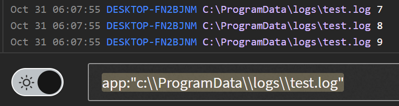

---

copyright:
  years: 2022, 2024
lastupdated: "2024-05-24"

keywords: IBM Cloud, Log Analysis, search, filter

subcollection: log-analysis

---

{{site.data.keyword.attribute-definition-list}}


# Searching logs by using queries
{: #views}

Through the {{site.data.keyword.la_full_notm}} web UI, you can apply search and filtering criteria to define the set of logs that are displayed through a custom view.
{: shortdesc}

<!-- common deprecation notice -->
{{_include-segments/deprecation_notice.md}}

## Prerequisites
{: #views_prereqs}

Before you start, check that your user ID has permissions to launch the web UI and view events. The following table lists the minimum roles that a user must have to be able to launch the {{site.data.keyword.la_full_notm}} web UI, and view, search, and filter events:

| Role                      | Permission granted            |
|---------------------------|-------------------------------|
| Platform role: `viewer`     | Allows the user to view the list of service instances in the Observability dashboard. |
| Service role: `reader`      | Allows the user to launch the web UI and view events in the web UI.  |
| Service role: `standard-member`      | Allows the user save a view based on a search.  |
{: caption="Table 1. IAM roles" caption-side="top"}

For more information on how to configure policies for a user, see [Granting user permissions to a user or service ID](/docs/services/log-analysis?topic=log-analysis-iam_view_events#iam_view_events).


## Step 1. Go to the web UI and select a view
{: #views_step1}

Complete the following steps:

1. [Go to the web UI](/docs/services/log-analysis?topic=log-analysis-launch#launch).
2. Click the **Views** icon .
3. Select **Everything** or a view.


## Step 2. Select the set of logs to display through a view by applying a search query
{: #views_step2}

To search for specific logs, you can apply a search query.

* You can do simple searches (single term string search), compound search (multiple search terms and operators), field searches if the log line can be parsed, and others.
* AND and OR operators are case-sensitive and must be capitalized.
* Use `FieldName:==FieldValue` to search for a specific field value.
* Use `FieldName:Value` to search for field values that start with that value.

You can only search logs for the number of days that is specified through the instance's service plan.
{: important}

If you are searching for Windows logs, you must use double slashes (`//`) in the search query even though the console will show directories with single slashes.

{: caption="Figure 1. Example search for Windows logs" caption-side="bottom"}

Complete the following steps:
1. Enter a search query.
2. Press **Enter**.

When you run a query, notice that the name of the view changes to **Unsaved View**.


### Query for logs that are generated by a host
{: #views_step2_1}

To filter logs for a specific host on an {{site.data.keyword.la_full_notm}} instance with platform logs, you need to enter the following query:

```text
host:<HOSTNAME>
```
{: codeblock}

Where `HOSTNAME` is the name of a host providing platform logs.  For example, to return {{site.data.keyword.cloud_notm}} database logs specify the following query:

```text
host:ibm-cloud-databases-prod
```
{: codeblock}

### Query by log criticallity
{: #views_step2_2}

Each log has a **level** field that defines the level of threat the log issue might have.

Valid values in ascending order of severity are shown in the following table.

| Value                      | Description            |
|---------------------------|-------------------------------|
| `N/A` | Log entries with no level specified. |
| `INFO` | An informational log entry providing information about the routine operations of the service. |
| `REQUEST` | A log entry indicating a request to the service. |
| `METADATA` | A log entry indicating a change to the service metadata. |
| `DEBUG` | A log entry used to provide additional troubleshooting information. |
| `WARN` | A log entry providing information about an issue that might potentially indicate a problem. |
| `ERROR`| A log entry indicating a problem with the operation of the service. |
| `CRIT` | A log entry indicating a critial issue with the operation of the service. |
{: caption="Table 2. Levels" caption-side="top"}

This is a list of possible values.  The actual available values will vary depending on the service or host generating the logs.
{: important}

You can enter the following query to search for these type of logs entries:

```text
level:<VALUE>
```
{: codeblock}


For example, to query for `ERROR` log entries, you can run the following query:

```text
level:ERROR
```
{: codeblock}

### Query by label
{: #views_step2_3}

You can also query by labels specified in the log entries.

To see the available labels, open a log entry in the {{site.data.keyword.la_full_notm}} UI. Available labels will be listed in the `LABELS` section.

For example, to filter to all the log entries for the `ibm-cloud-databases-prod` host with the `postgresql` label, run the following query:

```text
host:ibm-cloud-databases-prod AND label.database:postgresql
```
{: codeblock}

## Step 3. Create a custom view
{: #views_step3}

After you apply the search query to the **Everything** view or to an existing custom view, complete the following steps to save the outcome as a custom view:

1. In the web UI, click **Unsaved View**.
2. Select **Save as new view**. The *Create new view* page opens.
3. Enter a name for the view in the *Name* field.
4. Optionally, add a category. Enter a name and then click **Add this as new view category**.
5. Optionally, attach an alert. A new section is displayed for you to configure the alert.
6. Click **Save View**


## Step 4. Customize how log lines are displayed through a view
{: #views_step4}

There are different options to customize how you see data in a view:
* You can modify the properties of a view.
* You can rename a view, add or modify its description, and apply a specific line format.
* You can change the `log format` in the *USER PREFERENCES* section.
* You can apply a line template from the *Tools* section. Notice that this overrides any other line configuration. If you select **Persist these settings**, all views in the UI will show data per the line format that is specified in this section.
* You can apply color to terms or strings by setting **Highlight Terms** in the **Tools** section.


### Change the line format through the view properties page
{: #views_step4_1}

Complete the following steps to modify the format of an event line in a single view:

1. In your view, select **Edit View Properties**. The *Edit View Properties* page opens.

2. Enter a custom line format in the **Custom %LINE Template** section. The default is set to `{{line}}`.

    For more information about the line template guidelines, see [Guidelines](#views_line).

3. Click **Save properties**.


### Change the line format through the user preferences section
{: #views_step4_2}

In the **USER PREFERENCES** section, you can modify the order of the data fields that are displayed per line.

Complete the following steps to modify the format of an event line:

1. In the web UI, click the **Configuration** icon .
2. Select **USER PREFERENCES**. A new window opens.
3. Select **Log Format**.
4. Modify the *Line Format* section to match your requirements by dragging the boxes to the desired location.


### Change the line format through the line template in the tools section
{: #views_step4_3}

Complete the following steps to modify the format of an event line:

1. In the view, click the **Tools** icon .
2. In the **Line Template** field, enter your custom line format. For more information about the line template guidelines, see [Guidelines](#views_line).
3. Optionally, click **Persist these settings** to apply the line format to all views.


### Highlight terms
{: #view_events_step4_4}

Complete the following steps to highlight terms in a view:

1. In the view, click the **Tools** icon .
2. In the **Line Template** field, enter a word or string in the **Highlight Terms** section.
3. Optionally, click **Persist these settings** to apply these setting to all views.


## Guidelines defining line templates
{: #views_line}

The following are guidelines when defining a line templates:
* Use mustache style `{{field.name}}` or bash style `${field.name}` variables to construct your template.
* Use `{{line}}` or `$@` to reference the original line.
* All other characters or strings are interpreted as a text literal.


For example, you can define a line template as `{{_host}} -- {{_label.database}} -- {{message}}` to see these fields for each log entry in a view.


## Change the name and description of a custom view
{: #views_step5}

You can rename a view. You can add or modify the description of a view.


Complete the following steps:

1. In your view, select **Edit View Properties**. The *Edit View Properties* page opens.

    You can rename the view, add or modify the description of the view, and apply a custom line format.

2. Enter a new name in the **Rename View** section to rename the view.

3. Enter or modify the description in the **Description** section.

4. Click **Save properties**.
